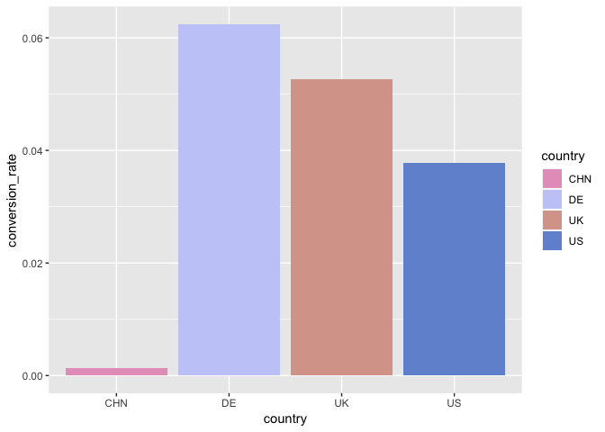
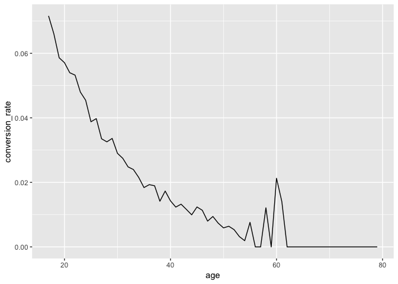
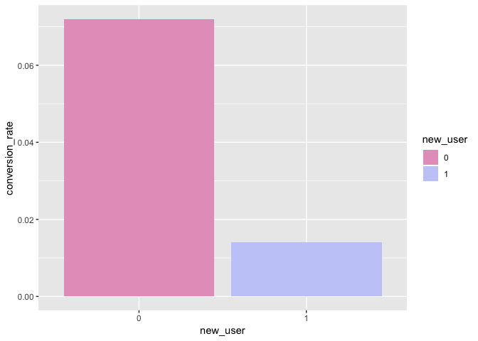
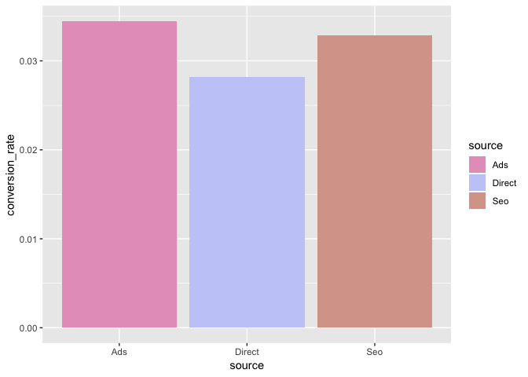
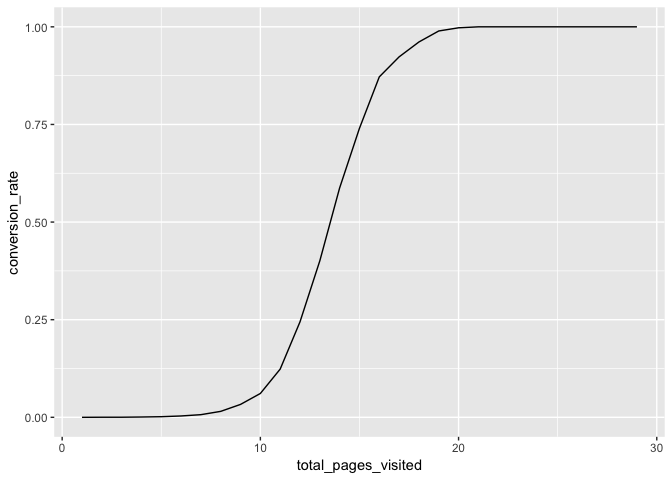
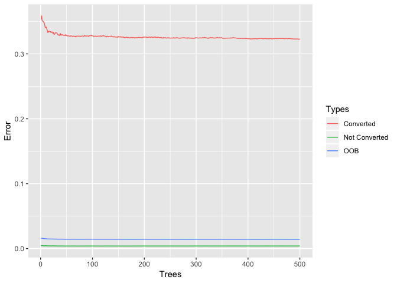
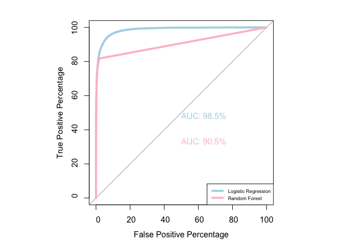
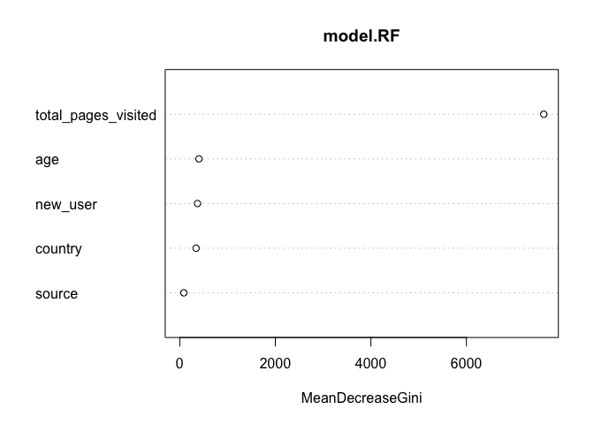
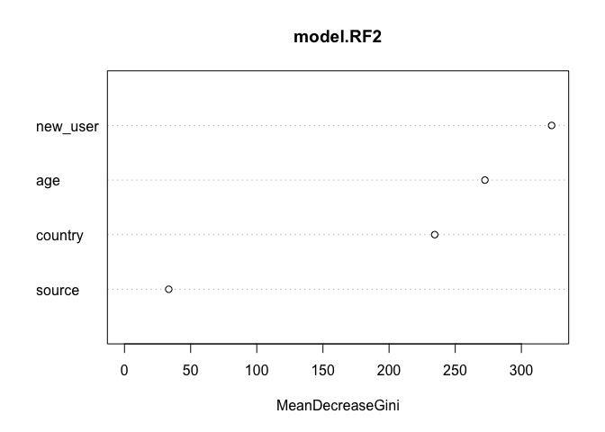
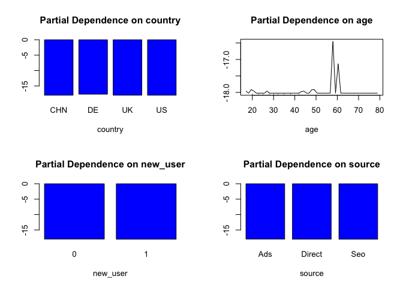

Conversion rate
================

### We have data about users who hit our site: whether they converted or not as well as some of their characteristics such as their country, the marketing channel, their age, whether they are repeated usersand the number of pages wisited during that session (as a proxy for site activity/time spent on site).

### Your project is to:

#### (1) Predict conversion rate

#### (2) Come up with recommendations for the product team and the marketing team to improve conversion rate.

### Library needed packages

### Read in dataset

### Look into data and its structure

    ##   country age new_user source total_pages_visited converted
    ## 1      UK  25        1    Ads                   1         0
    ## 2      US  23        1    Seo                   5         0
    ## 3      US  28        1    Seo                   4         0
    ## 4   China  39        1    Seo                   5         0
    ## 5      US  30        1    Seo                   6         0
    ## 6      US  31        0    Seo                   1         0

    ## 'data.frame':    316200 obs. of  6 variables:
    ##  $ country            : Factor w/ 4 levels "China","Germany",..: 3 4 4 1 4 4 1 4 3 4 ...
    ##  $ age                : int  25 23 28 39 30 31 27 23 29 25 ...
    ##  $ new_user           : int  1 1 1 1 1 0 1 0 0 0 ...
    ##  $ source             : Factor w/ 3 levels "Ads","Direct",..: 1 3 3 3 3 3 3 1 2 1 ...
    ##  $ total_pages_visited: int  1 5 4 5 6 1 4 4 4 2 ...
    ##  $ converted          : int  0 0 0 0 0 0 0 0 0 0 ...

    ##     country            age            new_user         source      
    ##  China  : 76602   Min.   : 17.00   Min.   :0.0000   Ads   : 88740  
    ##  Germany: 13056   1st Qu.: 24.00   1st Qu.:0.0000   Direct: 72420  
    ##  UK     : 48450   Median : 30.00   Median :1.0000   Seo   :155040  
    ##  US     :178092   Mean   : 30.57   Mean   :0.6855                  
    ##                   3rd Qu.: 36.00   3rd Qu.:1.0000                  
    ##                   Max.   :123.00   Max.   :1.0000                  
    ##  total_pages_visited   converted      
    ##  Min.   : 1.000      Min.   :0.00000  
    ##  1st Qu.: 2.000      1st Qu.:0.00000  
    ##  Median : 4.000      Median :0.00000  
    ##  Mean   : 4.873      Mean   :0.03226  
    ##  3rd Qu.: 7.000      3rd Qu.:0.00000  
    ##  Max.   :29.000      Max.   :1.00000

From such descriptive statistics, we observed that: (1) The site is most likely a US site since the number of users is the largest in the US, followed by China, UK, and Germany. (2) Users of this site are relatively young (Q3 is 36−year old); and the maximum age 123 does not make sense, suggesting we need to examine this variable further. (3) Over half (69%) users are returned. (4) In general, the conversion rate is around 3%.

### Examine the variable age

    ## [1] 123 111  79  77  73  72

Age 123 and 111 seem to be incorrect input (only 2 entries). We remove them before further analyses.

### Remove two entries

    ##  country           age        new_user      source      
    ##  CHN: 76602   Min.   :17.00   0: 99454   Ads   : 88739  
    ##  DE : 13055   1st Qu.:24.00   1:216744   Direct: 72420  
    ##  UK : 48449   Median :30.00              Seo   :155039  
    ##  US :178092   Mean   :30.57                             
    ##               3rd Qu.:36.00                             
    ##               Max.   :79.00                             
    ##  total_pages_visited   converted      
    ##  Min.   : 1.000      Min.   :0.00000  
    ##  1st Qu.: 2.000      1st Qu.:0.00000  
    ##  Median : 4.000      Median :0.00000  
    ##  Mean   : 4.873      Mean   :0.03225  
    ##  3rd Qu.: 7.000      3rd Qu.:0.00000  
    ##  Max.   :29.000      Max.   :1.00000

### Visualization: Examine the features and how their distributions differ

#### Country

Germany has the highest conversion rate among 4 countries, followed by UK and US; Chinese convert at a much lower rate than other countries.

#### Users' age

In general, the conversion rate looks much higher among young users. And there is a small peak around age 60.

#### Whether a returned user

A returned user is more likely to convert, which makes sense.

#### Marketing channels

Though the conversion rate of direct source is the lowest one, this variable seems unimportant (no big difference among three channels).

#### Total page visited

It is reasonable that users who spend more time on site are likely to convert (as suggested by the challenge description, the total\_pages\_visited is actually a proxy).

### Construct a model for the conversion rate to identify actionable factors to enhance revenue

    ## 
    ##          0          1 
    ## 0.96783495 0.03216505

There are several ways for a predictive model, such as logistic regression, random forest.

#### Logistic regression: Logistic regression: for the logistic regression, we need several things from the output: (1) estimate, standard error, and p-value; (2) pseudo R square.

    ## [[1]]
    ##                         Estimate  Std. Error     z value      Pr(>|z|)
    ## (Intercept)         -10.27642517 0.184113578 -55.8156833  0.000000e+00
    ## countryDE             3.77899905 0.162137854  23.3073213 3.736718e-120
    ## countryUK             3.56476528 0.146865084  24.2723811 3.838188e-130
    ## countryUS             3.21640298 0.142340755  22.5965008 4.691049e-113
    ## age                  -0.07687665 0.002952445 -26.0383007 1.825396e-149
    ## new_user1            -1.73014754 0.043981351 -39.3382083  0.000000e+00
    ## sourceDirect         -0.22139649 0.060251159  -3.6745598  2.382598e-04
    ## sourceSeo            -0.04865626 0.049236783  -0.9882095  3.230500e-01
    ## total_pages_visited   0.76268134 0.007702171  99.0216044  0.000000e+00
    ## 
    ## [[2]]
    ## [1] 0.72

A fast check on all the p-value, all are significant (0.05 level). A pseudo R square of 0.72 suggests that 72% of the variance is explained. The model is powerful to predict the converstion rate. However, due to extreme unbalance of the dataset, the accuracy is 97% if we predict all users are not converted, suggesting that the accuracy is not a good criterion for this dataset. In this case, we may want to see if actionable solutions could be used to enhance the rate, indicating that we need to identify users who have not converted accurately (i.e., to minimize false positives). Accordingly, we are going to train a loss function with a higher cost of false positives.

#### Random forest: For the random forest, we first need to decide the number of the tree as well as the number of features randomly sampled at each split, both of which can be done by visualization. (If the dataset contains missings, we need to impute it first.)

    ## [1] 0.01472998 0.01402080 0.01432268 0.01507020 0.01530500

For this model, the number of 50 or 100 trees is good enough to see the OOB convergence in the graph. We will use 100 to shorten the training time. The number of features at each split should be 2 or 3.

Then we refit the random forest.

OOB error and test error are pretty similar: 1.4% and 1.44%, suggesting that we did not over-fit the model. However, we still have 97% accuracy even if we predict all entries in test data as non-convert, suggesting that we need to decide a threshold instead of the default 0.5, which can be achieved by receiver operating characteristic (ROC) curve.

#### Compare two predictive models and decide a better cut-off value rather than 0.5

    ## Setting levels: control = 0, case = 1

    ## Setting direction: controls < cases

    ## 
    ## Call:
    ## roc.default(response = test_data$converted, predictor = logit0_pred,     percent = T, plot = T, legacy.axes = T, xlab = "False Positive Percentage",     ylab = "True Positive Percentage", col = "light blue", lwd = 4,     print.auc = T)
    ## 
    ## Data: logit0_pred in 104050 controls (test_data$converted 0) < 3458 cases (test_data$converted 1).
    ## Area under the curve: 98.54%

    ## Setting levels: control = 0, case = 1
    ## Setting direction: controls < cases

#### Look at threshold between TPP 60% and 80%

    ## Setting levels: control = 0, case = 1

    ## Setting direction: controls < cases

    ##           tpp       fpp thresholds
    ## 9004 79.93060 1.1811629  0.2227622
    ## 9005 79.93060 1.1792407  0.2229635
    ## 9006 79.90168 1.1792407  0.2233710
    ## 9007 79.90168 1.1782797  0.2237376
    ## 9008 79.90168 1.1773186  0.2238580
    ## 9009 79.87276 1.1753964  0.2243874
    ## 9010 79.87276 1.1744354  0.2254588
    ## 9011 79.84384 1.1744354  0.2260809
    ## 9012 79.84384 1.1677078  0.2263192
    ## 9013 79.84384 1.1667468  0.2265227
    ## 9014 79.84384 1.1657857  0.2267498
    ## 9015 79.84384 1.1648246  0.2270796
    ## 9016 79.69925 1.1600192  0.2276143
    ## 9017 79.61249 1.1600192  0.2280364
    ## 9018 79.61249 1.1590581  0.2281994
    ## 9019 79.58357 1.1590581  0.2285627
    ## 9020 79.55466 1.1590581  0.2290997
    ## 9021 79.52574 1.1580971  0.2296374
    ## 9022 79.52574 1.1561749  0.2299994
    ## 9023 79.49682 1.1523306  0.2305389
    ## 9024 79.49682 1.1504085  0.2310789
    ## 9025 79.41006 1.1465642  0.2313779
    ## 9026 79.41006 1.1456031  0.2316579
    ## 9027 79.38115 1.1436809  0.2322002
    ## 9028 79.38115 1.1427198  0.2327428
    ## 9029 79.38115 1.1388755  0.2329641
    ## 9030 79.38115 1.1379145  0.2332077
    ## 9031 79.35223 1.1359923  0.2335176
    ## 9032 79.35223 1.1350312  0.2340628
    ## 9033 79.35223 1.1311869  0.2346085
    ## 9034 79.32331 1.1292648  0.2349760
    ## 9035 79.29439 1.1206151  0.2352591
    ## 9036 79.26547 1.1196540  0.2354682
    ## 9037 79.23655 1.1196540  0.2357327
    ## 9038 79.23655 1.1167708  0.2360717
    ## 9039 79.12088 1.1090822  0.2364957
    ## 9040 79.12088 1.1081211  0.2370877
    ## 9041 79.12088 1.1071600  0.2374978
    ## 9042 79.12088 1.1061989  0.2381440
    ## 9043 79.12088 1.1052379  0.2389738
    ## 9044 79.12088 1.1033157  0.2394329
    ## 9045 79.12088 1.1023546  0.2397754
    ## 9046 79.12088 1.0985103  0.2400625
    ## 9047 79.12088 1.0975493  0.2404915
    ## 9048 79.12088 1.0946660  0.2408548
    ## 9049 79.06304 1.0917828  0.2411942
    ## 9050 79.06304 1.0908217  0.2419227
    ## 9051 79.06304 1.0898606  0.2426859
    ## 9052 79.03412 1.0898606  0.2429558
    ## 9053 79.03412 1.0888996  0.2431393
    ## 9054 79.03412 1.0879385  0.2435189
    ## 9055 78.97629 1.0869774  0.2438090
    ## 9056 78.94737 1.0869774  0.2439671
    ## 9057 78.88953 1.0840942  0.2443447
    ## 9058 78.88953 1.0812110  0.2448197
    ## 9059 78.88953 1.0783277  0.2450913
    ## 9060 78.83169 1.0725613  0.2454700
    ## 9061 78.80278 1.0706391  0.2460144
    ## 9062 78.77386 1.0706391  0.2464265
    ## 9063 78.74494 1.0706391  0.2467385
    ## 9064 78.74494 1.0677559  0.2473046
    ## 9065 78.71602 1.0667948  0.2479395
    ## 9066 78.71602 1.0658337  0.2483779
    ## 9067 78.71602 1.0648727  0.2487243
    ## 9068 78.71602 1.0619894  0.2490759
    ## 9069 78.62927 1.0571840  0.2493704
    ## 9070 78.62927 1.0552619  0.2495880
    ## 9071 78.60035 1.0552619  0.2498631
    ## 9072 78.60035 1.0514176  0.2502158
    ## 9073 78.51359 1.0485344  0.2505111
    ## 9074 78.51359 1.0475733  0.2507294
    ## 9075 78.48467 1.0475733  0.2511712
    ## 9076 78.48467 1.0466122  0.2516666
    ## 9077 78.45575 1.0466122  0.2523420
    ## 9078 78.42684 1.0456511  0.2529161
    ## 9079 78.42684 1.0437290  0.2532137
    ## 9080 78.39792 1.0427679  0.2537896
    ## 9081 78.39792 1.0379625  0.2543866
    ## 9082 78.39792 1.0370014  0.2549060
    ## 9083 78.39792 1.0360404  0.2552632
    ## 9084 78.25333 1.0283518  0.2557687
    ## 9085 78.25333 1.0273907  0.2563924
    ## 9086 78.22441 1.0273907  0.2567955
    ## 9087 78.19549 1.0254685  0.2571860
    ## 9088 78.19549 1.0245074  0.2575405
    ## 9089 78.19549 1.0235464  0.2579585
    ## 9090 78.19549 1.0206631  0.2582599
    ## 9091 78.19549 1.0197021  0.2584243
    ## 9092 78.16657 1.0158578  0.2588165
    ## 9093 78.13765 1.0139356  0.2593100
    ## 9094 78.10873 1.0139356  0.2595921
    ## 9095 78.07981 1.0120135  0.2598412
    ## 9096 78.07981 1.0100913  0.2601441
    ## 9097 78.07981 1.0091302  0.2605510
    ## 9098 78.07981 1.0081691  0.2610028
    ## 9099 78.05090 1.0081691  0.2613268
    ## 9100 78.02198 1.0043248  0.2618910
    ## 9101 78.02198 0.9995195  0.2625502
    ## 9102 77.99306 0.9947141  0.2630054
    ## 9103 77.96414 0.9947141  0.2633651
    ## 9104 77.96414 0.9927919  0.2637301
    ## 9105 77.93522 0.9870255  0.2640358
    ## 9106 77.93522 0.9860644  0.2643965
    ## 9107 77.93522 0.9851033  0.2649134
    ## 9108 77.93522 0.9774147  0.2651900
    ## 9109 77.93522 0.9764536  0.2652653
    ## 9110 77.87739 0.9716482  0.2657538
    ## 9111 77.87739 0.9706872  0.2663176
    ## 9112 77.87739 0.9697261  0.2671203
    ## 9113 77.84847 0.9687650  0.2680245
    ## 9114 77.84847 0.9678039  0.2682525
    ## 9115 77.81955 0.9668429  0.2686431
    ## 9116 77.76171 0.9629986  0.2692200
    ## 9117 77.76171 0.9620375  0.2696826
    ## 9118 77.76171 0.9601153  0.2700743
    ## 9119 77.70388 0.9553099  0.2706748
    ## 9120 77.70388 0.9543489  0.2713216
    ## 9121 77.70388 0.9533878  0.2717395
    ## 9122 77.67496 0.9524267  0.2720511
    ## 9123 77.64604 0.9524267  0.2722210
    ## 9124 77.64604 0.9505046  0.2725121
    ## 9125 77.61712 0.9495435  0.2729454
    ## 9126 77.58820 0.9476213  0.2732579
    ## 9127 77.55928 0.9476213  0.2734282
    ## 9128 77.50145 0.9428160  0.2738349
    ## 9129 77.50145 0.9408938  0.2743464
    ## 9130 77.47253 0.9408938  0.2746388
    ## 9131 77.47253 0.9360884  0.2748970
    ## 9132 77.47253 0.9351273  0.2752108
    ## 9133 77.47253 0.9332052  0.2759684
    ## 9134 77.44361 0.9274387  0.2770211
    ## 9135 77.44361 0.9245555  0.2779043
    ## 9136 77.41469 0.9216723  0.2783758
    ## 9137 77.41469 0.9207112  0.2785482
    ## 9138 77.41469 0.9159058  0.2789263
    ## 9139 77.32794 0.9120615  0.2792429
    ## 9140 77.29902 0.9111004  0.2794769
    ## 9141 77.27010 0.9111004  0.2797727
    ## 9142 77.24118 0.9082172  0.2801518
    ## 9143 77.12551 0.9082172  0.2804693
    ## 9144 77.12551 0.9053340  0.2807039
    ## 9145 77.09659 0.9053340  0.2819042
    ## 9146 77.03875 0.9043729  0.2830533
    ## 9147 77.03875 0.9024507  0.2833948
    ## 9148 77.03875 0.9014897  0.2838722
    ## 9149 77.03875 0.9005286  0.2842546
    ## 9150 76.95200 0.8966843  0.2859279
    ## 9151 76.95200 0.8947621  0.2876361
    ## 9152 76.95200 0.8938011  0.2878370
    ## 9153 76.95200 0.8928400  0.2880415
    ## 9154 76.86524 0.8899568  0.2884646
    ## 9155 76.86524 0.8889957  0.2887877
    ## 9156 76.86524 0.8870735  0.2889639
    ## 9157 76.86524 0.8861124  0.2893844
    ## 9158 76.83632 0.8851514  0.2900105
    ## 9159 76.80740 0.8793849  0.2906374
    ## 9160 76.69173 0.8784238  0.2916661
    ## 9161 76.69173 0.8765017  0.2925766
    ## 9162 76.66281 0.8726574  0.2932069
    ## 9163 76.60497 0.8716963  0.2938377
    ## 9164 76.57606 0.8707352  0.2940788
    ## 9165 76.57606 0.8697741  0.2942570
    ## 9166 76.54714 0.8678520  0.2946477
    ## 9167 76.43146 0.8611245  0.2949749
    ## 9168 76.40254 0.8592023  0.2956083
    ## 9169 76.34471 0.8515137  0.2962419
    ## 9170 76.34471 0.8505526  0.2963988
    ## 9171 76.31579 0.8505526  0.2970018
    ## 9172 76.28687 0.8505526  0.2982742
    ## 9173 76.25795 0.8486305  0.2992409
    ## 9174 76.25795 0.8476694  0.2997339
    ## 9175 76.22903 0.8467083  0.3000870
    ## 9176 76.22903 0.8457472  0.3002325
    ## 9177 76.17120 0.8438251  0.3007910
    ## 9178 76.17120 0.8428640  0.3014801
    ## 9179 76.11336 0.8419029  0.3019253
    ## 9180 76.11336 0.8409419  0.3028179
    ## 9181 76.08444 0.8390197  0.3036416
    ## 9182 76.05552 0.8380586  0.3041822
    ## 9183 76.05552 0.8370975  0.3046447
    ## 9184 76.05552 0.8361365  0.3048299
    ## 9185 76.05552 0.8351754  0.3050117
    ## 9186 76.02660 0.8332532  0.3052864
    ## 9187 75.99769 0.8332532  0.3056204
    ## 9188 75.99769 0.8313311  0.3059913
    ## 9189 75.99769 0.8303700  0.3063032
    ## 9190 75.99769 0.8284479  0.3067380
    ## 9191 75.93985 0.8274868  0.3073630
    ## 9192 75.93985 0.8265257  0.3084851
    ## 9193 75.91093 0.8246036  0.3095710
    ## 9194 75.88201 0.8197982  0.3100735
    ## 9195 75.85309 0.8197982  0.3104704
    ## 9196 75.85309 0.8159539  0.3108731
    ## 9197 75.85309 0.8121096  0.3112104
    ## 9198 75.85309 0.8111485  0.3118633
    ## 9199 75.79526 0.8073042  0.3125163
    ## 9200 75.79526 0.8024988  0.3131834
    ## 9201 75.79526 0.8015377  0.3138048
    ## 9202 75.70850 0.8015377  0.3139540
    ## 9203 75.70850 0.8005766  0.3146100
    ## 9204 75.65067 0.7996156  0.3152662
    ## 9205 75.62175 0.7986545  0.3156061
    ## 9206 75.59283 0.7967323  0.3158571
    ## 9207 75.59283 0.7957713  0.3162871
    ## 9208 75.50607 0.7938491  0.3169220
    ## 9209 75.47715 0.7938491  0.3171736
    ## 9210 75.47715 0.7928880  0.3174542
    ## 9211 75.47715 0.7919270  0.3181699
    ## 9212 75.47715 0.7900048  0.3188146
    ## 9213 75.44824 0.7900048  0.3194759
    ## 9214 75.44824 0.7890437  0.3200350
    ## 9215 75.44824 0.7880827  0.3202217
    ## 9216 75.44824 0.7861605  0.3205414
    ## 9217 75.41932 0.7842383  0.3209112
    ## 9218 75.39040 0.7842383  0.3211700
    ## 9219 75.36148 0.7832773  0.3213607
    ## 9220 75.36148 0.7823162  0.3215477
    ## 9221 75.27473 0.7794330  0.3223151
    ## 9222 75.27473 0.7784719  0.3233241
    ## 9223 75.21689 0.7746276  0.3237755
    ## 9224 75.18797 0.7746276  0.3240740
    ## 9225 75.18797 0.7736665  0.3249329
    ## 9226 75.18797 0.7717444  0.3257887
    ## 9227 75.15905 0.7717444  0.3262381
    ## 9228 75.10121 0.7698222  0.3269074
    ## 9229 75.07230 0.7669390  0.3275771
    ## 9230 74.95662 0.7592504  0.3280949
    ## 9231 74.95662 0.7582893  0.3288514
    ## 9232 74.92770 0.7573282  0.3299904
    ## 9233 74.89879 0.7573282  0.3312648
    ## 9234 74.86987 0.7573282  0.3319388
    ## 9235 74.84095 0.7573282  0.3320925
    ## 9236 74.84095 0.7544450  0.3324417
    ## 9237 74.78311 0.7534839  0.3331174
    ## 9238 74.75419 0.7534839  0.3337936
    ## 9239 74.72527 0.7515617  0.3340520
    ## 9240 74.72527 0.7506007  0.3344264
    ## 9241 74.72527 0.7496396  0.3351614
    ## 9242 74.69636 0.7496396  0.3359600
    ## 9243 74.69636 0.7486785  0.3366390
    ## 9244 74.66744 0.7438731  0.3370959
    ## 9245 74.63852 0.7429121  0.3375105
    ## 9246 74.60960 0.7409899  0.3379992
    ## 9247 74.60960 0.7371456  0.3383515
    ## 9248 74.60960 0.7361845  0.3385435
    ## 9249 74.55176 0.7323402  0.3390018
    ## 9250 74.52285 0.7284959  0.3400373
    ## 9251 74.52285 0.7275348  0.3410264
    ## 9252 74.46501 0.7275348  0.3415256
    ## 9253 74.46501 0.7265738  0.3419857
    ## 9254 74.46501 0.7256127  0.3422807
    ## 9255 74.46501 0.7246516  0.3425052
    ## 9256 74.40717 0.7246516  0.3428954
    ## 9257 74.34933 0.7217684  0.3433564
    ## 9258 74.34933 0.7208073  0.3438492
    ## 9259 74.32042 0.7198462  0.3442678
    ## 9260 74.29150 0.7179241  0.3447297
    ## 9261 74.20474 0.7083133  0.3452607
    ## 9262 74.20474 0.7073522  0.3460364
    ## 9263 74.20474 0.7044690  0.3468711
    ## 9264 74.17582 0.7044690  0.3475258
    ## 9265 74.17582 0.7035079  0.3479767
    ## 9266 74.17582 0.7025469  0.3486282
    ## 9267 74.14691 0.7025469  0.3492012
    ## 9268 74.14691 0.6996636  0.3493586
    ## 9269 74.14691 0.6987025  0.3497166
    ## 9270 74.14691 0.6977415  0.3499808
    ## 9271 74.14691 0.6967804  0.3502756
    ## 9272 74.14691 0.6958193  0.3507037
    ## 9273 74.06015 0.6938972  0.3511017
    ## 9274 74.03123 0.6929361  0.3513664
    ## 9275 74.03123 0.6919750  0.3516618
    ## 9276 74.03123 0.6910139  0.3521436
    ## 9277 74.00231 0.6910139  0.3526259
    ## 9278 73.97340 0.6910139  0.3530929
    ## 9279 73.94448 0.6910139  0.3537883
    ## 9280 73.91556 0.6890918  0.3544841
    ## 9281 73.88664 0.6881307  0.3548690
    ## 9282 73.88664 0.6871696  0.3550974
    ## 9283 73.88664 0.6852475  0.3552691
    ## 9284 73.88664 0.6833253  0.3555412
    ## 9285 73.85772 0.6804421  0.3558778
    ## 9286 73.79988 0.6775589  0.3562634
    ## 9287 73.79988 0.6765978  0.3566245
    ## 9288 73.79988 0.6746756  0.3574954
    ## 9289 73.71313 0.6698703  0.3592083
    ## 9290 73.71313 0.6689092  0.3604201
    ## 9291 73.71313 0.6679481  0.3608917
    ## 9292 73.62637 0.6641038  0.3612549
    ## 9293 73.62637 0.6631427  0.3615231
    ## 9294 73.59746 0.6631427  0.3618621
    ## 9295 73.56854 0.6621816  0.3622965
    ## 9296 73.48178 0.6602595  0.3626602
    ## 9297 73.45286 0.6602595  0.3634534
    ## 9298 73.45286 0.6583373  0.3647018
    ## 9299 73.45286 0.6573763  0.3653711
    ## 9300 73.39503 0.6573763  0.3656166
    ## 9301 73.39503 0.6564152  0.3659818
    ## 9302 73.36611 0.6564152  0.3665675
    ## 9303 73.33719 0.6544930  0.3670292
    ## 9304 73.30827 0.6544930  0.3678574
    ## 9305 73.27935 0.6525709  0.3688956
    ## 9306 73.25043 0.6525709  0.3694428
    ## 9307 73.25043 0.6516098  0.3701519
    ## 9308 73.22152 0.6516098  0.3710774
    ## 9309 73.22152 0.6506487  0.3717877
    ## 9310 73.16368 0.6506487  0.3721554
    ## 9311 73.16368 0.6496877  0.3723559
    ## 9312 73.07692 0.6477655  0.3729770
    ## 9313 73.04800 0.6458433  0.3735784
    ## 9314 73.04800 0.6448823  0.3737791
    ## 9315 73.01909 0.6429601  0.3742581
    ## 9316 73.01909 0.6419990  0.3753401
    ## 9317 72.99017 0.6410380  0.3761681
    ## 9318 72.96125 0.6410380  0.3764880
    ## 9319 72.96125 0.6400769  0.3768947
    ## 9320 72.93233 0.6400769  0.3774949
    ## 9321 72.90341 0.6400769  0.3782101
    ## 9322 72.90341 0.6371937  0.3788060
    ## 9323 72.90341 0.6343104  0.3795223
    ## 9324 72.90341 0.6333494  0.3802390
    ## 9325 72.81666 0.6275829  0.3806100
    ## 9326 72.81666 0.6256607  0.3814189
    ## 9327 72.78774 0.6237386  0.3826919
    ## 9328 72.75882 0.6237386  0.3833744
    ## 9329 72.75882 0.6227775  0.3836247
    ## 9330 72.75882 0.6218164  0.3843445
    ## 9331 72.75882 0.6208554  0.3850645
    ## 9332 72.72990 0.6189332  0.3854629
    ## 9333 72.72990 0.6179721  0.3861839
    ## 9334 72.70098 0.6141278  0.3871872
    ## 9335 72.70098 0.6131667  0.3882466
    ## 9336 72.70098 0.6122057  0.3889523
    ## 9337 72.67206 0.6122057  0.3896758
    ## 9338 72.67206 0.6112446  0.3902874
    ## 9339 72.67206 0.6102835  0.3904915
    ## 9340 72.58531 0.6083614  0.3909785
    ## 9341 72.55639 0.6083614  0.3914988
    ## 9342 72.55639 0.6054781  0.3918487
    ## 9343 72.49855 0.6025949  0.3924284
    ## 9344 72.49855 0.6016338  0.3935299
    ## 9345 72.41180 0.5997117  0.3945816
    ## 9346 72.38288 0.5997117  0.3951122
    ## 9347 72.35396 0.5997117  0.3956012
    ## 9348 72.35396 0.5987506  0.3961631
    ## 9349 72.35396 0.5977895  0.3966069
    ## 9350 72.32504 0.5949063  0.3970571
    ## 9351 72.26721 0.5929841  0.3977857
    ## 9352 72.26721 0.5920231  0.3985148
    ## 9353 72.23829 0.5881788  0.3990781
    ## 9354 72.23829 0.5872177  0.3999009
    ## 9355 72.23829 0.5862566  0.4011388
    ## 9356 72.23829 0.5852955  0.4025228
    ## 9357 72.23829 0.5843345  0.4032546
    ## 9358 72.23829 0.5833734  0.4034213
    ## 9359 72.12261 0.5804901  0.4038002
    ## 9360 72.09370 0.5785680  0.4045330
    ## 9361 72.06478 0.5776069  0.4050680
    ## 9362 72.06478 0.5766458  0.4056345
    ## 9363 72.06478 0.5756848  0.4066547
    ## 9364 72.06478 0.5747237  0.4078994
    ## 9365 71.97802 0.5718405  0.4088415
    ## 9366 71.92019 0.5708794  0.4094295
    ## 9367 71.89127 0.5699183  0.4101653
    ## 9368 71.80451 0.5660740  0.4109016
    ## 9369 71.77559 0.5651129  0.4120198
    ## 9370 71.74667 0.5641519  0.4135835
    ## 9371 71.71776 0.5641519  0.4145039
    ## 9372 71.71776 0.5631908  0.4147460
    ## 9373 71.71776 0.5612686  0.4151024
    ## 9374 71.71776 0.5603075  0.4155991
    ## 9375 71.65992 0.5564632  0.4159815
    ## 9376 71.65992 0.5545411  0.4164322
    ## 9377 71.63100 0.5535800  0.4170034
    ## 9378 71.63100 0.5526189  0.4172921
    ## 9379 71.57316 0.5487746  0.4174606
    ## 9380 71.57316 0.5478136  0.4181263
    ## 9381 71.57316 0.5468525  0.4188291
    ## 9382 71.57316 0.5458914  0.4190868
    ## 9383 71.57316 0.5449303  0.4192433
    ## 9384 71.57316 0.5430082  0.4199844
    ## 9385 71.57316 0.5420471  0.4212685
    ## 9386 71.57316 0.5410860  0.4220104
    ## 9387 71.54425 0.5382028  0.4224366
    ## 9388 71.51533 0.5382028  0.4227201
    ## 9389 71.51533 0.5372417  0.4232055
    ## 9390 71.42857 0.5343585  0.4240113
    ## 9391 71.39965 0.5343585  0.4255554
    ## 9392 71.37073 0.5343585  0.4270432
    ## 9393 71.31290 0.5314753  0.4274284
    ## 9394 71.25506 0.5314753  0.4276383
    ## 9395 71.19722 0.5266699  0.4281390
    ## 9396 71.16831 0.5266699  0.4287687
    ## 9397 71.16831 0.5257088  0.4291284
    ## 9398 71.05263 0.5237866  0.4296296
    ## 9399 70.99479 0.5228256  0.4303494
    ## 9400 70.96588 0.5228256  0.4309241
    ## 9401 70.93696 0.5228256  0.4313360
    ## 9402 70.93696 0.5209034  0.4318418
    ## 9403 70.93696 0.5199423  0.4326783
    ## 9404 70.90804 0.5189813  0.4334253
    ## 9405 70.87912 0.5189813  0.4337106
    ## 9406 70.87912 0.5180202  0.4339213
    ## 9407 70.85020 0.5151370  0.4343833
    ## 9408 70.76345 0.5093705  0.4351310
    ## 9409 70.73453 0.5064873  0.4358790
    ## 9410 70.64777 0.5036040  0.4362661
    ## 9411 70.64777 0.5026430  0.4364511
    ## 9412 70.64777 0.5016819  0.4366419
    ## 9413 70.64777 0.5007208  0.4373905
    ## 9414 70.64777 0.4997597  0.4390474
    ## 9415 70.64777 0.4987987  0.4403757
    ## 9416 70.64777 0.4978376  0.4408657
    ## 9417 70.61885 0.4949543  0.4412964
    ## 9418 70.61885 0.4930322  0.4418759
    ## 9419 70.58994 0.4920711  0.4423662
    ## 9420 70.58994 0.4882268  0.4428875
    ## 9421 70.58994 0.4872657  0.4436958
    ## 9422 70.56102 0.4872657  0.4444469
    ## 9423 70.53210 0.4872657  0.4451983
    ## 9424 70.53210 0.4853436  0.4459499
    ## 9425 70.50318 0.4853436  0.4464553
    ## 9426 70.50318 0.4843825  0.4470564
    ## 9427 70.44534 0.4843825  0.4478086
    ## 9428 70.41643 0.4814993  0.4485611
    ## 9429 70.35859 0.4805382  0.4492877
    ## 9430 70.35859 0.4795771  0.4500407
    ## 9431 70.30075 0.4786160  0.4507938
    ## 9432 70.27183 0.4786160  0.4516378
    ## 9433 70.24291 0.4766939  0.4522401
    ## 9434 70.24291 0.4757328  0.4524872
    ## 9435 70.24291 0.4738107  0.4528510
    ## 9436 70.21400 0.4718885  0.4533578
    ## 9437 69.98265 0.4670831  0.4541120
    ## 9438 69.92481 0.4661221  0.4547903
    ## 9439 69.92481 0.4651610  0.4550848
    ## 9440 69.86698 0.4613167  0.4552566
    ## 9441 69.80914 0.4593945  0.4555449
    ## 9442 69.78022 0.4584334  0.4570166
    ## 9443 69.75130 0.4574724  0.4586868
    ## 9444 69.75130 0.4565113  0.4593994
    ## 9445 69.72238 0.4565113  0.4598931
    ## 9446 69.66455 0.4565113  0.4613874
    ## 9447 69.66455 0.4555502  0.4632528
    ## 9448 69.63563 0.4555502  0.4642575
    ## 9449 69.60671 0.4545891  0.4648624
    ## 9450 69.60671 0.4536281  0.4651578
    ## 9451 69.51995 0.4517059  0.4655232
    ## 9452 69.43320 0.4507448  0.4661283
    ## 9453 69.37536 0.4488227  0.4667682
    ## 9454 69.37536 0.4478616  0.4671337
    ## 9455 69.31752 0.4478616  0.4674562
    ## 9456 69.25969 0.4478616  0.4678481
    ## 9457 69.23077 0.4459395  0.4688836
    ## 9458 69.20185 0.4459395  0.4699808
    ## 9459 69.14401 0.4440173  0.4704428
    ## 9460 69.14401 0.4430562  0.4709524
    ## 9461 69.11510 0.4430562  0.4714968
    ## 9462 69.11510 0.4420951  0.4717864
    ## 9463 69.11510 0.4411341  0.4720002
    ## 9464 69.08618 0.4401730  0.4724688
    ## 9465 68.88375 0.4344065  0.4728612
    ## 9466 68.88375 0.4334455  0.4731509
    ## 9467 68.85483 0.4334455  0.4738131
    ## 9468 68.68132 0.4257568  0.4750986
    ## 9469 68.62348 0.4257568  0.4760450
    ## 9470 68.62348 0.4247958  0.4764645
    ## 9471 68.62348 0.4238347  0.4770939
    ## 9472 68.62348 0.4219125  0.4775630
    ## 9473 68.62348 0.4209515  0.4779558
    ## 9474 68.62348 0.4199904  0.4787150
    ## 9475 68.56564 0.4171072  0.4794743
    ## 9476 68.56564 0.4161461  0.4800608
    ## 9477 68.53673 0.4151850  0.4812402
    ## 9478 68.53673 0.4142239  0.4825273
    ## 9479 68.47889 0.4142239  0.4837182
    ## 9480 68.44997 0.4123018  0.4845746
    ## 9481 68.44997 0.4113407  0.4847888
    ## 9482 68.42105 0.4103796  0.4852997
    ## 9483 68.39213 0.4094185  0.4859420
    ## 9484 68.39213 0.4084575  0.4863089
    ## 9485 68.33430 0.4074964  0.4866325
    ## 9486 68.33430 0.4065353  0.4870257
    ## 9487 68.27646 0.4065353  0.4883139
    ## 9488 68.27646 0.4055742  0.4896290
    ## 9489 68.24754 0.4055742  0.4901401
    ## 9490 68.18971 0.4026910  0.4907274
    ## 9491 68.16079 0.4026910  0.4911909
    ## 9492 68.13187 0.4026910  0.4916609
    ## 9493 68.04511 0.3998078  0.4920543
    ## 9494 68.04511 0.3988467  0.4928148
    ## 9495 67.95836 0.3950024  0.4935753
    ## 9496 67.90052 0.3950024  0.4942593
    ## 9497 67.90052 0.3940413  0.4949813
    ## 9498 67.87160 0.3921192  0.4952459
    ## 9499 67.87160 0.3911581  0.4956395
    ## 9500 67.87160 0.3901970  0.4962701
    ## 9501 67.81377 0.3901970  0.4970307
    ## 9502 67.78485 0.3901970  0.4977481
    ## 9503 67.75593 0.3901970  0.4982451
    ## 9504 67.69809 0.3892359  0.4990058
    ## 9505 67.66917 0.3882749  0.5001214
    ## 9506 67.64025 0.3882749  0.5014103
    ## 9507 67.61134 0.3863527  0.5023854
    ## 9508 67.58242 0.3853916  0.5029933
    ## 9509 67.55350 0.3853916  0.5035395
    ## 9510 67.49566 0.3844306  0.5039066
    ## 9511 67.43783 0.3834695  0.5048816
    ## 9512 67.43783 0.3805863  0.5060356
    ## 9513 67.43783 0.3786641  0.5075302
    ## 9514 67.35107 0.3786641  0.5091425
    ## 9515 67.29323 0.3748198  0.5099029
    ## 9516 67.26431 0.3748198  0.5101933
    ## 9517 67.26431 0.3738587  0.5104077
    ## 9518 67.26431 0.3728976  0.5108776
    ## 9519 67.14864 0.3700144  0.5112709
    ## 9520 67.11972 0.3690533  0.5115613
    ## 9521 67.11972 0.3680923  0.5122830
    ## 9522 67.11972 0.3671312  0.5134364
    ## 9523 67.11972 0.3661701  0.5141965
    ## 9524 67.09080 0.3661701  0.5147243
    ## 9525 67.06189 0.3661701  0.5154842
    ## 9526 67.03297 0.3642480  0.5159808
    ## 9527 67.00405 0.3632869  0.5163739
    ## 9528 66.97513 0.3632869  0.5169607
    ## 9529 66.94621 0.3632869  0.5174572
    ## 9530 66.88837 0.3623258  0.5182168
    ## 9531 66.83054 0.3623258  0.5193309
    ## 9532 66.83054 0.3613647  0.5203214
    ## 9533 66.83054 0.3604037  0.5211772
    ## 9534 66.80162 0.3604037  0.5216876
    ## 9535 66.77270 0.3604037  0.5223503
    ## 9536 66.77270 0.3575204  0.5229918
    ## 9537 66.74378 0.3575204  0.5232058
    ## 9538 66.68595 0.3555983  0.5237160
    ## 9539 66.62811 0.3555983  0.5246804
    ## 9540 66.59919 0.3546372  0.5254391
    ## 9541 66.51243 0.3527150  0.5259660
    ## 9542 66.48352 0.3517540  0.5265503
    ## 9543 66.48352 0.3507929  0.5273087
    ## 9544 66.45460 0.3507929  0.5280364
    ## 9545 66.42568 0.3507929  0.5285461
    ## 9546 66.36784 0.3498318  0.5289383
    ## 9547 66.33892 0.3498318  0.5291868
    ## 9548 66.28109 0.3498318  0.5295526
    ## 9549 66.28109 0.3479097  0.5300621
    ## 9550 66.10758 0.3450264  0.5311736
    ## 9551 66.10758 0.3440654  0.5320275
    ## 9552 66.10758 0.3421432  0.5329142
    ## 9553 66.10758 0.3411821  0.5343903
    ## 9554 66.07866 0.3402210  0.5351473
    ## 9555 66.02082 0.3402210  0.5358611
    ## 9556 65.99190 0.3402210  0.5366178
    ## 9557 65.81839 0.3392600  0.5370522
    ## 9558 65.81839 0.3382989  0.5384884
    ## 9559 65.78947 0.3382989  0.5399703
    ## 9560 65.76056 0.3382989  0.5403991
    ## 9561 65.67380 0.3373378  0.5407332
    ## 9562 65.67380 0.3363767  0.5413371
    ## 9563 65.64488 0.3363767  0.5418795
    ## 9564 65.61596 0.3334935  0.5421271
    ## 9565 65.58704 0.3325324  0.5423400
    ## 9566 65.47137 0.3296492  0.5428476
    ## 9567 65.47137 0.3286881  0.5439930
    ## 9568 65.44245 0.3248438  0.5450857
    ## 9569 65.44245 0.3238827  0.5461778
    ## 9570 65.38462 0.3229217  0.5471445
    ## 9571 65.38462 0.3219606  0.5476513
    ## 9572 65.38462 0.3200384  0.5482333
    ## 9573 65.38462 0.3190774  0.5486927
    ## 9574 65.29786 0.3190774  0.5491583
    ## 9575 65.06651 0.3152331  0.5495099
    ## 9576 65.03759 0.3152331  0.5503585
    ## 9577 65.00868 0.3123498  0.5518639
    ## 9578 65.00868 0.3104277  0.5533302
    ## 9579 64.95084 0.3104277  0.5542106
    ## 9580 64.92192 0.3085055  0.5549194
    ## 9581 64.92192 0.3065834  0.5556708
    ## 9582 64.83516 0.3065834  0.5564218
    ## 9583 64.83516 0.3056223  0.5572301
    ## 9584 64.80625 0.3056223  0.5591006
    ## 9585 64.80625 0.3046612  0.5608933
    ## 9586 64.74841 0.3027391  0.5611389
    ## 9587 64.71949 0.3027391  0.5613501
    ## 9588 64.63274 0.3017780  0.5618536
    ## 9589 64.63274 0.2998558  0.5629897
    ## 9590 64.54598 0.2950505  0.5642843
    ## 9591 64.51706 0.2950505  0.5655778
    ## 9592 64.45922 0.2950505  0.5666170
    ## 9593 64.45922 0.2940894  0.5673640
    ## 9594 64.37247 0.2940894  0.5681107
    ## 9595 64.22788 0.2921672  0.5690731
    ## 9596 64.19896 0.2921672  0.5699140
    ## 9597 64.19896 0.2902451  0.5712032
    ## 9598 64.17004 0.2902451  0.5726556
    ## 9599 64.14112 0.2892840  0.5731158
    ## 9600 64.08329 0.2883229  0.5735008
    ## 9601 64.05437 0.2883229  0.5742448
    ## 9602 64.02545 0.2844786  0.5753050
    ## 9603 63.96761 0.2844786  0.5763951
    ## 9604 63.96761 0.2825565  0.5773636
    ## 9605 63.96761 0.2815954  0.5782001
    ## 9606 63.93869 0.2815954  0.5786989
    ## 9607 63.88086 0.2796732  0.5795552
    ## 9608 63.88086 0.2787122  0.5804973
    ## 9609 63.88086 0.2777511  0.5808806
    ## 9610 63.85194 0.2777511  0.5811821
    ## 9611 63.85194 0.2767900  0.5819224
    ## 9612 63.79410 0.2767900  0.5830836
    ## 9613 63.79410 0.2758289  0.5839120
    ## 9614 63.76518 0.2758289  0.5846509
    ## 9615 63.76518 0.2719846  0.5853896
    ## 9616 63.73626 0.2719846  0.5859598
    ## 9617 63.67843 0.2710235  0.5866978
    ## 9618 63.47600 0.2691014  0.5872474
    ## 9619 63.41816 0.2681403  0.5880409
    ## 9620 63.38924 0.2681403  0.5887779
    ## 9621 63.36032 0.2681403  0.5895142
    ## 9622 63.33141 0.2671792  0.5909068
    ## 9623 63.30249 0.2671792  0.5917679
    ## 9624 63.18681 0.2662182  0.5921899
    ## 9625 63.15789 0.2662182  0.5924705
    ## 9626 63.12898 0.2662182  0.5929504
    ## 9627 63.01330 0.2662182  0.5939710
    ## 9628 62.98438 0.2662182  0.5952534
    ## 9629 62.98438 0.2652571  0.5962092
    ## 9630 62.95547 0.2652571  0.5967350
    ## 9631 62.92655 0.2642960  0.5972271
    ## 9632 62.86871 0.2623739  0.5978415
    ## 9633 62.83979 0.2623739  0.5985728
    ## 9634 62.66628 0.2614128  0.5990941
    ## 9635 62.63736 0.2614128  0.5994721
    ## 9636 62.57953 0.2614128  0.6003821
    ## 9637 62.57953 0.2594906  0.6014388
    ## 9638 62.55061 0.2594906  0.6024942
    ## 9639 62.52169 0.2585296  0.6034282
    ## 9640 62.52169 0.2566074  0.6039175
    ## 9641 62.49277 0.2566074  0.6042940
    ## 9642 62.46385 0.2566074  0.6047374
    ## 9643 62.43493 0.2546852  0.6053722
    ## 9644 62.34818 0.2527631  0.6057482
    ## 9645 62.34818 0.2518020  0.6069052
    ## 9646 62.34818 0.2508409  0.6083197
    ## 9647 62.34818 0.2498799  0.6093527
    ## 9648 62.31926 0.2489188  0.6102005
    ## 9649 62.29034 0.2469966  0.6106160
    ## 9650 62.23250 0.2469966  0.6113391
    ## 9651 62.17467 0.2450745  0.6123522
    ## 9652 62.14575 0.2450745  0.6129100
    ## 9653 62.08791 0.2450745  0.6141487
    ## 9654 62.05899 0.2441134  0.6155734
    ## 9655 62.05899 0.2421913  0.6159713
    ## 9656 62.05899 0.2412302  0.6163436
    ## 9657 62.03008 0.2412302  0.6167567
    ## 9658 62.00116 0.2412302  0.6171037
    ## 9659 61.85656 0.2402691  0.6174098
    ## 9660 61.85656 0.2393080  0.6177815
    ## 9661 61.82765 0.2393080  0.6189976
    ## 9662 61.76981 0.2383469  0.6207529
    ## 9663 61.76981 0.2373859  0.6219501
    ## 9664 61.68305 0.2364248  0.6225218
    ## 9665 61.68305 0.2345026  0.6229576
    ## 9666 61.68305 0.2335416  0.6235813
    ## 9667 61.59630 0.2316194  0.6239507
    ## 9668 61.56738 0.2306583  0.6254309
    ## 9669 61.53846 0.2306583  0.6269419
    ## 9670 61.48062 0.2306583  0.6277744
    ## 9671 61.45171 0.2306583  0.6287315
    ## 9672 61.42279 0.2277751  0.6290028
    ## 9673 61.42279 0.2268140  0.6293050
    ## 9674 61.39387 0.2268140  0.6297436
    ## 9675 61.36495 0.2248919  0.6304645
    ## 9676 61.36495 0.2239308  0.6312273
    ## 9677 61.33603 0.2239308  0.6321383
    ## 9678 61.33603 0.2229697  0.6331217
    ## 9679 61.24928 0.2229697  0.6334873
    ## 9680 61.22036 0.2229697  0.6336864
    ## 9681 61.22036 0.2210476  0.6341610
    ## 9682 61.16252 0.2210476  0.6348666
    ## 9683 61.13360 0.2200865  0.6355716
    ## 9684 61.10468 0.2200865  0.6366401
    ## 9685 61.07577 0.2200865  0.6376588
    ## 9686 61.07577 0.2191254  0.6381718
    ## 9687 61.04685 0.2191254  0.6386439
    ## 9688 60.87334 0.2191254  0.6391480
    ## 9689 60.81550 0.2191254  0.6395757
    ## 9690 60.78658 0.2181643  0.6400470
    ## 9691 60.69983 0.2181643  0.6407477
    ## 9692 60.64199 0.2172033  0.6414478
    ## 9693 60.58415 0.2152811  0.6431708
    ## 9694 60.55523 0.2143200  0.6449812
    ## 9695 60.49740 0.2143200  0.6457964
    ## 9696 60.38172 0.2143200  0.6464922
    ## 9697 60.35281 0.2133590  0.6472402
    ## 9698 60.35281 0.2123979  0.6480181
    ## 9699 60.32389 0.2123979  0.6489821
    ## 9700 60.32389 0.2114368  0.6497632
    ## 9701 60.29497 0.2114368  0.6504550
    ## 9702 60.29497 0.2104757  0.6512537
    ## 9703 60.26605 0.2085536  0.6518058
    ## 9704 60.20821 0.2085536  0.6523892
    ## 9705 60.17929 0.2085536  0.6527222
    ## 9706 60.15038 0.2056704  0.6531856
    ## 9707 60.09254 0.2047093  0.6549999
    ## 9708 60.03470 0.2047093  0.6566825
    ## 9709 60.03470 0.2027871  0.6571005
    ## 9710 60.00578 0.2018260  0.6575612

**If it were a model for prediction, from this step, we would select the logistic regression as the predictive model and decide a cut-off value based on the ROC. Yet, this project is only for obtaining insights and coming up with an idea to improve revenue. Accordingly, we will use the random forest for further analysis due to its strengths. **

#### Extract insights out from the random forest model

Total\_pages\_visited is the most important one by far. Unfortunately, it is likely the least "actionable", since a high association between buying and visiting many pages (and as suggested by the description, this variable is a proxy). To have insights into other features, we remove this feature and reconstruct the model (for this step, we care more about insights into variable importance instead of prediction).

#### Reconstruct a machine learning model

#### Recheck variable importance

New user is the most important one. Source doesn't seem to matter at all.

#### check partial dependence plots for 4 vaiables

In partial dependence plots, we care more about the pattern (1) Users with an old account are much better than new users (2) Germany has the highest conversion rate and China has the lowest. (3) The site works very well for young people and bad for less young people (&gt;30 yrs old) (4) The source might not be irrelevant to the conversion rate.

#### Build a simple decision tree and check the 2 or 3 most important segaments

    ## n= 316198 
    ## 
    ## node), split, n, loss, yval, (yprob)
    ##       * denotes terminal node
    ## 
    ##  1) root 316198 94859.4000 0 (0.70000000 0.30000000)  
    ##    2) new_user=1 216744 28268.0600 0 (0.84540048 0.15459952) *
    ##    3) new_user=0 99454 66591.3400 0 (0.50063101 0.49936899)  
    ##      6) country=CHN 23094   613.9165 0 (0.96445336 0.03554664) *
    ##      7) country=DE,UK,US 76360 50102.8100 1 (0.43162227 0.56837773)  
    ##       14) age>=29.5 38341 19589.5200 0 (0.57227507 0.42772493) *
    ##       15) age< 29.5 38019 23893.0000 1 (0.33996429 0.66003571) *

A simple small tree comfirms exactly the random forest findings.

### Some conclusions and suggestions:

1.  The site is working very well for young users. It is a good idea to let marketing to advertise and use marketing channel which is more likely to reach young people;
2.  The site is working very well for Germany in terms of conversion. But the summary showed that few Germans are coming to the website: less than the UK, despite a larger population. Again, marketing should get more Germans.
3.  Users with old accounts do much better. Targeted emails with offers to bring them back to the site could be a good idea to try.
4.  Something is wrong with the Chinese version of the site. It is either poorly translated or culture factor! Given the huge number of users are based in China, fixing this should be a top priority.
5.  Maybe go through with the UI and figure out why older users perform so poorly. From 30 y/o conversion clearly starts dropping.
6.  If I know someone has visited many pages but hasn't converted, she almost surely has high purchase intent. I could email her targeted offers or sending her reminders.
