

Credit Card Transactions
================

### Company XYZ is a major credit card company. It has information about all the transactions that users make with their credit card. Your boss asks you to do the following:

#### (1) Your boss wants to identify those users that in your dataset never went above the monthly credit card limit (calendar month). The goal of this is to increase their limit automatically. Can you send him the list of Ids?

#### (2) On the other hand, she wants you to implement an algorithm that as soon as a user goes above her monthly limit, it triggers an alert so that the user can be notified about that. We assume here that at the beginning of a new month, user total money spent gets reset to zero (i.e., she pays the card fully at the end of each month). Build a function that for each day, returns a list of users who went above their credit card monthly limit on that day.

#### (3) Finally, your boss is very concerned about frauds cause they are a huge cost for credit card companies. She wants you to implement an unsupervised algorithm that returns all transactions that seem unusual and are worth being investigated further.

### Library needed packages and source codes

### Read in dataset

### Look into dataset

    ## 'data.frame':    984 obs. of  5 variables:
    ##  $ credit_card      : num  1.28e+15 9.74e+15 4.75e+15 9.59e+15 2.10e+15 ...
    ##  $ city             : Factor w/ 124 levels "Akron","Albany",..: 30 51 7 85 79 6 90 11 120 66 ...
    ##  $ state            : Factor w/ 35 levels "AL","AZ","CA",..: 27 27 15 35 24 24 27 22 21 3 ...
    ##  $ zipcode          : int  18612 15342 1501 26412 10001 14808 15201 8011 3280 90001 ...
    ##  $ credit_card_limit: int  6000 16000 14000 18000 20000 21000 6000 4000 15000 20000 ...

    ## 'data.frame':    294588 obs. of  5 variables:
    ##  $ credit_card              : num  1e+15 1e+15 1e+15 1e+15 1e+15 ...
    ##  $ date                     : Factor w/ 281065 levels "2015-07-31 09:39:48",..: 129496 266802 270279 256799 270672 244931 92387 46308 148899 131390 ...
    ##  $ transaction_dollar_amount: num  43.8 103.2 48.5 136.2 71.8 ...
    ##  $ Long                     : num  -80.2 -80.2 -80.2 -80.2 -80.2 ...
    ##  $ Lat                      : num  40.3 40.2 40.3 40.3 40.2 ...

    ## [1] 984   5

    ## [1] 294588      5

    ##   credit_card                 city         state        zipcode     
    ##  Min.   :1.004e+15   Washington :370   NH     :389   Min.   :  690  
    ##  1st Qu.:3.316e+15   Houston    : 81   PA     :153   1st Qu.: 3280  
    ##  Median :5.365e+15   New York   : 54   NY     : 96   Median : 5820  
    ##  Mean   :5.410e+15   El Paso    : 43   IL     : 53   Mean   :17895  
    ##  3rd Qu.:7.562e+15   Dallas     : 35   MA     : 53   3rd Qu.:18101  
    ##  Max.   :1.000e+16   Springfield: 18   VT     : 30   Max.   :98401  
    ##                      (Other)    :383   (Other):210                  
    ##  credit_card_limit
    ##  Min.   : 2000    
    ##  1st Qu.: 7000    
    ##  Median :10000    
    ##  Mean   :12321    
    ##  3rd Qu.:16000    
    ##  Max.   :55000    
    ## 

    ##   credit_card                         date       
    ##  Min.   :1.004e+15   2015-08-01 00:18:43:     4  
    ##  1st Qu.:3.344e+15   2015-08-13 21:18:33:     4  
    ##  Median :5.353e+15   2015-08-14 21:59:56:     4  
    ##  Mean   :5.425e+15   2015-08-20 21:42:15:     4  
    ##  3rd Qu.:7.646e+15   2015-08-21 19:48:43:     4  
    ##  Max.   :1.000e+16   2015-08-28 21:53:27:     4  
    ##                      (Other)            :294564  
    ##  transaction_dollar_amount      Long              Lat        
    ##  Min.   :   0.01           Min.   :-179.39   Min.   :-68.05  
    ##  1st Qu.:  29.97           1st Qu.: -80.21   1st Qu.: 40.49  
    ##  Median :  58.47           Median : -73.20   Median : 42.40  
    ##  Mean   :  86.01           Mean   : -76.24   Mean   : 40.94  
    ##  3rd Qu.: 100.40           3rd Qu.: -72.09   3rd Qu.: 43.18  
    ##  Max.   : 999.97           Max.   : 179.92   Max.   : 78.91  
    ## 

    ## [1] TRUE

    ## [1] 0

#### (1) Your boss wants to identify those users that in your dataset never went above the monthly credit card limit (calendar month). The goal of this is to automatically increase their limit. Can you send him the list of Ids?

##### Step 1: Sum all transaction dollar amount group by each credit card/month

    ## [1] "2015-07-31" "2015-10-30"

##### Step 2: Right join the general card information and the monthly amount

##### Step 3: Create a flag for each card in each month to indicate if the total amount was went above the limit (0-below the limit; 1-above the limit)

##### Step 4: Get the list that was requested

    ## [1] 862

    ## # A tibble: 6 x 2
    ##   credit_card      credit_indicator
    ##   <chr>                       <int>
    ## 1 1003715054175576                0
    ## 2 1013870087888817                0
    ## 3 1023820165155391                0
    ## 4 1073931538936472                0
    ## 5 1077622576192810                0
    ## 6 1087468642191606                0

The list contains 862 credit cards, and we print first records of it.

#### (2) On the other hand, she wants you to implement an algorithm that as soon as a user goes above her monthly limit, it triggers an alert so that the user can be notified about that. We assume here that at the beginning of a new month, user total money spent gets reset to zero (i.e., she pays the card fully at the end of each month). Build a function that for each day, returns a list of users who went above their credit card monthly limit on that day.

##### Step 1: Right join the dataset of the general information of credit cards and the transaction history

##### Step 2: Implement an algorithm that as soon as a user goes above her monthly limit, it triggers an alert so that the user can be notified about that

In our algorithm, it is the trigger when the flag of "alert" becomes true.

##### Step 3: Build a function to return a list of users who went above their credit card limit on that day.

##### Step 4: Exemplify the function

    ## # A tibble: 9 x 4
    ##   credit_card      date                credit_card_limit amount_sum
    ##   <chr>            <dttm>                          <int>      <dbl>
    ## 1 2850146878241916 2015-08-16 20:27:30              4000      4005.
    ## 2 3936887050542904 2015-08-17 19:36:16              4000      4805.
    ## 3 4118286032166087 2015-08-19 06:19:53              3000      3115.
    ## 4 4462290711836916 2015-08-13 17:03:05              2000      2156.
    ## 5 5723635641134781 2015-08-20 18:44:22              2000      2045.
    ## 6 7299183791723634 2015-08-20 23:41:16              7000      7074.
    ## 7 7850942767136368 2015-08-16 19:54:34              4000      4061.
    ## 8 8522875529951473 2015-08-13 21:42:56              5000      5001.
    ## 9 8972201384562696 2015-08-20 22:58:23              5000      5266.

    ## # A tibble: 9 x 4
    ##   credit_card      date                credit_card_limit amount_sum
    ##   <chr>            <dttm>                          <int>      <dbl>
    ## 1 2850146878241916 2015-08-16 23:05:17              4000      4013.
    ## 2 3936887050542904 2015-08-20 22:46:06              4000      5352.
    ## 3 4118286032166087 2015-08-20 22:35:46              3000      3417.
    ## 4 4462290711836916 2015-08-20 23:23:29              2000      3120.
    ## 5 5723635641134781 2015-08-20 22:12:50              2000      2161.
    ## 6 7299183791723634 2015-08-20 23:41:16              7000      7074.
    ## 7 7850942767136368 2015-08-20 23:47:59              4000      5704 
    ## 8 8522875529951473 2015-08-20 23:49:52              5000      5861.
    ## 9 8972201384562696 2015-08-20 22:58:23              5000      5266.

#### (3) Finally, your boss is very concerned about frauds cause they are a huge cost for credit card companies. She wants you to implement an unsupervised algorithm that returns all transactions that seem unusual and are worth being investigated further.

##### Step 1: Prepare features

To identify a fraud payment, we want to investigate several features, such as the amount of transaction, the local time, time difference between consecutive transactions, the location of one transaction, time difference between consecutive transactions, physical distance between consecutive transactions, and if such payment would let the total amount go above the credit limit. (1) The amount of a transaction: for example, if a credit card holder spends less than $300 most of the time, then it is suspect if he/she pays $1000. (2) Location of the payment: it is suspect if the transaction happens too away from the billing address. (3) Local time: it seems implausible to me if a holder spends money between local midnight and local 7 : 00 AM. (4) For a holder, he/she should always be aware of the credit limit; accordingly, if a transaction makes the expenditure go above the threshold, we need to investigate further. (5) Time/location difference between consecutive transactions: if the time difference between consecutive transactions is too small or the location distance is too large, it is suspected.

For the (2) and (3), since we do not have information concerning "travel notice", we then assume all credit holders stay in local to make a conservative analysis.

###### Amount: For the amount, we may just use the continuous amount

    ## # A tibble: 6 x 18
    ## # Groups:   credit_card [1]
    ##   credit_card city  state zipcode credit_card_lim… date               
    ##   <chr>       <fct> <fct> <chr>              <int> <dttm>             
    ## 1 1003715054… Hous… PA    15342              20000 2015-07-31 20:03:05
    ## 2 1003715054… Hous… PA    15342              20000 2015-07-31 20:25:28
    ## 3 1003715054… Hous… PA    15342              20000 2015-07-31 23:09:32
    ## 4 1003715054… Hous… PA    15342              20000 2015-08-01 10:48:03
    ## 5 1003715054… Hous… PA    15342              20000 2015-08-01 17:43:43
    ## 6 1003715054… Hous… PA    15342              20000 2015-08-01 17:44:19
    ## # … with 12 more variables: transaction_dollar_amount <dbl>, Long <dbl>,
    ## #   Lat <dbl>, month <chr>, amount_sum <dbl>, alert <lgl>, latitude <dbl>,
    ## #   longitude <dbl>, distance <dbl>, time <dbl>, time_diff <dbl>,
    ## #   distance_diff <dbl>

###### Subset dataset which would be used for building the models

For this project, we decided to use k-means clustering, which is the most commonly used unsupervised machine learning algorithm for dividing a given dataset into k clusters. Here, k represents the number of clusters and must be provided by the users. In our case, we want to set the k as 3 for the transaction with a regular pattern, a suspected pattern, and a highly suspected pattern, respectively. k-means is a good algorithm choice for the dataset since we do not knot the target labels making the problem unsupervised and there is pre-specified k value.

##### Step 2: Build a k-means model (k=3)

    ## 
    ##      1      2      3 
    ##  46360  57775 190453

    ##        alert scale_dollar scale_distance scale_time scale_time_diff
    ## 1 0.01315789  0.006764122   1.249912e-05 -2.1603476      -0.3319696
    ## 2 0.01415837  0.002417916  -3.591957e-03  0.1034389       1.7945970
    ## 3 0.01339438 -0.002380009   1.086598e-03  0.4944923      -0.4635933
    ##   scale_distance_diff
    ## 1                   0
    ## 2                   0
    ## 3                   0

##### Step 3: Visulize/Summarize clusterings

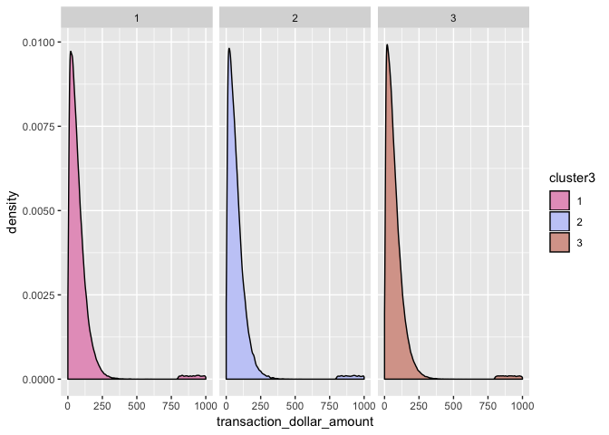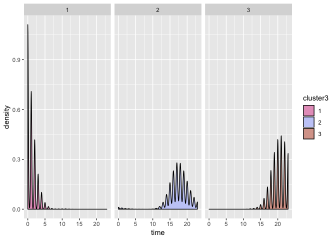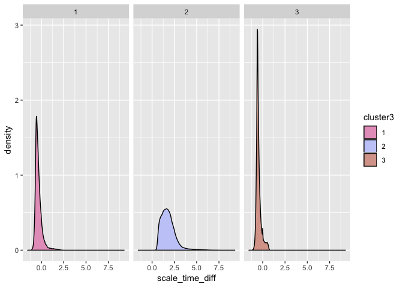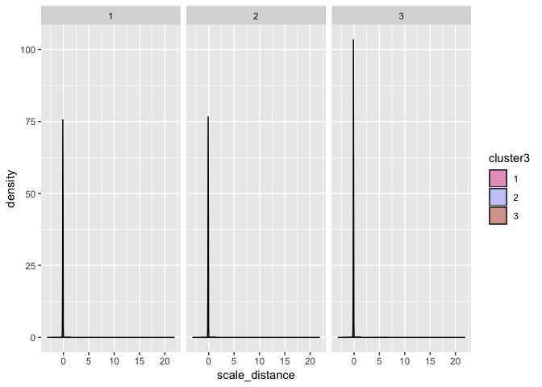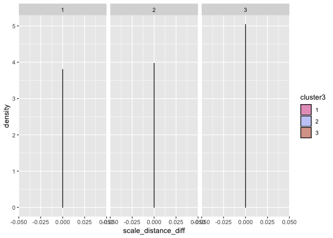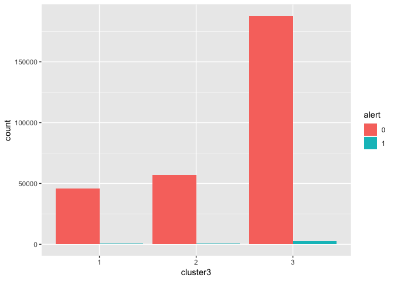

##### Step 4: Build a k-means model (k=4)

    ## 
    ##      1      2      3      4 
    ##  45468  56699 186972   5449

    ##        alert scale_dollar scale_distance  scale_time scale_time_diff
    ## 1 0.01315211   -0.1230463   0.0010107207 -2.16012605   -0.3317673949
    ## 2 0.01395086   -0.1234509  -0.0041223843  0.10325937    1.7949532665
    ## 3 0.01321588   -0.1256888   0.0006505776  0.49442283   -0.4636148144
    ## 4 0.02183887    6.6240578   0.0121379751 -0.01492355   -0.0007829463
    ##   scale_distance_diff
    ## 1                   0
    ## 2                   0
    ## 3                   0
    ## 4                   0

##### Step 5: Visulize/Summarize clusterings

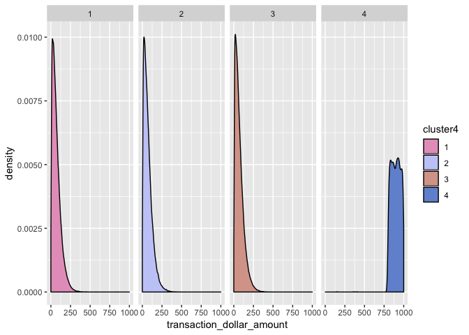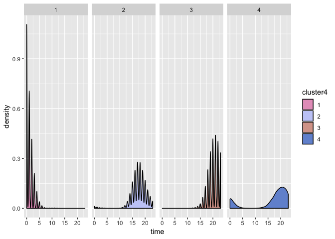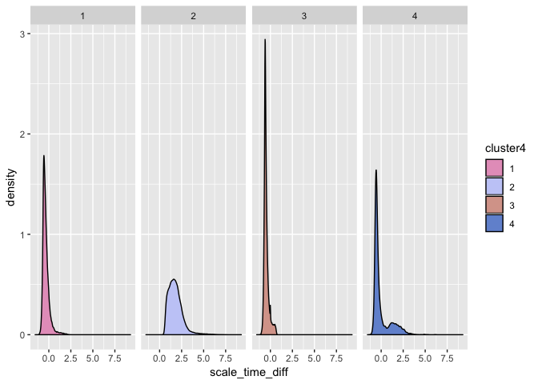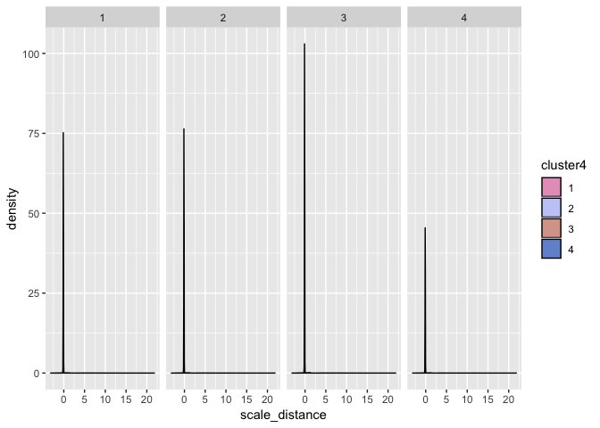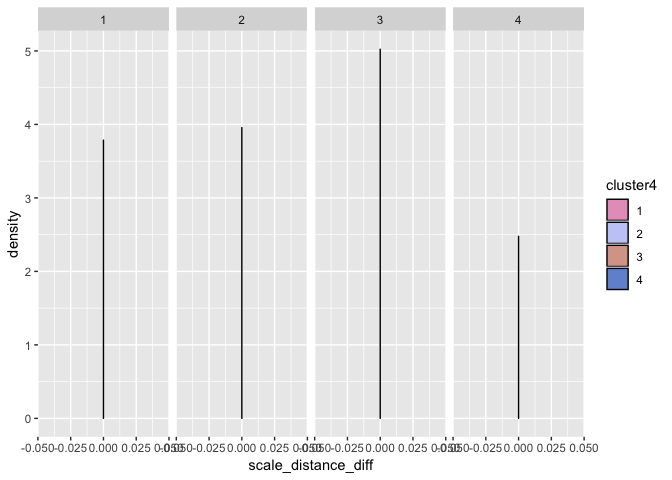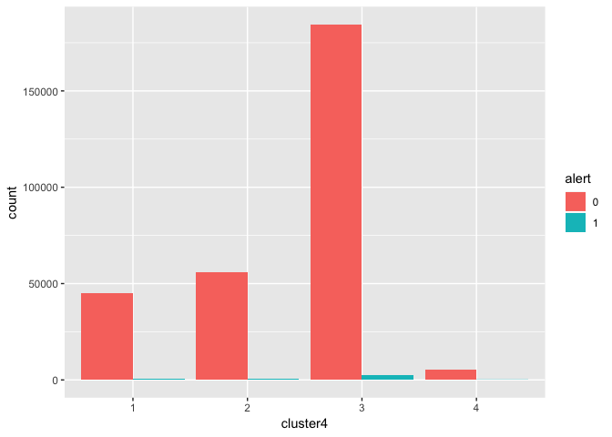

