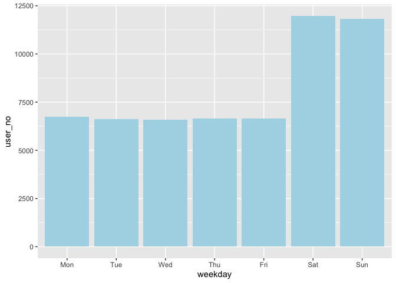

### Company XYZ has started a new referral program on Oct, 31. Each user who refers a new user will get 10$ in credit when the new user buys something.

#### The program has been running for almost a month and the Growth Product Manager wants to know if it's been successful. She is very excited cause, since the referral program started, the company saw a spike in number of users and wants you to be able to give her some data she can show to her boss.

#### (1) Can you estimate the impact the program had on the site?

#### (2) Based on the data, what would you suggest to do as a next step?

#### (3) The referral program wasn't really tested in a rigorous way. It simply started on a given day for all users and you are drawing conclusions by looking at the data before and after the test started. What kinds of risks this approach presents? Can you think of a better way to test the referral program and measure its impact?

### Library needed packages and source codes

### Read in dataset

### Look into dataset

    ## 'data.frame':    97341 obs. of  6 variables:
    ##  $ user_id    : int  2 3 6 7 7 10 17 19 19 19 ...
    ##  $ date       : Factor w/ 56 levels "2015-10-03","2015-10-04",..: 1 1 1 1 1 1 1 1 1 1 ...
    ##  $ country    : Factor w/ 9 levels "CA","CH","DE",..: 5 1 5 8 7 3 8 8 9 5 ...
    ##  $ money_spent: int  65 54 35 73 35 36 25 69 17 29 ...
    ##  $ is_referral: int  0 0 0 0 0 0 0 0 0 0 ...
    ##  $ device_id  : Factor w/ 17887 levels "AAASIUHCEETRZ",..: 3342 15670 1443 10783 10783 2019 11776 5578 5578 5578 ...

    ## 'data.frame':    97341 obs. of  6 variables:
    ##  $ user_id    : Factor w/ 18809 levels "1","2","3","4",..: 2 3 6 7 7 10 17 19 19 19 ...
    ##  $ date       : Date, format: "2015-10-03" "2015-10-03" ...
    ##  $ country    : Factor w/ 9 levels "CA","CH","DE",..: 5 1 5 8 7 3 8 8 9 5 ...
    ##  $ money_spent: int  65 54 35 73 35 36 25 69 17 29 ...
    ##  $ is_referral: int  0 0 0 0 0 0 0 0 0 0 ...
    ##  $ device_id  : Factor w/ 17887 levels "AAASIUHCEETRZ",..: 3342 15670 1443 10783 10783 2019 11776 5578 5578 5578 ...

    ##     user_id           date               country       money_spent    
    ##  1107   :   27   Min.   :2015-10-03   UK     :15493   Min.   : 10.00  
    ##  1532   :   25   1st Qu.:2015-10-17   FR     :15396   1st Qu.: 27.00  
    ##  2236   :   25   Median :2015-10-31   US     :15280   Median : 42.00  
    ##  1168   :   24   Mean   :2015-10-30   IT     :11446   Mean   : 44.69  
    ##  1347   :   24   3rd Qu.:2015-11-14   DE     :11093   3rd Qu.: 59.00  
    ##  1424   :   24   Max.   :2015-11-27   ES     : 9831   Max.   :220.00  
    ##  (Other):97192                        (Other):18802                   
    ##   is_referral             device_id    
    ##  Min.   :0.0000   JOVUEUUQPQVXO:   35  
    ##  1st Qu.:0.0000   XLJODRPXYKPRO:   34  
    ##  Median :0.0000   KRGUOOGZKNQRQ:   33  
    ##  Mean   :0.2878   KQMNMACBAEKPP:   32  
    ##  3rd Qu.:1.0000   NWJQZEWLIUYHW:   30  
    ##  Max.   :1.0000   OMCIHDOOQWZIG:   30  
    ##                   (Other)      :97147

    ##    
    ##     CA CH DE ES FR IT MX UK US
    ##   1  0  0  3  1  1  1  1  1  1
    ##   2  1  0  1  2  3  2  0  3  2
    ##   3  3  0  2  0  2  2  0  3  3
    ##   4  1  0  1  1  2  2  1  1  4
    ##   5  1  0  2  0  1  1  0  0  1
    ##   6  1  1  2  2  2  2  1  0  2

From this step, we have 18, 809 unique user ID but only 17, 887 unique
device ID, suggesting that a couple of users may share one device.
Though they are likely to be family or very close friends, it seems
weird to me, since it is more likely that one person may have multiple
accounts which allowed her easily to have such referral bonus. With
further information such as billing address, shipping address, even
payment information, we may investigate the reasons for the gap between
the number of the user ID and that of the device.

From the distribution of the date, we are also aware that half entries
were collected before the test date while others were after the test
date.

Another potential issue of the data lies in one user may have purchase
history in multiple countries. It could either be an indicator of some
bug in the logging code or be the result of some users are trying to
disguise themselves to take advantage of the referral code. Again, a
better way to get the information of users' locations is the shipping
address or billing address.

**Though we identified above potential issues of the data itself,
without any further information, we can do nothing. Let's just do the
analysis using the given information.**

\#\#\# Analyze the impact of the referral program \#\#\#\# Add a flag in
the referral dataset to indicate if the transaction happened after the
test date (i.e., 2015-10-31 in this case)

`##    Min. 1st Qu.  Median    Mean 3rd Qu.    Max.    ##  0.0000  0.0000  1.0000  0.5603  1.0000  1.0000`

From this step, after starting the new referral program, around 56%
transactions used the promo code.

#### Visualize the impact on the site of the new referral program

##### The number of unique users, money spent, and the revenue overall

We do observe a spike of the user number and the money spent after
launching the referral program; however, it seems that the revenue did
not change meaningfully. This suggests that the revenue per user
decreased, which is worrisome in the long-run. One possible explanation
for this phenomenon is that one person may register multiple accounts to
obtain the referral promotion code.

**For evaluating the effects of the referral program, we propose three
metrics: "daily users", "daily purchase activity", "daily revenue", and
"daily revenue per user".** From the EDA, the total expenditure appears
to have a weekly pattern, suggesting that users were more active on some
specific weekday. Let's investigate such weekly pattern.

##### Daily User

Those users are more active on weekend.

#### Test difference between pre- and post- referral program

##### Overall

While all three metrics we proposed here "daily users", "daily purchase
activity" and "daily money spent" increased after the referral program
launching, those increments were non-significant.

##### Stratified by day-of-week

    ##   weekday pre_user_no post_user_no p_value_user_no pre_activity
    ## 1     Mon     1036.75      1190.25            0.00      1159.75
    ## 2     Tue     1026.50      1168.00            0.01      1152.75
    ## 3     Wed      987.50      1174.75            0.00      1104.00
    ## 4     Thu     1036.25      1190.25            0.00      1148.75
    ## 5     Fri     1014.25      1167.75            0.00      1123.50
    ## 6     Sat     2280.50      2967.75            0.00      3052.00
    ## 7     Sun     2309.50      2950.00            0.00      3094.50
    ##   post_activity p_value_activity pre_spent post_spent p_value_spent
    ## 1       1233.50             0.01  48356.50   57677.00          0.00
    ## 2       1200.50             0.16  49333.00   55473.25          0.01
    ## 3       1209.50             0.01  47302.00   57406.75          0.00
    ## 4       1229.00             0.02  48445.00   57043.25          0.00
    ## 5       1200.50             0.02  48019.75   57138.50          0.00
    ## 6       3219.75             0.01 129109.25  150779.25          0.00
    ## 7       3207.25             0.01 131033.50  150482.75          0.00
    ##   pre_spent_per_user post_spent_per_user p_value_spent_per_user
    ## 1              46.64               48.45                   0.00
    ## 2              48.06               47.51                   0.85
    ## 3              47.89               48.88                   0.10
    ## 4              46.75               47.94                   0.00
    ## 5              47.34               48.93                   0.03
    ## 6              56.62               50.81                   1.00
    ## 7              56.74               51.01                   1.00

When stratified by day-of-week, the increments of the first three
metrics become significant, which is good. This also indicates that the
day-of-week is an effect modifier (this is Simpson's paradox). However,
it should be noticed that the increment of the revenue per user is not
significant (actually, on weekend, the revenue per user decreased after
launching the referral program.)

**In real analysis, we do need to stratify by countries to see the
increments patterns across countries. However, it is not meaningful in
this project since we've found the potential problems with the column
country in EDA. We may conduct the analysis stratified by country after
checking the issue with the engineering group.**

### Answering questions:

#### (1) Can you estimate the impact the program had on the site?

    ##                  pre-mean/day post-mean/day increment p-value
    ## user #                1384.46       1686.96    302.50    0.06
    ## activity #            1690.75       1785.71     94.96    0.35
    ## revenue              71657.00      83714.39  12057.39    0.14
    ## revenue_per_user        50.00         49.07     -0.93    0.85

    ##   weekday pre-mean/day post-mean/day increment p-value
    ## 1     Mon      1036.75       1190.25    153.50    0.00
    ## 2     Tue      1026.50       1168.00    141.50    0.01
    ## 3     Wed       987.50       1174.75    187.25    0.00
    ## 4     Thu      1036.25       1190.25    154.00    0.00
    ## 5     Fri      1014.25       1167.75    153.50    0.00
    ## 6     Sat      2280.50       2967.75    687.25    0.00
    ## 7     Sun      2309.50       2950.00    640.50    0.00

    ##   weekday pre-mean/day post-mean/day increment p-value
    ## 1     Mon      1159.75       1233.50     73.75    0.01
    ## 2     Tue      1152.75       1200.50     47.75    0.16
    ## 3     Wed      1104.00       1209.50    105.50    0.01
    ## 4     Thu      1148.75       1229.00     80.25    0.02
    ## 5     Fri      1123.50       1200.50     77.00    0.02
    ## 6     Sat      3052.00       3219.75    167.75    0.01
    ## 7     Sun      3094.50       3207.25    112.75    0.01

    ##   weekday pre-mean/day post-mean/day increment p-value
    ## 1     Mon     48356.50      57677.00   9320.50    0.00
    ## 2     Tue     49333.00      55473.25   6140.25    0.01
    ## 3     Wed     47302.00      57406.75  10104.75    0.00
    ## 4     Thu     48445.00      57043.25   8598.25    0.00
    ## 5     Fri     48019.75      57138.50   9118.75    0.00
    ## 6     Sat    129109.25     150779.25  21670.00    0.00
    ## 7     Sun    131033.50     150482.75  19449.25    0.00

    ##   weekday pre-mean/day post-mean/day increment p-value
    ## 1     Mon        46.64         48.45      1.81    0.00
    ## 2     Tue        48.06         47.51     -0.55    0.85
    ## 3     Wed        47.89         48.88      0.99    0.10
    ## 4     Thu        46.75         47.94      1.19    0.00
    ## 5     Fri        47.34         48.93      1.59    0.03
    ## 6     Sat        56.62         50.81     -5.81    1.00
    ## 7     Sun        56.74         51.01     -5.73    1.00

#### (2) Based on the data, what would you suggest to do as a next step?

Since we do observe that several users shared one device and that the
number of users increased while the revenue per users decreased. It is
crucial to investigate further to see if evidence of users taking
advantage of the referral program can be uncovered. For example, we may
examine:

-   Whether the users who shared one device have the same shipping
    address/billing address/payment information. If those things are the
    same, the users are likely to be one person.

-   Whether the users who shared one device have a similar browsing
    history, which can be evaluated by Jaccard similarity. If so, it is
    possible that those users are one person.

-   The behavior of new users after launching the referral program such
    as how long they took to get themselves familiar with the website or
    the time interval between the account creation and the first
    purchase. If both were short, then the account is highly suspicious.

And if so, we may reconsider the referral strategy, for example, send
the referral promotion code based on the billing/shipping address or
payment information instead of on the user account.

#### (3) The referral program wasn't really tested in a rigorous way. It simply started on a given day for all users and you are drawing conclusions by looking at the data before and after the test started. What kinds of risks this approach presents? Can you think of a better way to test the referral program and measure its impact?

In this project, we did see the increasing trend after launching the
referral program. However, we don't know such increment was the
"referral effect" or time effect (i.e., things like week-of-year). A
better way is to separate users into two groups, A and B (which should
have similar metrics values and being unrelated), and at a certain time
point, let Group A expose to the referral program and Group B be the
control to see whether the difference exists during the period of
referral programs.
