### We have access to a specific bank loan data. We have data about all loans asked to the bank, whether the bank decided to grant it and, finally, whether the borrower managed to repay it. We also have info about the borrower at the moment she is asking for the loan.

### You have to come up with a better strategy to grant loans. Specifically you should: Build a model which is better than the bank model. For simplicity, assume that:

-   If you grant the loan and the it doesn't get repaid, you lose 1

-   If you grant the loan and the it does get repaid, you gain 1

-   If you don't grant the loan, you gain 0

#### (1) Using the rules above, compare bank profitability vs your model profitability.

#### (2) Describe the impact of the most important variables on the prediction. Also, focus on the variable "is\_employed", which describes whether the borrower is employed when she asks for the loan. How does this variable impact the model? Explain why.

#### (3) Are there any other variables, not in the data provided, that you'd have liked to include in the model?

### Library needed packages and source codes

### Read in dataset

### Look into dataset

#### Check uniqule ID and see which data includes more observations (potentially)

    ## [1] TRUE

    ## [1] TRUE

    ## [1] 0

    ## [1] 0

No duplicate information and two data sets have the same number of
observations, so it's safe to merge two data sets.

#### EDA

    ## 'data.frame':    101100 obs. of  16 variables:
    ##  $ loan_id                                        : int  19454 496811 929493 580653 172419 77085 780070 303138 91475 422392 ...
    ##  $ loan_purpose                                   : Factor w/ 5 levels "business","emergency_funds",..: 4 4 5 5 1 5 1 2 4 1 ...
    ##  $ date                                           : Factor w/ 260 levels "2012-01-02","2012-01-03",..: 54 12 29 128 101 175 53 175 105 214 ...
    ##  $ loan_granted                                   : int  0 0 0 1 1 0 1 1 1 0 ...
    ##  $ loan_repaid                                    : int  NA NA NA 1 0 NA 1 0 1 NA ...
    ##  $ is_first_loan                                  : int  1 1 1 0 1 1 0 0 0 0 ...
    ##  $ fully_repaid_previous_loans                    : int  NA NA NA 1 NA NA 1 0 1 1 ...
    ##  $ currently_repaying_other_loans                 : int  NA NA NA 0 NA NA 0 1 0 1 ...
    ##  $ total_credit_card_limit                        : int  8600 5300 0 5400 2900 3000 7800 4300 3900 1000 ...
    ##  $ avg_percentage_credit_card_limit_used_last_year: num  0.79 0.52 NA 0.52 0.76 0.82 0.3 1.02 0.65 1.09 ...
    ##  $ saving_amount                                  : int  1491 141 660 3345 1050 1028 4206 886 1837 134 ...
    ##  $ checking_amount                                : int  6285 5793 3232 2764 3695 3269 4368 1597 3795 1408 ...
    ##  $ is_employed                                    : int  1 0 1 1 1 0 1 1 1 0 ...
    ##  $ yearly_salary                                  : int  45200 0 26500 15800 34800 0 51100 15000 12000 0 ...
    ##  $ age                                            : int  42 42 60 58 31 45 51 59 24 36 ...
    ##  $ dependent_number                               : int  7 5 4 4 4 3 2 2 1 2 ...

    ##     loan_id                loan_purpose           date      
    ##  Min.   :    30   business       :21707   2012-03-27:  500  
    ##  1st Qu.:250334   emergency_funds:18091   2012-12-25:  488  
    ##  Median :499885   home           :24314   2012-07-31:  487  
    ##  Mean   :499667   investment     :21484   2012-03-06:  478  
    ##  3rd Qu.:749706   other          :15504   2012-01-31:  477  
    ##  Max.   :999987                           2012-07-03:  477  
    ##                                           (Other)   :98193  
    ##   loan_granted     loan_repaid    is_first_loan   
    ##  Min.   :0.0000   Min.   :0.00    Min.   :0.0000  
    ##  1st Qu.:0.0000   1st Qu.:0.00    1st Qu.:0.0000  
    ##  Median :0.0000   Median :1.00    Median :1.0000  
    ##  Mean   :0.4714   Mean   :0.64    Mean   :0.5435  
    ##  3rd Qu.:1.0000   3rd Qu.:1.00    3rd Qu.:1.0000  
    ##  Max.   :1.0000   Max.   :1.00    Max.   :1.0000  
    ##                   NA's   :53446                   
    ##  fully_repaid_previous_loans currently_repaying_other_loans
    ##  Min.   :0.0                 Min.   :0.00                  
    ##  1st Qu.:1.0                 1st Qu.:0.00                  
    ##  Median :1.0                 Median :0.00                  
    ##  Mean   :0.9                 Mean   :0.36                  
    ##  3rd Qu.:1.0                 3rd Qu.:1.00                  
    ##  Max.   :1.0                 Max.   :1.00                  
    ##  NA's   :54947               NA's   :54947                 
    ##  total_credit_card_limit avg_percentage_credit_card_limit_used_last_year
    ##  Min.   :    0           Min.   :0.000                                  
    ##  1st Qu.: 2700           1st Qu.:0.600                                  
    ##  Median : 4100           Median :0.730                                  
    ##  Mean   : 4113           Mean   :0.724                                  
    ##  3rd Qu.: 5500           3rd Qu.:0.860                                  
    ##  Max.   :13500           Max.   :1.090                                  
    ##                          NA's   :6972                                   
    ##  saving_amount   checking_amount  is_employed     yearly_salary  
    ##  Min.   :    0   Min.   :    0   Min.   :0.0000   Min.   :    0  
    ##  1st Qu.:  834   1st Qu.: 1706   1st Qu.:0.0000   1st Qu.:    0  
    ##  Median : 1339   Median : 2673   Median :1.0000   Median :21500  
    ##  Mean   : 1800   Mean   : 3177   Mean   :0.6587   Mean   :21021  
    ##  3rd Qu.: 2409   3rd Qu.: 4241   3rd Qu.:1.0000   3rd Qu.:35300  
    ##  Max.   :10641   Max.   :13906   Max.   :1.0000   Max.   :97200  
    ##                                                                  
    ##       age        dependent_number
    ##  Min.   :18.00   Min.   :0.000   
    ##  1st Qu.:32.00   1st Qu.:2.000   
    ##  Median :41.00   Median :3.000   
    ##  Mean   :41.49   Mean   :3.865   
    ##  3rd Qu.:50.00   3rd Qu.:6.000   
    ##  Max.   :79.00   Max.   :8.000   
    ## 

    ##    
    ##     FALSE  TRUE
    ##   0     0 34508
    ##   1 66579    13

Based on the descriptive statistics, the rate of the loan granted is
47.14%, and the rate of the loan repaid is 64%. Based on the
information, the amount of money gained by this model is 13758. Also,
the variable is\_employed is highly correlated to the variable of
yearly\_salary, we will only keep the variable yearly\_salary in the
following analysis.

#### Create a new outcome flag to indicate if we should grant the loan

Since the project aims to rebuild the loan granted model, a better
outcome variable than the flag "loan\_granted" is the flag of
"loan\_repaid". Accordingly, we first subset data with granted loans and
use the loan\_repaid as our binary outcome.

    ##    Min. 1st Qu.  Median    Mean 3rd Qu.    Max. 
    ##  0.0000  0.0000  1.0000  0.6444  1.0000  1.0000

Based on the output, the loan repaid rate is around 64.44%.

### Visulization

#### Should grant by loan purpose

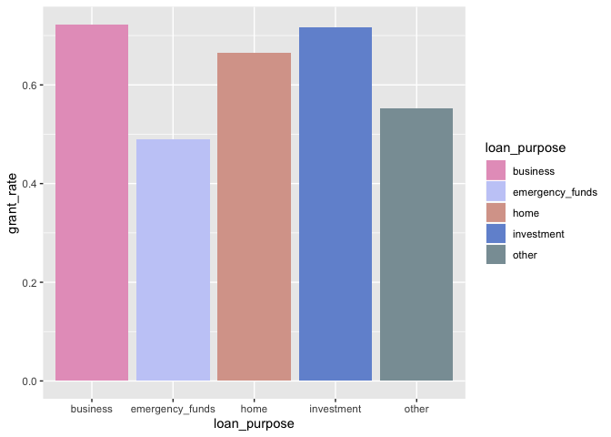

Loans with a purpose of business or investment have relatively high
granted rates.

#### Should grant by date

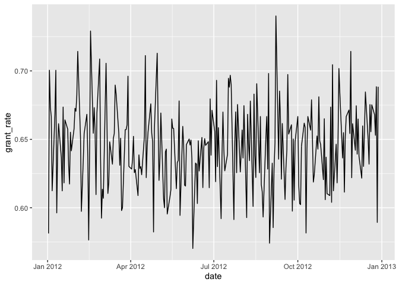

No obvious patterns by date.

#### Should grant by is\_first\_loan

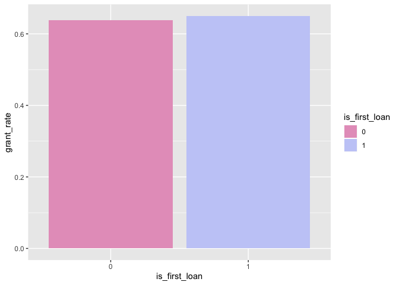

No difference between the first loan or not.

#### Should grant by fully\_repaid\_previous\_loans

    ## Warning: Factor `fully_repaid_previous_loans` contains implicit NA,
    ## consider using `forcats::fct_explicit_na`

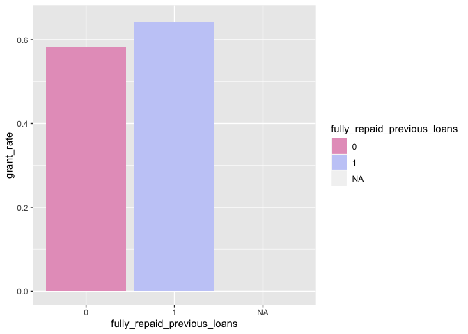

Higher granted rates to the borrowers who have fully repaid the previous
loans, which makes sense.

#### Should grant by currently\_repaying\_other\_loans

    ## Warning: Factor `currently_repaying_other_loans` contains implicit NA,
    ## consider using `forcats::fct_explicit_na`

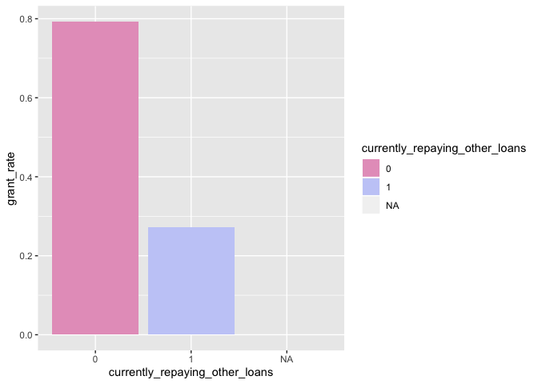

Higher granted rates to the borrowers who are not repaying other loans,
which also makes sense.

#### Should grant by yearly\_salary

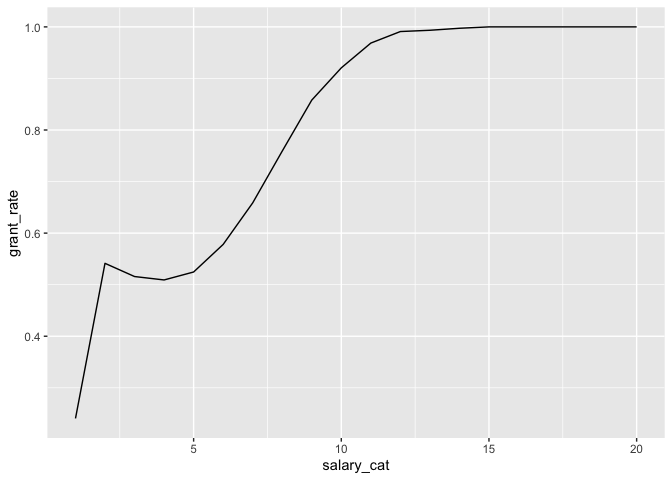

Higher granted rates to the borrowers who have higher yearly salary,
which also makes sense.

#### Should grant by age

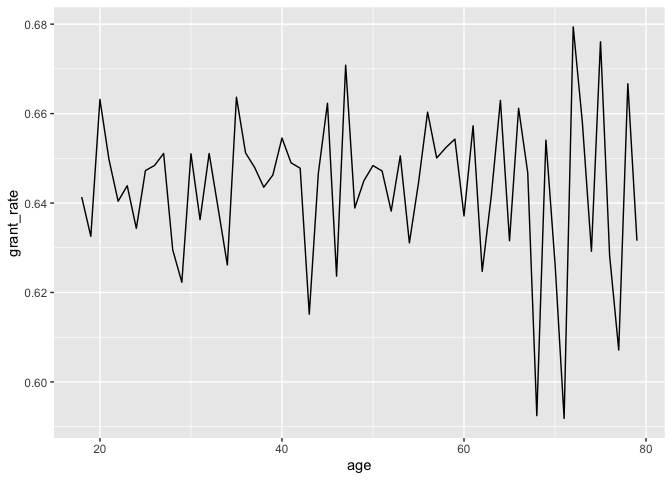

No obvious patterns of the grant rate against age.

#### Should grant by dependent\_number

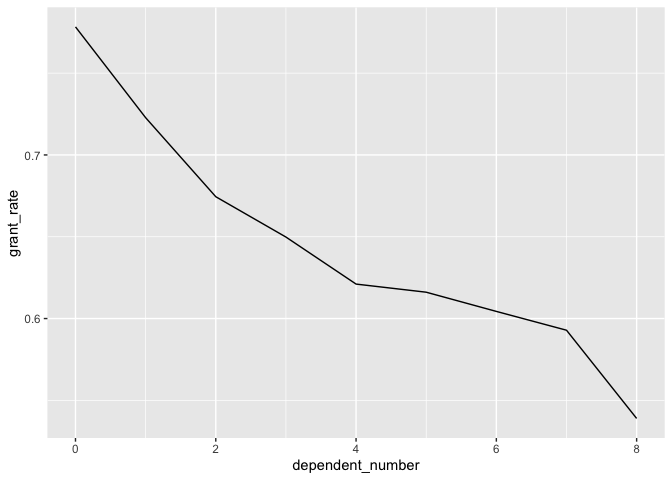

The granted rate decreased with an increasing number of dependents.

#### Should grant by deposit

    ## Warning: Removed 1 rows containing missing values (geom_path).

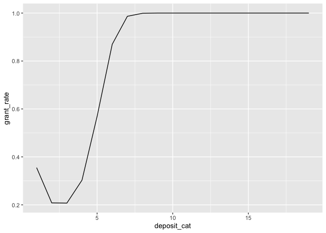

The grant rate increases with an increasing deposit when the total
deposit is less than 75000.

### Build a classifier

#### Address the missing values of the dataset.

The missings of the variables "fully\_repaid\_previous\_loans" and
"currently\_repaying\_other\_loans" are due to the first loans. So we
want to combine the information of "is\_first\_loan" and
"fully\_repaid\_previous\_loans"/"currently\_repaying\_other\_loans" by
adding interactions.

The missings of the variable
"avg\_percentage\_credit\_card\_limit\_used\_last\_year" is due to the
zero "total\_credit\_card\_limit". We may simply imput the missings as
−1.

#### Split data to training and testing.

    ## [1] 4779

#### Build a random forest

For the random forest, we first need to decide the number of the tree as
well as the number of features randomly sampled at each split, both of
which can be done by visualization.
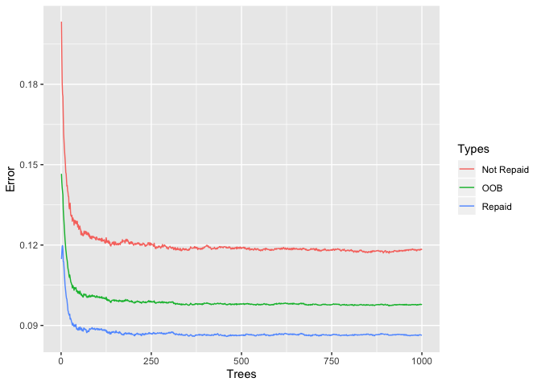

    ## [1] 0.09986964 0.09688086 0.09853423 0.09799370 0.10021939

For this model, the number of 250 trees is good enough to see the OOB
convergence in the graph. We will use 250 to shorten the training time.
The number of features at each split should be 2.

Then we refit the random forest.

    ## 
    ## Call:
    ##  randomForest(x = train_data[, -c(2, 3)], y = train_data$loan_repaid,      xtest = test_data[, -c(2, 3)], ytest = test_data$loan_repaid,      ntree = 250, mtry = 2, keep.forest = T) 
    ##                Type of random forest: classification
    ##                      Number of trees: 250
    ## No. of variables tried at each split: 2
    ## 
    ##         OOB estimate of  error rate: 9.78%
    ## Confusion matrix:
    ##      0     1 class.error
    ## 0 9881  1355  0.12059452
    ## 1 1722 18493  0.08518427
    ##                 Test set error rate: 9.76%
    ## Confusion matrix:
    ##      0    1 class.error
    ## 0 5003  709  0.12412465
    ## 1  872 9619  0.08311886

OOB error and test error are pretty similar: 9.78% and 9.76%, suggesting
that we did not over-fit the model and the accuracy is better than a
random guess 64.44%. **However, the project aims to maximize the the
number of true positive (earn 1$ for each) and minimize the number of
false positive (lose 1$ for each). Accordingly, we need to optimize the
cut-off of probability to maximize the precision.**

#### Optimize the cutoff parameter of the random forest

    ##  [1] 6155 7047 7537 7867 8101 8309 8484 8626 8772 8911 9036 9160 9259 9383
    ## [15] 9482 9573 9624 9701 9751

#### Reconstruct a machine learning model

#### Check variable importance

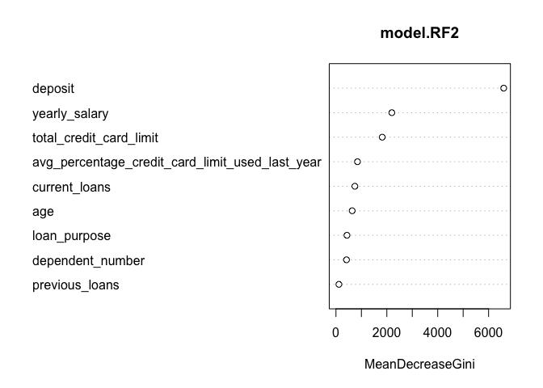

New user is the most important one. Source doesn't seem to matter at
all.

#### Check partial dependence plots for 9 vaiables

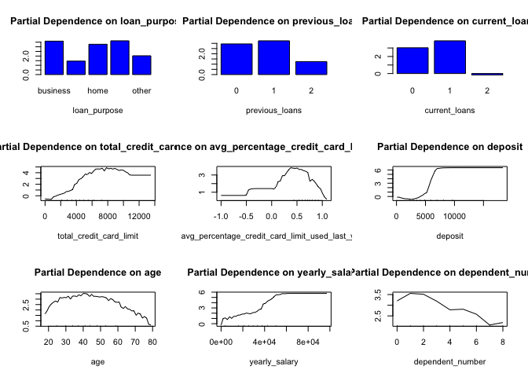

#### (1) Using the rules above, compare bank profitability vs your model profitability.

For the test set, the bank profitability is 4779 while the new model
profitability is 9745.

#### (2) Describe the impact of the most important variables on the prediction. Also, focus on the variable "is\_employed", which describes whether the borrower is employed when she asks for the loan. How does this variable impact the model? Explain why.

Based on the variable importance plot, the most important variables is
total deposit (checking amount + saving amount) and then yearly salary.
We do not inclue the variable "is\_employed" in the predictive model,
since this information has already been included in the yearly\_salary
variable.

#### (3) Are there any other variables, not in the data provided, that you'd have liked to include in the model?

-   The loan amount. It is important since a smaller amount may indicate
    lower risk.

-   The date of the last loan, by adding which we may calculate the time
    difference between consecutive loans. A shorter period may indicate
    a higher risk.

-   Household income. Since we consider the number of dependents of a
    borrower, it's better to include the information of the household
    income rather than personal income.

-   Evaluation of estates, such as a house or apartment. / If it's hard
    to evaluate, at least to have information such as house status
    (self-owned or renting and if renting, how much should be paid for
    rent.)

-   Education level (not necessary, but still better to have). It's not
    a big issue if we cannot have this information from the application
    form since the personal yearly salary is sorts of a proxy of
    education level.
