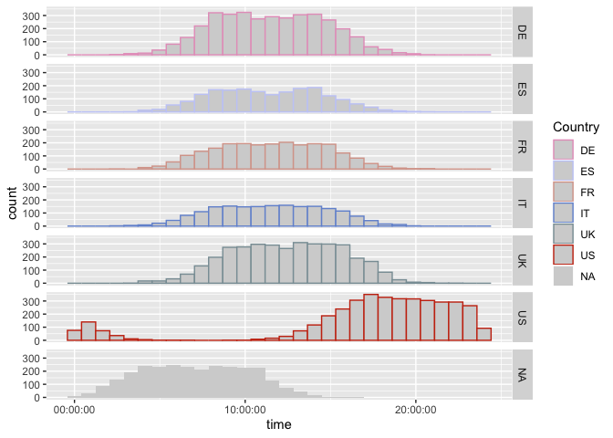
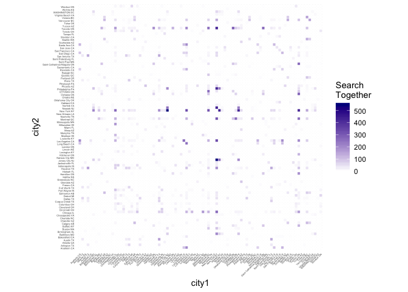

### Company XYZ is an Online Travel Agent, such as Expedia, Booking.com, etc. They store their data in JSON files. Each row in the json shows all different cities which have been searched for by a user within the same session (as well as some other info about the user). That is, if I go to company XYZ site and look for hotels in NY and SF within the same session, the corresponding JSON row will show my user id, some basic info about me and the two cities.

### You are given the following tasks:

#### (1) There was a bug in the code and one country didn't get logged. It just shows up as an empty field (""). Can you guess which country was that? How?

#### (2) For each city, find the most likely city to be also searched for within the same session.

#### (3) Travel sites are browsed by two kinds of users. Users who are actually planning a trip and users who just dream about a vacation. The first ones have obviously a much higher purchasing intent. Users planning a trip often search for cities close to each other, while users who search for cities far away from each other are often just dreaming about a vacation. That is, a user searching for LA, SF and Las Vegas in the same session is much more likely to book a hotel than a user searching for NY, Paris, Kuala Lumpur (makes sense, right?). Based on this idea, come up with an algorithm that clusters sessions into two groups: high intent and low intent. Explain all assumptions you make along the way.

Require needed packages and source codes
----------------------------------------

Read in dataset
---------------

Data Manipulation
-----------------

### Step 1: Separate the users info to three columns

### Step 2: Separate the cities info to multiple columns

    ## Warning: Expected 89 pieces. Missing pieces filled with `NA` in 20022
    ## rows [1, 2, 3, 4, 5, 6, 7, 8, 9, 10, 11, 12, 13, 14, 15, 16, 17, 18, 19,
    ## 20, ...].

    ## Warning: Column `Var2`/`cities` joining factor and character vector,
    ## coercing into character vector

#### (1) There was a bug in the code and one country didn't get logged. It just shows up as an empty field (""). Can you guess which country was that? How?

    ## `stat_bin()` using `bins = 30`. Pick better value with `binwidth`.

**With an assumption that users across countries search online at the
same time interval of local time**, the missing of the country variable
is an Asian country such as Chinese, Japan, and Korea since the lag
between the missing and US is around 12 hours and that between the
missing and European countries is around 5 hours.

#### (2) For each city, find the most likely city to be also searched for within the same session.

##### Step 1: Create the similarity matrix (Here, we define the similarity as the occasions of search together)

##### Step 2: Visulize the similarity matrix

##### Step 3: Write a function to return the most likely city to be searched in the same session

    ## [1] "Incorrect city, try again!"

    ## [1] "New York NY"

    ## [1] "New York NY"

    ## [1] "Jersey City NJ"

#### (3) Travel sites are browsed by two kinds of users. Users who are actually planning a trip and users who just dream about a vacation. The first ones have obviously a much higher purchasing intent. Users planning a trip often search for cities close to each other, while users who search for cities far away from each other are often just dreaming about a vacation. That is, a user searching for LA, SF and Las Vegas in the same session is much more likely to book a hotel than a user searching for NY, Paris, Kuala Lumpur (makes sense, right?). Based on this idea, come up with an algorithm that clusters sessions into two groups: high intent and low intent. Explain all assumptions you make along the way.

There are multiple ways to realize this aim. For example, we may map a
city to a combination of latitude and longitude and then calculate the
Euclidean distance between cities searched with the same session.
Another way is to employ the similarity matrix which was built in
Question 2. The idea is, for those search session with a low intention,
users just input the cities arbitrary and the occurance in that
similarity matrix should be pretty low. For this project, I am going to
use the second approach.

##### Step 1: Obtain the occasions for each session

##### Step 2: Decide the cut-offs: we will use two dimensions, the mean occasion score, and the search length to make clusters.

    ## 
    ##     1     2 
    ##  3701 16321

    ##   mean_intension search_length
    ## 1      309.03046      1.560119
    ## 2       26.82838      1.425280

Based on the output, it is easy to tell sessions in cluster 1 were with
high intention while those in cluster 2 were with low intention.
