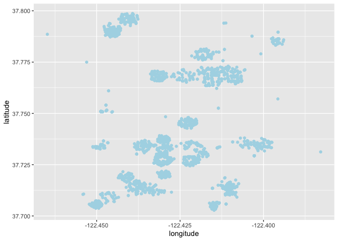
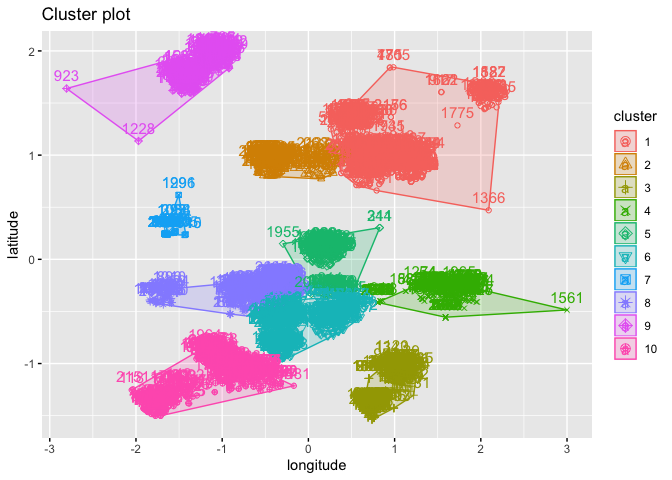
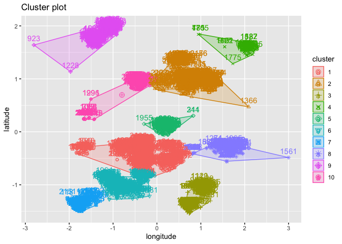
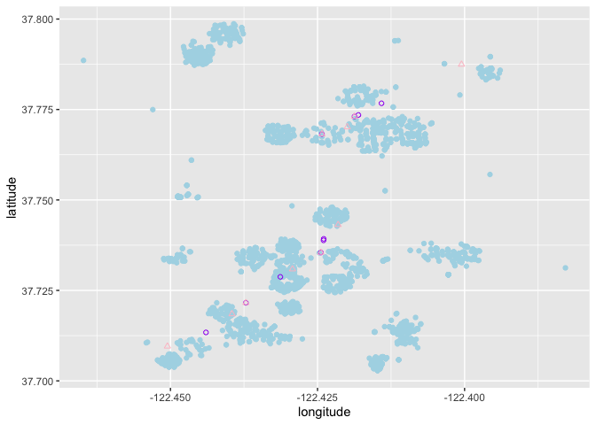

### Company XYZ has decided to offer a shuttle bus to help its employees commute from San Francisco to Mountain View. The city of San Francisco has given the company a list of potential bus stop locations to choose from and asked to not have more than 10 stops within the city.

### You have been given the home address of all employees interested in taking the shuttle and asked to come up with the ten most efficient stops. While you have been given a certain freedom in defining what is "efficient", the general consensus within the company is that the most efficient way to select the bus stops is to minimize the overall walking distance between employee homes and the 􏰀losest bus stop.

### Estimating all possible 10 stop combinations would require a lot of time (how many combinations would that be?). Therefore, your boss is fine with simplifying the problem and returning 10 stops that have a high probability of being the best stops.

Require needed packages and source codes
----------------------------------------

Read in dataset
---------------

Look into dataset
-----------------

    ## [1] TRUE

    ## 'data.frame':    2191 obs. of  2 variables:
    ##  $ address    : Factor w/ 1761 levels " B Mission St, San Francisco, CA 94112, USA",..: 1726 672 427 388 328 621 170 839 10 649 ...
    ##  $ employee_id: int  206 2081 178 50 1863 485 489 1200 336 2015 ...

    ## 'data.frame':    119 obs. of  2 variables:
    ##  $ Street_One: Factor w/ 1 level "MISSION ST": 1 1 1 1 1 1 1 1 1 1 ...
    ##  $ Street_Two: Factor w/ 119 levels "01ST ST","02ND ST",..: 67 83 1 20 59 13 50 38 53 102 ...

    ## [1] 1761

Based on the output, it seems that, for the potential bus stops, one
street has been fixed, we need to decide the other street. Though we
have 2191 employees, we only have 1761 unique addresses. So we are going
to have the longitude and latitude of each individual address and of
potential bus stops.

Obtain longitude and latitude of these locations
------------------------------------------------

### Longitude and latitude of addresses

    unique_add <- as.data.frame(unclass(table(employee$address)))
    address_weights <- data.frame(address = rownames(unique_add),
                                  weights = unique_add$`unclass(table(employee$address))`)
    for (i in 1:nrow(address_weights)){
      loc <- geocode(as.character(address_weights$address[i]), source = "dsk")
      address_weights$longitude[i] <- loc[1]
      address_weights$latitude[i] <- loc[2]
    }
    employee <- employee %>% left_join(address_weights, by = "address")
    employee$longitude <- as.numeric(employee$longitude)
    employee$latitude <- as.numeric(employee$latitude)

### Longitude and latitude of potential bus stops

    for (i in 1:nrow(bus_stop)){
      loc <- geocode(paste0(bus_stop[i, 1], ", ", bus_stop[i, 2], ", ", "CA, USA"),
                     source = "google")
      bus_stop$longitude[i] <- loc[1]
      bus_stop$latitude[i] <- loc[2]
    }
    bus_stop$longitude <- as.numeric(bus_stop$longitude)
    bus_stop$latitude <- as.numeric(bus_stop$latitude)

### Visulize addresses and potential bus stops

    ## [1] -122.4542 -117.1368

    ## [1] 34.10946 37.79323

    ## [1] -122.4648 -122.3829

    ## [1] 37.70287 37.79868

To return 10 stops that have a high probability, we can separate the
employee's addresses to 10 clusters by k-means, then decide the stops by
minimizing the distance between the cluster centroids and the stops.

    ## 
    ##   1   2   3   4   5   6   7   8   9  10 
    ## 494 139 196 136 132 307  45 264 184 294

    ##    longitude latitude
    ## 1  -122.4116 37.77151
    ## 2  -122.4295 37.76804
    ## 3  -122.4125 37.70966
    ## 4  -122.4032 37.73418
    ## 5  -122.4221 37.74324
    ## 6  -122.4266 37.72630
    ## 7  -122.4480 37.75169
    ## 8  -122.4339 37.73495
    ## 9  -122.4435 37.79223
    ## 10 -122.4418 37.71196

Based on the above plots, we noticed that the clusters of employee's
addresses are not well spherical-shaped and that some outliers exist in
the data, suggesting that we need to resort to trimmed k-means or other
cluster analysis with considering uncertainty.

### Method 1. Trimmed K-means

#### Step 1. Obtained centroids of 10 clusters

#### Step 2. For each centroid of the trimmed k-means, select the bus stop with a minimum distance

    ##     Street_One     Street_Two longitude latitude
    ## 77  MISSION ST   LAFAYETTE ST -122.4181 37.77349
    ## 87  MISSION ST        MARY ST -122.4244 37.73548
    ## 105 MISSION ST FLORENTINE AVE -122.4440 37.71339
    ## 67  MISSION ST        14TH ST -122.4243 37.76820
    ## 55  MISSION ST      LASKIE ST -122.4141 37.77671
    ## 85  MISSION ST        12TH ST -122.4187 37.77307
    ## 14  MISSION ST     SILVER AVE -122.4313 37.72875
    ## 3   MISSION ST        01ST ST -122.4239 37.73925
    ## 57  MISSION ST     RUSSIA AVE -122.4372 37.72158
    ## 46  MISSION ST   APPLETON AVE -122.4240 37.73884

### Method 2. Gaussian Mixture model

#### Step 1. Build a Gaussian mixture model with 10 latent classes (minimum BIC)

    possible.Models <- mclust.options("emModelNames")
    model.BIC <- NULL
    for (model in possible.Models){
      temp <- Mclust(employee[, 4:5], G = 10, modelNames = model)
      model.BIC[length(model.BIC) + 1] <- summary(temp)$bic
    }
    loc.GMM10 <- Mclust(employee[, 4:5], G = 10, modelNames =
                          possible.Models[which.min(model.BIC)])
    (loc.GMM10.center <- summary(loc.GMM10)$mean)

    ##                 [,1]       [,2]       [,3]      [,4]       [,5]       [,6]
    ## longitude -122.42950 -122.41388 -122.41257 -122.3975 -122.42263 -122.43614
    ## latitude    37.73142   37.76978   37.70968   37.7859   37.74395   37.71637
    ##                 [,7]       [,8]       [,9]      [,10]
    ## longitude -122.44902 -122.40306 -122.44346 -122.43632
    ## latitude    37.70673   37.73417   37.79226   37.76316

    fviz_cluster(loc.GMM10, data = employee[, 4:5])

#### Step 2. For each centroid of the Gaussian mixture model, select the bus stop with a minimum distance

    ##    Street_One        Street_Two longitude latitude
    ## 18 MISSION ST       TRUMBULL ST -122.4293 37.73089
    ## 6  MISSION ST           13TH ST -122.4199 37.77015
    ## 57 MISSION ST        RUSSIA AVE -122.4372 37.72158
    ## 2  MISSION ST NEW MONTGOMERY ST -122.4005 37.78746
    ## 39 MISSION ST      VIRGINIA AVE -122.4215 37.74314
    ## 1  MISSION ST         ITALY AVE -122.4395 37.71848
    ## 24 MISSION ST         OLIVER ST -122.4505 37.70956
    ## 87 MISSION ST           MARY ST -122.4244 37.73548
    ## 85 MISSION ST           12TH ST -122.4187 37.77307
    ## 67 MISSION ST           14TH ST -122.4243 37.76820

### Visualize bus stops selected by two approaches

From the above plot, we see that some bus stops selected by two
approaches were overlapping. However, I do want to return the 10 bus
stops, which were chosen by the Gaussian mixture model. On the one hand,
this method considers distribution shapes which can handle outliers
relatively better so that we do not need to remove outliers (after all,
we want to decide the stops based on the address information of all
employees). On the other hand, the clustering result of k means highly
relies on the set of the initial status (i.e., sometimes, it just
returns the local optimal, especially for such large number of
clusters).

