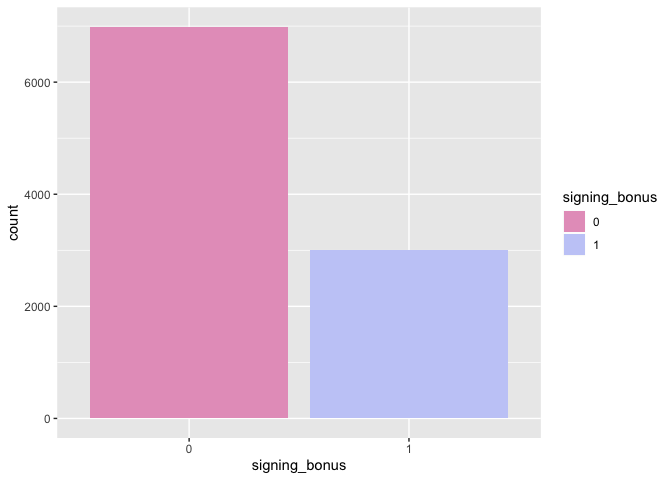
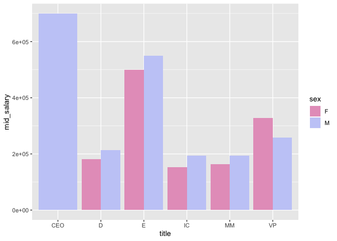

### There has been lots of talking about diversity in the workplace, especially in technology. The Head of HR at your company is very concerned about that and has asked you to analyze internal data about employees and see whether results suggest that the company is treating its employees fairly.

### Specifically, she gave you the following tasks:

#### (1) In the company there are 6 levels (described below). Identify, for each employee, her corresponding level.

-   Individual Contributors (IC): they don't manage anyone

-   Middle Managers (MM): they are the direct bosses of IC

-   Directors (D): they are the direct bosses of MM

-   VP: D direct bosses

-   Executives (E): VP direct bosses

-   CEO: The direct boss of E.

#### (2) How many people each employee manages? You should have a table with employee ids and the number of people managed. Consider that if John directly manages 2 people and these two people manage 5 people each, then we conclude that John manages 12 people.

#### (3) Build a model to predict the salary of each employee. Describe the main factors impacting employee salaries.

#### (4) Do you think the company has been treating its employees fairly? Do you see any bias? What are the next steps you would suggest to the Head of HR?

Require needed packages and source codes
----------------------------------------

Read in dataset
---------------

Look into dataset
-----------------

    ## [1] TRUE

    ## 'data.frame':    10000 obs. of  3 variables:
    ##  $ employee_id: int  46456 104708 120853 142630 72711 61704 153072 58903 166034 54819 ...
    ##  $ boss_id    : int  175361 29733 41991 171266 198240 53109 67178 150290 116750 182038 ...
    ##  $ dept       : Factor w/ 5 levels "CEO","engineering",..: 5 3 5 3 5 5 3 3 2 5 ...

    ## 'data.frame':    10000 obs. of  6 variables:
    ##  $ employee_id   : int  138719 3192 114657 29039 118607 91334 101901 171111 23443 24195 ...
    ##  $ signing_bonus : int  0 0 0 0 0 0 1 1 1 0 ...
    ##  $ salary        : num  273000 301000 261000 86000 126000 221000 194000 119000 217000 230000 ...
    ##  $ degree_level  : Factor w/ 4 levels "Bachelor","High_School",..: 3 1 3 2 1 4 4 3 4 3 ...
    ##  $ sex           : Factor w/ 2 levels "F","M": 2 1 1 1 1 1 2 1 2 2 ...
    ##  $ yrs_experience: int  2 1 2 4 3 2 12 1 8 4 ...

    ## [1] 0

    ## [1] 0

    ##   employee_id     signing_bonus        salary            degree_level 
    ##  Min.   :    40   Min.   :0.0000   Min.   : 60000   Bachelor   :2735  
    ##  1st Qu.: 50574   1st Qu.:0.0000   1st Qu.:110000   High_School:1657  
    ##  Median : 99244   Median :0.0000   Median :182000   Master     :2786  
    ##  Mean   :100002   Mean   :0.3014   Mean   :189112   PhD        :2822  
    ##  3rd Qu.:149748   3rd Qu.:1.0000   3rd Qu.:255000                     
    ##  Max.   :199956   Max.   :1.0000   Max.   :700000                     
    ##                                                                       
    ##  sex      yrs_experience      boss_id                dept     
    ##  F:3561   Min.   : 1.000   Min.   :    79   CEO        :   1  
    ##  M:6439   1st Qu.: 2.000   1st Qu.: 55883   engineering:2696  
    ##           Median : 3.000   Median :102712   HR         :1694  
    ##           Mean   : 3.875   Mean   :103300   marketing  :2010  
    ##           3rd Qu.: 5.000   3rd Qu.:152288   sales      :3599  
    ##           Max.   :34.000   Max.   :199950                     
    ##                            NA's   :1

From this step, we noticed that **one missing** exists in the "boss\_id"
variable, which corresponds to the CEO.

Create company hierarchical structure
-------------------------------------

Create data structure for the company structure and calculate the number of manages
-----------------------------------------------------------------------------------

Output the number of manages of each ID
---------------------------------------

Visualize salary by potential factors
-------------------------------------

For the salary, we'll use the median value since that variable is
usually right-skewed.

### By title

### By degree

### By department

### By signing bonus

### By sex

### By number of manages

### By years of experience

Answer questions
----------------

### (1) Generate titles for each employee.

    ## title
    ##  CEO    E   VP    D   MM   IC 
    ##    1    4   35  160  800 9000

### (2) How many people each employee manages?

    ##      employee_id manages title
    ## 2428       61554    9999   CEO
    ## 1010      110464    2009     E
    ## 1311       11277    3598     E
    ## 2779       51535    2695     E
    ## 9641       93708    1693     E
    ## 53         79693     290    VP
    ## 453        74062     308    VP
    ## 674        97647     265    VP
    ## 874       133795     179    VP
    ## 1057       84011     553    VP
    ## 1113       40920     259    VP
    ## 1232      162476     286    VP
    ## 1252      152500     183    VP
    ## 2041       96752     176    VP
    ## 2219      107658     236    VP
    ## 2465       71889     389    VP
    ## 2526       26053     327    VP
    ## 2955      176424     206    VP
    ## 3000      190801     290    VP
    ## 3039      109804     344    VP

Build a predictive model
------------------------

#### Split data to training and testing.

#### Build a random forest

For the random forest, we first need to decide the number of the tree as
well as the number of features randomly sampled at each split, both of
which can be done by visualization.

    ## [1] 0.2605244 0.3287677 0.3222491 0.3104625 0.2990741

For this model, the number of 300 trees is good enough to see the
proportion of explained variance convergence in the graph. We will use
300 to shorten the training time. The number of features at each split
should be 2.

Then we refit the random forest.

    ## 
    ## Call:
    ##  randomForest(x = train_data[, -c(1, 3)], y = train_data$salary,      xtest = test_data[, -c(1, 3)], ytest = test_data$salary,      ntree = 500, mtry = 2, keep.forest = T) 
    ##                Type of random forest: regression
    ##                      Number of trees: 500
    ## No. of variables tried at each split: 2
    ## 
    ##           Mean of squared residuals: 5324705769
    ##                     % Var explained: 32.89
    ##                        Test set MSE: 5161596394
    ##                     % Var explained: 34.42

The proportion of explained variance of the training set and the test
set are 32.89% and 34.53%, respectively. We do not have overfitting
issue.

### Check variable importance

Definitely the most important factor is the department since we do have
an outlier, CEO. Remove this observation and refit the model.

    ## 
    ## Call:
    ##  randomForest(x = train_data[, -c(1, 3)], y = train_data$salary,      xtest = test_data[, -c(1, 3)], ytest = test_data$salary,      ntree = 500, mtry = 2, keep.forest = T) 
    ##                Type of random forest: regression
    ##                      Number of trees: 500
    ## No. of variables tried at each split: 2
    ## 
    ##           Mean of squared residuals: 5286344251
    ##                     % Var explained: 32.78
    ##                        Test set MSE: 5163563334
    ##                     % Var explained: 34.96

### Recheck variable importance

### Build a simple decision tree and check the 2 or 3 most important segaments

    ## n= 6599 
    ## 
    ## node), split, n, deviance, yval
    ##       * denotes terminal node
    ## 
    ## 1) root 6599 5.189743e+13 189773.80  
    ##   2) dept=HR 1096 7.682317e+11  85160.58 *
    ##   3) dept=engineering,marketing,sales 5503 3.674578e+13 210608.90  
    ##     6) dept=marketing,sales 3708 2.028442e+13 195001.60 *
    ##     7) dept=engineering 1795 1.369231e+13 242849.60 *

The tree splits at the department first, which aligns the result of the
variable importance of random forest. The second important feature is
the year of experience, which makes sense since more extended experience
deserves more salary. Also, we observed that the title and
signing\_bonus are not meaningful features in the model, which is also
reasonable since the random forest has been split on the years of
experience and the number of manages, there is not much left information
in the signing bonus and title.

### Do you think the company has been treating its employees fairly?

We do observed that the variable sex does affect salary, let's further
investigate the interaction between sex and other variables, such as
department, the number of manages, etc.

### By the interaction of title and sex

In general, at each title level, the male median salary is higher than
the female median salary, so is the count.

### By degree and sex

In general, at each education level, the male median salary is higher
than the female median salary, so is the count.

### By department and sex

Female employees outnumber male employees in HR and sales department.
And the median salary of male employees and female employees are the
same.

### By signing bonus and sex

The signing\_bonus rate among the male employees is relatively high than
that among female employees.

Based on the above plots, I would say the bias may exist. Possible next
steps may include:

-   Hiring more females employees, especially those in the Engineering
    department;

-   Make sure employee salaries are comparable if they are in the same
    department/with the same degree/with the same title.

