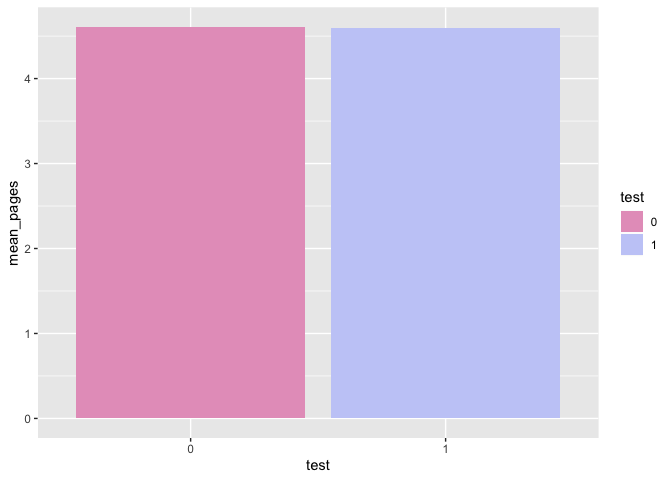
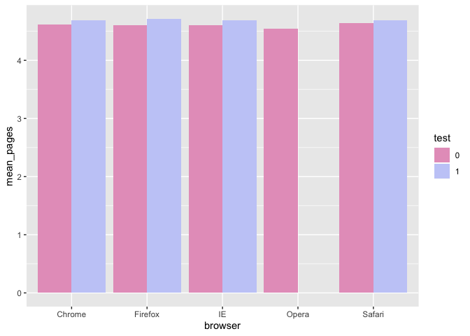
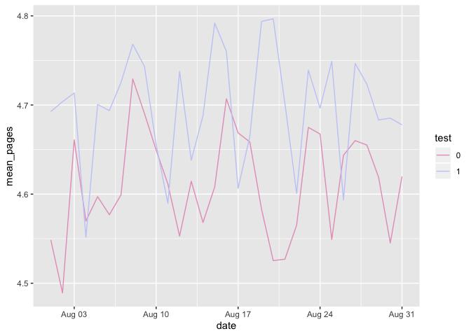

### The company of this exercise is a social network. They decided to add a feature called: Recommended Friends, i.e. they suggest people you may know.

### A data scientist has built a model to suggest 5 people to each user. These potential friends will be shown on the user newsfeed. At first, the model is tested just on a random subset of users to see how it performs compared to the newsfeed without the new feature.

### The test has been running for some time and your boss asks you to check the results. You are asked to check, for each user, the number of pages visited during their first session since the test started. If this number increased, the test is a success. Specifically, your boss wants to know:

#### (1) Is the test winning? That is, should 100% of the users see the Recommended Friends feature?

#### (2) Is the test performing similarly for all user segments or are there differences among different segments?

#### (3) If you identified segments that responded differently to the test, can you guess the reason? Would this change your point 1 conclusions?

Require needed packages and source codes
----------------------------------------

Read in dataset
---------------

Look into data
--------------

    ## [1] TRUE

    ## [1] TRUE

    ## [1] 0

    ## [1] 0

    ## 'data.frame':    100000 obs. of  2 variables:
    ##  $ user_id    : int  34 59 178 285 383 397 488 608 656 771 ...
    ##  $ signup_date: Factor w/ 243 levels "2015-01-01","2015-01-02",..: 1 1 1 1 1 1 1 1 1 1 ...

    ##     user_id         signup_date        
    ##  Min.   :     34   Min.   :2015-01-01  
    ##  1st Qu.:2271007   1st Qu.:2015-03-08  
    ##  Median :4519576   Median :2015-05-14  
    ##  Mean   :4511960   Mean   :2015-05-11  
    ##  3rd Qu.:6764484   3rd Qu.:2015-07-18  
    ##  Max.   :8999849   Max.   :2015-08-31

    ## 'data.frame':    100000 obs. of  5 variables:
    ##  $ user_id      : int  600597 4410028 6004777 5990330 3622310 1806423 5177398 2494813 6377383 1462493 ...
    ##  $ date         : Factor w/ 31 levels "2015-08-01","2015-08-02",..: 13 26 17 27 7 28 14 19 20 10 ...
    ##  $ browser      : Factor w/ 5 levels "Chrome","Firefox",..: 3 1 1 5 2 3 1 1 1 2 ...
    ##  $ test         : int  0 1 0 0 0 0 1 0 1 1 ...
    ##  $ pages_visited: int  2 5 8 8 1 5 5 10 1 7 ...

    ##     user_id             date               browser           test       
    ##  Min.   :     34   Min.   :2015-08-01   Chrome :43427   Min.   :0.0000  
    ##  1st Qu.:2271007   1st Qu.:2015-08-08   Firefox:21758   1st Qu.:0.0000  
    ##  Median :4519576   Median :2015-08-16   IE     :21880   Median :1.0000  
    ##  Mean   :4511960   Mean   :2015-08-16   Opera  : 2127   Mean   :0.5015  
    ##  3rd Qu.:6764484   3rd Qu.:2015-08-24   Safari :10808   3rd Qu.:1.0000  
    ##  Max.   :8999849   Max.   :2015-08-31                   Max.   :1.0000  
    ##  pages_visited   
    ##  Min.   : 0.000  
    ##  1st Qu.: 3.000  
    ##  Median : 5.000  
    ##  Mean   : 4.604  
    ##  3rd Qu.: 6.000  
    ##  Max.   :17.000

The data looks good and we see that half users were enrolled in the test
group.

Visulization
------------

### Page visits by test/control group overall

    ## # A tibble: 2 x 2
    ##   test  mean_pages
    ##   <fct>      <dbl>
    ## 1 0           4.61
    ## 2 1           4.60

Overall, the number of page visits of the test group was not better than
that of the control group.

### Page visits by test/control group by brower

    ## # A tibble: 10 x 3
    ## # Groups:   test [2]
    ##    test  browser mean_pages
    ##    <fct> <fct>        <dbl>
    ##  1 0     Chrome        4.61
    ##  2 0     Firefox       4.60
    ##  3 0     IE            4.60
    ##  4 0     Opera         4.55
    ##  5 0     Safari        4.64
    ##  6 1     Chrome        4.69
    ##  7 1     Firefox       4.71
    ##  8 1     IE            4.69
    ##  9 1     Opera         0   
    ## 10 1     Safari        4.69

We noticed that the mean of the page visits using the Opera browser in
the test group is 0, suggesting that it was problematic when visiting
the website with new features through the Opera browser. On the one
hand, we need to communicate with the engineering team to see if bugs
exist. On the other hand, we do not want to include users who used the
Opera browser for further analysis.

### Page visits by test/control group by date

    ## # A tibble: 62 x 3
    ## # Groups:   test [2]
    ##    test  date       mean_pages
    ##    <fct> <date>          <dbl>
    ##  1 0     2015-08-01       4.55
    ##  2 0     2015-08-02       4.49
    ##  3 0     2015-08-03       4.66
    ##  4 0     2015-08-04       4.57
    ##  5 0     2015-08-05       4.60
    ##  6 0     2015-08-06       4.58
    ##  7 0     2015-08-07       4.60
    ##  8 0     2015-08-08       4.73
    ##  9 0     2015-08-09       4.69
    ## 10 0     2015-08-10       4.65
    ## # … with 52 more rows

After removing users who used the Opera browser, the number of page
visits in the test group is higher than that in the control group.

### Compare the number of page visits of two groups overall and stratified by the browser for the whole data set and the data with removing users who used the Opera browser.

    ##   visits_in_control visits_in_test   p_value
    ## 1          4.608394       4.599693 0.5774523

    ## # A tibble: 5 x 4
    ##   browser visits_in_control visits_in_test  p_value
    ##   <fct>               <dbl>          <dbl>    <dbl>
    ## 1 Chrome               4.61           4.69 0.000472
    ## 2 Firefox              4.60           4.71 0.000291
    ## 3 IE                   4.60           4.69 0.00391 
    ## 4 Opera                4.55           0    1       
    ## 5 Safari               4.64           4.69 0.121

    ##   visits_in_control visits_in_test      p_value
    ## 1          4.608394       4.599693 4.403954e-08

    ## # A tibble: 4 x 4
    ##   browser visits_in_control visits_in_test  p_value
    ##   <fct>               <dbl>          <dbl>    <dbl>
    ## 1 Chrome               4.61           4.69 0.000472
    ## 2 Firefox              4.60           4.71 0.000291
    ## 3 IE                   4.60           4.69 0.00391 
    ## 4 Safari               4.64           4.69 0.121

Answer questions:
-----------------

### (1) Is the test winning? That is, should 100% of the users see the Recommended Friends feature?

    ##   visits_in_control visits_in_test   p_value
    ## 1          4.608394       4.599693 0.5774523

The test group won't win since the overall comparison did not provide
evidence suggesting that the mean of the page visits was greater than
that in the control group.

### (2) Is the test performing similarly for all user segments or are there differences among different segments?

    ## # A tibble: 5 x 4
    ##   browser visits_in_control visits_in_test  p_value
    ##   <fct>               <dbl>          <dbl>    <dbl>
    ## 1 Chrome               4.61           4.69 0.000472
    ## 2 Firefox              4.60           4.71 0.000291
    ## 3 IE                   4.60           4.69 0.00391 
    ## 4 Opera                4.55           0    1       
    ## 5 Safari               4.64           4.69 0.121

We then stratified the test by browser type and found that the mean of
the number of visits of users who were using Opera browser was 0,
suggesting that some issues, such as logging bugs may exist. The test
group wins among users using Chrome, Firefox, and IE, but loses among
users who used Safari.

### (3) If you identified segments that responded differently to the test, can you guess the reason? Would this change your point 1 conclusions?

    ##    Min. 1st Qu.  Median    Mean 3rd Qu.    Max. 
    ##  0.0000  0.0000  0.0000  0.1951  0.0000  1.0000

    ## 
    ##  Welch Two Sample t-test
    ## 
    ## data:  pages_visited by test
    ## t = 3.1407, df = 19509, p-value = 0.001688
    ## alternative hypothesis: true difference in means is not equal to 0
    ## 95 percent confidence interval:
    ##  0.04569657 0.19743008
    ## sample estimates:
    ## mean in group 0 mean in group 1 
    ##        4.630048        4.508485

The visits of new users among test group is worse than control group,
suggesting the novelty effect may exist.
