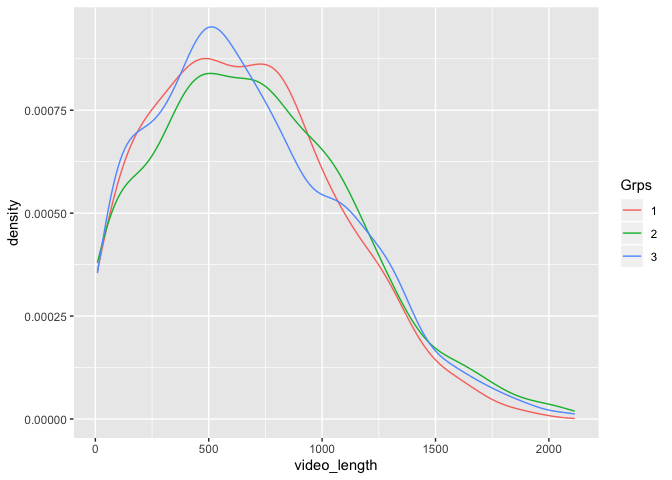
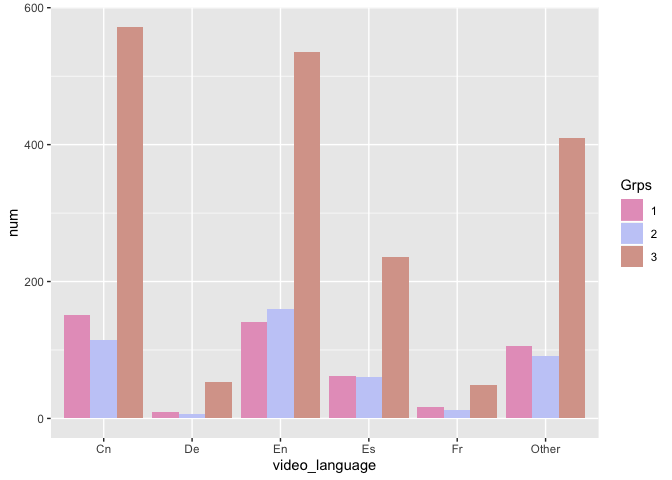
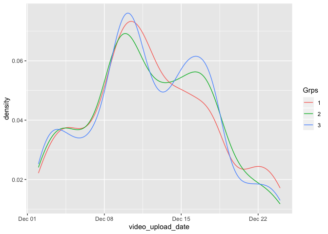
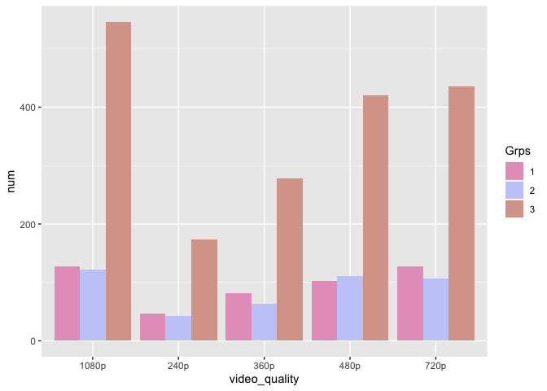
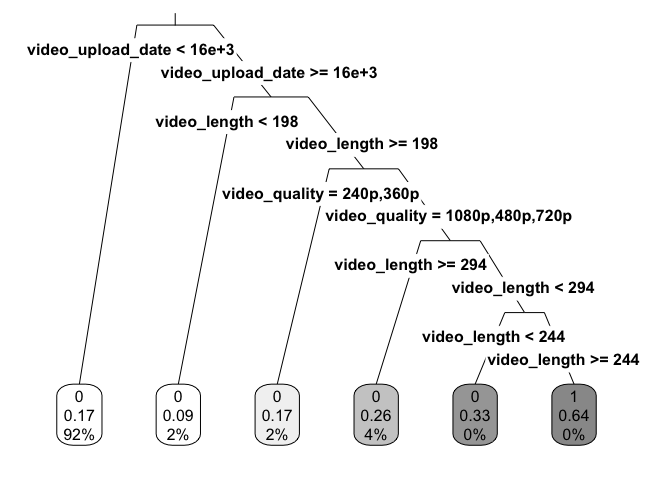

### Company XYZ is an online video streaming company, just like YouTube or Dailymotion. The Head of Product has identified as a major problem for the site a very high home page drop-off rate. That is, users come to the home-page and then leave the site without taking any action or watching any video. Since customer acquisition costs are very high, this is a huge problem: the company is spending a lot of money to acquire users who don't generate any revenue. Currently, the videos shown on the home page to new users are manually chosen. The Head of Product had this idea of creating a new recommended video section on the home page.

### He asked you the following:

#### (1) Classify each video into one the 3 categories below and explain your approach

-   "Hot": means trending up. These videos are candidate to be shown.

-   "Stable and Popular": video view counts are flat, but very high.
    These videos are candidates to be shown too.

-   "Everything else": these videos won't be shown.

#### (2) What are the main characteristics of the "hot videos"? After having identified the characteristics of the hot videos, how would you use this information from a product standpoint?

Require needed packages and source codes
----------------------------------------

Read in dataset
---------------

Look into data
--------------

    ## [1] FALSE

    ## [1] TRUE

    ## [1] 0

    ## [1] 0

    ## 'data.frame':    41775 obs. of  3 variables:
    ##  $ video_id: int  2303 1193 1219 1472 2947 1417 1564 2962 2057 1785 ...
    ##  $ count   : int  22 54854 1788779 234 14407 973996 42 278000 1134427 1059824 ...
    ##  $ date    : Factor w/ 15 levels "2015-01-01","2015-01-02",..: 7 12 3 4 8 14 9 3 5 9 ...

    ## 'data.frame':    2785 obs. of  5 variables:
    ##  $ video_id         : int  2374 1897 2386 2912 2432 2385 2104 1142 460 2484 ...
    ##  $ video_length     : int  1760 489 1273 986 1050 377 380 988 1226 1145 ...
    ##  $ video_language   : Factor w/ 6 levels "Cn","De","En",..: 1 1 4 4 6 1 3 6 6 6 ...
    ##  $ video_upload_date: Factor w/ 23 levels "2014-12-02","2014-12-03",..: 5 9 4 9 9 11 15 9 2 1 ...
    ##  $ video_quality    : Factor w/ 5 levels "1080p","240p",..: 4 5 4 2 4 3 5 3 3 1 ...

    ##     video_id        count              date           
    ##  Min.   :   1   Min.   :      1   Min.   :2015-01-01  
    ##  1st Qu.: 754   1st Qu.:   9096   1st Qu.:2015-01-04  
    ##  Median :1492   Median : 179558   Median :2015-01-08  
    ##  Mean   :1499   Mean   : 624371   Mean   :2015-01-08  
    ##  3rd Qu.:2236   3rd Qu.: 904362   3rd Qu.:2015-01-12  
    ##  Max.   :3000   Max.   :6070570   Max.   :2015-01-15

    ##     video_id     video_length    video_language video_upload_date   
    ##  Min.   :   1   Min.   :   9.0   Cn   :838      Min.   :2014-12-02  
    ##  1st Qu.: 754   1st Qu.: 363.0   De   : 69      1st Qu.:2014-12-09  
    ##  Median :1492   Median : 631.0   En   :836      Median :2014-12-12  
    ##  Mean   :1499   Mean   : 684.8   Es   :358      Mean   :2014-12-12  
    ##  3rd Qu.:2236   3rd Qu.: 973.0   Fr   : 78      3rd Qu.:2014-12-16  
    ##  Max.   :3000   Max.   :2114.0   Other:606      Max.   :2014-12-24  
    ##  video_quality
    ##  1080p:796    
    ##  240p :262    
    ##  360p :423    
    ##  480p :635    
    ##  720p :669    
    ## 

Create features for clustering: (1) baseline; (2) week-over-week ratios
-----------------------------------------------------------------------

K-means with 3, 4, 5, and 6 clusters to identify the required classes
---------------------------------------------------------------------

    ##   baseline  ratio
    ## 1   -0.836 12.275
    ## 2    1.473  0.833
    ## 3   -0.446  0.872

    ##   baseline  ratio
    ## 1   -0.836 17.696
    ## 2   -0.424  0.728
    ## 3    1.498  0.845
    ## 4   -0.836  9.111

    ##   baseline  ratio
    ## 1   -0.609  0.765
    ## 2    0.471  0.653
    ## 3   -0.836 17.696
    ## 4    1.863  0.908
    ## 5   -0.836  9.111

    ##   baseline  ratio
    ## 1   -0.836  7.873
    ## 2    0.511  0.663
    ## 3   -0.836 21.235
    ## 4   -0.836 13.331
    ## 5    1.887  0.915
    ## 6   -0.597  0.722

Based on the about result, I decide the three classes:

-   "Hot": the first, third, and fourth cluster of k-means with *k* = 6
    which has positive week-over-week ratios;

-   "Stable and Popular": the fifth cluster of k-means with *k* = 6
    which has the highest (normalized) baseline and around 1
    week-over-week ratios;

-   "Everything else": the other two clusters of k-means with *k* = 6.

<!-- -->

    ## 
    ##    1    2    3 
    ##  486  445 1854

Identify features of hot vedios
-------------------------------

### Distribution of video length by cluster

### Distribution of vedio language by cluster

### Distribution of upload date by cluster

### Distribution of vedio quality by cluster

### Simple tree

Based on the splits and segments of the tree, the feature of hot vedio
is that its length lies between 4 and 5 minutes (244 seconds and 294
seconds).

