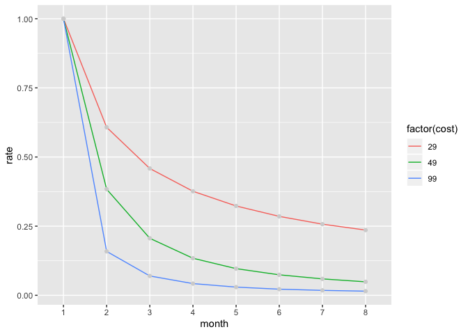
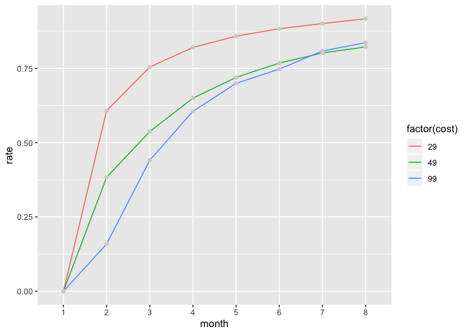
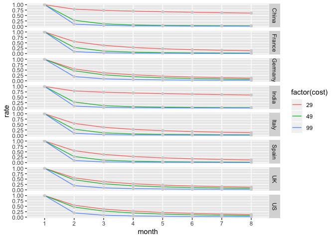
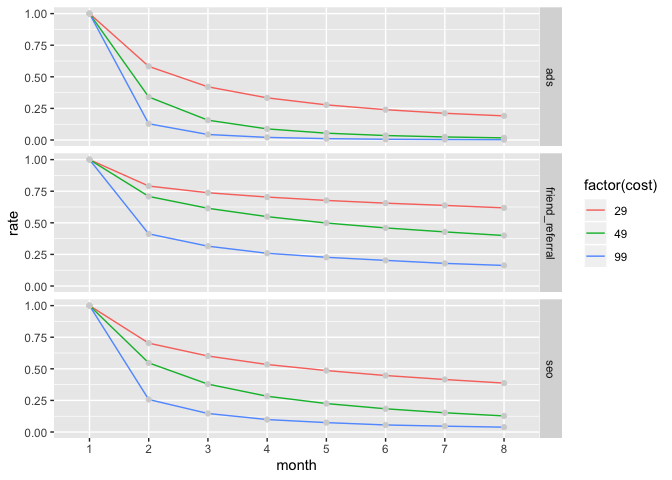
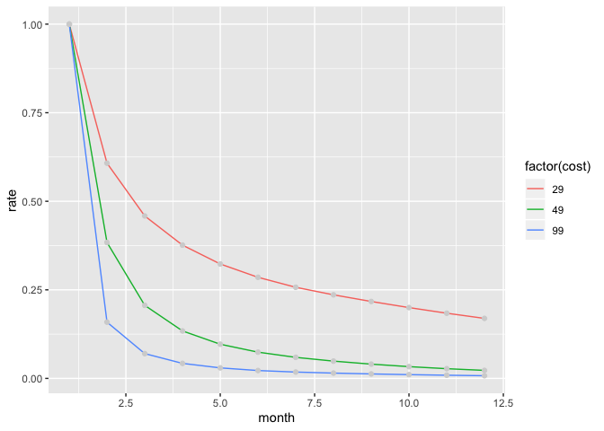

### Company XYZ started a subscription model in January, 2015. You get hired as a first data scientist at the end of August and, as a first task, you are asked to help executives understand how the subscription model is doing. Therefore, you decide to pull data from all the users who subscribed in January and see, for each month, how many of them unsubscribed. In particular, your boss is interested in:

#### (1) A model that predicts monthly retention rate for the different subscription price points

#### (2) Based on your model, for each price point, what percentage of users is still subscribed after at least 12 months?

#### (3) How do user country and source affect subscription retention rate? How would you use these findings to improve the company revenue?

Require needed packages and source codes
----------------------------------------

Read in dataset
---------------

Look into dataset
-----------------

    ## [1] TRUE

    ## 'data.frame':    500000 obs. of  7 variables:
    ##  $ user_id                  : int  1459 12474 12294 3878 9567 790 12214 7341 1026 11647 ...
    ##  $ subscription_signup_date : Factor w/ 1 level "January, 2015": 1 1 1 1 1 1 1 1 1 1 ...
    ##  $ subscription_monthly_cost: int  29 49 49 49 49 49 49 29 99 49 ...
    ##  $ country                  : Factor w/ 8 levels "China","France",..: 6 2 3 1 7 8 2 8 6 8 ...
    ##  $ source                   : Factor w/ 3 levels "ads","friend_referral",..: 1 1 1 1 1 1 1 1 1 1 ...
    ##  $ billing_cycles           : int  4 5 2 1 5 3 1 8 1 3 ...
    ##  $ is_active                : int  0 0 0 0 0 0 0 1 0 0 ...

    ##     user_id        subscription_signup_date subscription_monthly_cost
    ##  Min.   :     1   January, 2015:500000      Min.   :29.00            
    ##  1st Qu.:125001                             1st Qu.:29.00            
    ##  Median :250000                             Median :49.00            
    ##  Mean   :250000                             Mean   :48.47            
    ##  3rd Qu.:375000                             3rd Qu.:49.00            
    ##  Max.   :500000                             Max.   :99.00            
    ##                                                                      
    ##     country                  source       billing_cycles    is_active  
    ##  US     :91731   ads            :414469   Min.   :1.000   Min.   :0.0  
    ##  UK     :91252   friend_referral: 24428   1st Qu.:1.000   1st Qu.:0.0  
    ##  Germany:88944   seo            : 61103   Median :1.000   Median :0.0  
    ##  France :51662                            Mean   :2.385   Mean   :0.1  
    ##  India  :48027                            3rd Qu.:3.000   3rd Qu.:0.0  
    ##  Italy  :47459                            Max.   :8.000   Max.   :1.0  
    ##  (Other):80925

Visualize monthly retention rate of all subscibed users in January 2015
-----------------------------------------------------------------------

To calculate the retention rate of each month of all users in January
2015, we need to:

-   Calculate the number of retained users of each month. For example,
    if we want to calculate the number of remaining users of the second
    month, we need to subtract the number of unsubscribed users in the
    first month from the number of total users in the first month.

-   Calculate the ratio of the number of the retained users of each
    month and the number of all users in January 2015.

Visualize monthly retention rate of subscibed users in the last month
---------------------------------------------------------------------

To calculate the retention rate of each month of subscibed users in the
last month, we need to:

-   Calculate the number of retained users of each month as we did at
    the previous step;

-   Calculate the ratio of the number of the retained users of each
    month and the number of retained users in the last month.

Above two plots show interesting patterns. In general, subscribed users
were likely to unsubscribe over time; yet their willingness to
unsubscribe declined over time. This pattern suggests that if we build a
monthly retention rate model, the monthly retention rates increase over
the month.

Stratify the retention rate by country
--------------------------------------

Stratify the retention rate by source
-------------------------------------

Answer questions:
-----------------

### (1) A model that predicts monthly retention rate for the different subscription price points

#### Step 1: Prepare data

#### Step 2: Write a function to predict monthly retention rate (Generalized additive model: *a generalized linear model in which the linear predictor depends on unknown smooth functions of some predictor variables, and interest focuses on inference about these smooth functions*.)

### (2) Based on your model, for each price point, what percentage of users is still subscribed after at least 12 months?

Based on the output of our model, the percentages of users at 29, 49,
and 99 price are 16.94%, 2.23%, and 0.70%.

### (3) How do user country and source affect subscription retention rate? How would you use these findings to improve the company revenue?

From the stratified plots, the variable country and source do affect the
retention rate. For example, the retention rates of the low price of
users in China and India were pretty high, and the retention rates of
three prices were high among users who had been referred to the website
by friends. We then build a regression model with the revenue per month
as the outcome variable.

    ## 
    ## Call:
    ##  randomForest(x = train_data[, 2:4], y = train_data$revenue, xtest = test_data[,      2:4], ytest = test_data$revenue, ntree = 100, mtry = 3, keep.forest = T) 
    ##                Type of random forest: regression
    ##                      Number of trees: 100
    ## No. of variables tried at each split: 3
    ## 
    ##           Mean of squared residuals: 101.4764
    ##                     % Var explained: 21.03
    ##                        Test set MSE: 99.89
    ##                     % Var explained: 21.08

For the above random forest, the MSE of the training set and that of the
testing set were pretty similar, suggesting that we do not have
overfitting issue. Next, we are going to create a new data set with all
possible combinations of country, source, and monthly cost and predict
the revenue per month of each possible combination. We then select the
price, which maximizes the revenue per month.

    ## # A tibble: 8 x 4
    ## # Groups:   country [8]
    ##   country   ads friend_referral   seo
    ##   <fct>   <int>           <int> <int>
    ## 1 China      29              99    29
    ## 2 France     99              99    99
    ## 3 Germany    99              99    99
    ## 4 India      29              99    29
    ## 5 Italy      99              99    99
    ## 6 Spain      99              99    99
    ## 7 UK         99              99    99
    ## 8 US         99              99    99
