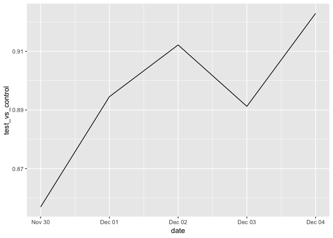

Spanish Translation A/B test
================

### Company XYZ is a worldwide e-commerce site with localized versions of the site. A data scientist at XYZ noticed that Spain-based users have a much higher conversion rate than any other Spanish-speaking country. She therefore went and talked to the international team in charge of Spain and LatAm to see if they had any ideas about why that was happening. Spain and LatAm country manager suggested that one reason could be the translation. All Spanish-speaking countries had the same translation of the site which was written by a Spaniard. They agreed to try a test where each country would have its one translation written by a local. That is, Argentinian users would see a translation written by an Argentinian, and Mexican users by a Mexican and so on. Obviously, nothing would change for users from Spain. After they run the test, however, they are really surprised cause the test is negative. I.e., it appears that the non-localized translation was doing better!

### You are asked to:

#### (1) Confirm that the test is actually negative. That is, it appears that the old version of the site with just one translation across Spain and LatAm performs better

#### (2) Explain why that might be happening. Are the localized translations really worse?

#### (3) If you identified what was wrong, design an algorithm that would return FALSE if the same problem is happening in the future and TRUE if everything is good and the results can be trusted.

### Library needed packages and source codes

### Read in dataset

### Look into the dataset

    ## [1] TRUE

    ## [1] TRUE

    ## [1] 452867

    ## [1] -454

Therefore, no duplicated id in both dataset, but some missings in user data.

### Merge two datasets

    ##     user_id                date           source          device      
    ##  Min.   :      1   2015-11-30: 71025   Ads   :181877   Mobile:201756  
    ##  1st Qu.: 249816   2015-12-01: 70991   Direct: 90834   Web   :251565  
    ##  Median : 500019   2015-12-02: 70649   SEO   :180610                  
    ##  Mean   : 499938   2015-12-03: 99493                                  
    ##  3rd Qu.: 749522   2015-12-04:141163                                  
    ##  Max.   :1000000                                                      
    ##                                                                       
    ##  browser_language   ads_channel            browser         conversion     
    ##  EN   : 63137     Bing    : 13689   Android_App:155135   Min.   :0.00000  
    ##  ES   :377547     Facebook: 68425   Chrome     :101929   1st Qu.:0.00000  
    ##  Other: 12637     Google  : 68180   FireFox    : 40766   Median :0.00000  
    ##                   Other   :  4148   IE         : 61715   Mean   :0.04958  
    ##                   Yahoo   : 27435   Iphone_App : 46621   3rd Qu.:0.00000  
    ##                   NA's    :271444   Opera      :  6090   Max.   :1.00000  
    ##                                     Safari     : 41065                    
    ##       test          sex              age             country      
    ##  Min.   :0.0000   F   :188382   Min.   :18.00   Mexico   :128484  
    ##  1st Qu.:0.0000   M   :264485   1st Qu.:22.00   Colombia : 54060  
    ##  Median :0.0000   NA's:   454   Median :26.00   Spain    : 51782  
    ##  Mean   :0.4764                 Mean   :27.13   Argentina: 46733  
    ##  3rd Qu.:1.0000                 3rd Qu.:31.00   Peru     : 33666  
    ##  Max.   :1.0000                 Max.   :70.00   (Other)  :138142  
    ##                                 NA's   :454     NA's     :   454

    ##   user_id       date source device browser_language ads_channel
    ## 1       1 2015-12-02    SEO    Web               EN        <NA>
    ## 2       2 2015-11-30    SEO Mobile               ES        <NA>
    ## 3       3 2015-12-03    SEO Mobile               ES        <NA>
    ## 4       5 2015-11-30    Ads    Web               ES    Facebook
    ## 5       8 2015-12-03    Ads Mobile               ES      Google
    ## 6      11 2015-12-03    Ads    Web               ES       Yahoo
    ##       browser conversion test sex age   country
    ## 1      Chrome          0    0   M  38     Chile
    ## 2 Android_App          0    0   M  27  Colombia
    ## 3  Iphone_App          0    1   M  18 Guatemala
    ## 4      Chrome          0    1   M  22 Argentina
    ## 5 Android_App          0    1   M  19 Venezuela
    ## 6      Chrome          0    1   F  28  Colombia

    ##     user_id             date               source          device      
    ##  Min.   :      1   Min.   :2015-11-30   Ads   :181877   Mobile:201756  
    ##  1st Qu.: 249816   1st Qu.:2015-12-01   Direct: 90834   Web   :251565  
    ##  Median : 500019   Median :2015-12-03   SEO   :180610                  
    ##  Mean   : 499938   Mean   :2015-12-02                                  
    ##  3rd Qu.: 749522   3rd Qu.:2015-12-04                                  
    ##  Max.   :1000000   Max.   :2015-12-04                                  
    ##                                                                        
    ##  browser_language   ads_channel            browser         conversion     
    ##  EN   : 63137     Bing    : 13689   Android_App:155135   Min.   :0.00000  
    ##  ES   :377547     Facebook: 68425   Chrome     :101929   1st Qu.:0.00000  
    ##  Other: 12637     Google  : 68180   FireFox    : 40766   Median :0.00000  
    ##                   Other   :  4148   IE         : 61715   Mean   :0.04958  
    ##                   Yahoo   : 27435   Iphone_App : 46621   3rd Qu.:0.00000  
    ##                   NA's    :271444   Opera      :  6090   Max.   :1.00000  
    ##                                     Safari     : 41065                    
    ##       test          sex              age             country      
    ##  Min.   :0.0000   F   :188382   Min.   :18.00   Mexico   :128484  
    ##  1st Qu.:0.0000   M   :264485   1st Qu.:22.00   Colombia : 54060  
    ##  Median :0.0000   NA's:   454   Median :26.00   Spain    : 51782  
    ##  Mean   :0.4764                 Mean   :27.13   Argentina: 46733  
    ##  3rd Qu.:1.0000                 3rd Qu.:31.00   Peru     : 33666  
    ##  Max.   :1.0000                 Max.   :70.00   (Other)  :138142  
    ##                                 NA's   :454     NA's     :   454

### (1) Check test results

#### Make sure it is true Spain converts much better than the rest of LatAm countries

    ## Warning: Factor `country` contains implicit NA, consider using
    ## `forcats::fct_explicit_na`

    ## # A tibble: 18 x 2
    ##    country     conversion
    ##    <fct>            <dbl>
    ##  1 Spain           0.0797
    ##  2 <NA>            0.0776
    ##  3 El Salvador     0.0536
    ##  4 Nicaragua       0.0526
    ##  5 Costa Rica      0.0523
    ##  6 Colombia        0.0521
    ##  7 Honduras        0.0509
    ##  8 Guatemala       0.0506
    ##  9 Venezuela       0.0503
    ## 10 Peru            0.0499
    ## 11 Mexico          0.0495
    ## 12 Bolivia         0.0494
    ## 13 Ecuador         0.0492
    ## 14 Paraguay        0.0485
    ## 15 Chile           0.0481
    ## 16 Panama          0.0468
    ## 17 Argentina       0.0151
    ## 18 Uruguay         0.0120

It is true, Spain converts much better than the rest of LatAm countries.

#### Make an independent t-test between test group and control group

    ## 
    ##  Welch Two Sample t-test
    ## 
    ## data:  data$conversion[data$test == 1] and data$conversion[data$test == 0]
    ## t = -7.3539, df = 385258, p-value = 1.929e-13
    ## alternative hypothesis: true difference in means is not equal to 0
    ## 95 percent confidence interval:
    ##  -0.006181421 -0.003579837
    ## sample estimates:
    ##  mean of x  mean of y 
    ## 0.04341116 0.04829179

With intervention, the conversion rate is 4.3% while without, the conversion is 4.8%. That's 10% drop (also statistical significance).

### (2) Explain why that might be happening

#### Firstly, plot day by day, to see if these weird results have been constantly happening or they just started happening all of a sudden.

From the plot, we notice a couple of things (1) Test has constantly been worse than control, and there is relatively little variance across days, which likely suggests that there was some bias in the experiment set up (i.e., the distributions of people in test and control for each segment are not the same).
(2) On the other hand, we just ran it for 5 days. It is better if we can run the test for at least 1 − 2 weeks to capture weekly patterns.

By building a decision tree in which the response is whether the user is in the test group or control and the variables are users' features, we examine if the randomization works.

#### Run a decision tree

    ## n= 401085 
    ## 
    ## node), split, n, deviance, yval
    ##       * denotes terminal node
    ## 
    ## 1) root 401085 99692.820 0.5379757  
    ##   2) country=Bolivia,Chile,Colombia,Costa Rica,Ecuador,El Salvador,Guatemala,Honduras,Mexico,Nicaragua,Panama,Paraguay,Peru,Venezuela 350218 87553.970 0.4987693 *
    ##   3) country=Argentina,Uruguay 50867  7894.097 0.8079108 *

The tree splits--countries on one split are Bolivia, Chile, Colombia, Costa Rica, Ecuador, El, Guatemala, Honduras, Mexico, Nicaragua, Panama, Paraguay, Peru, Venezuela (test/control ratio = 0.499) and on the other split are Argentina, Uruguay (test/control ratio = 0.808), suggesting the randomization does not work.

#### Check for each country how the test is doing

    ## # A tibble: 16 x 4
    ##    country     p_value conversion_test conversion_control
    ##    <fct>         <dbl>           <dbl>              <dbl>
    ##  1 Mexico        0.166          0.0512             0.0495
    ##  2 El Salvador   0.248          0.0479             0.0536
    ##  3 Chile         0.303          0.0513             0.0481
    ##  4 Argentina     0.335          0.0137             0.0151
    ##  5 Colombia      0.424          0.0506             0.0521
    ##  6 Honduras      0.471          0.0475             0.0509
    ##  7 Guatemala     0.572          0.0486             0.0506
    ##  8 Venezuela     0.574          0.0490             0.0503
    ##  9 Costa Rica    0.688          0.0547             0.0523
    ## 10 Panama        0.705          0.0494             0.0468
    ## 11 Bolivia       0.719          0.0479             0.0494
    ## 12 Peru          0.772          0.0506             0.0499
    ## 13 Nicaragua     0.780          0.0542             0.0526
    ## 14 Uruguay       0.880          0.0129             0.0120
    ## 15 Paraguay      0.884          0.0492             0.0485
    ## 16 Ecuador       0.962          0.0490             0.0492

After we control for the country, the test appears non-significant. While it is not a great success since we want to improve the conversion rate, at least we know that the localized translation did not make things worse.

### (3) Design an algorithm for automatically conducting A/B test

For this part, we need to write a function for this algorithm, not only for the whole sample t-test but for a stratified t-test (in our case, it is the country). If the overall t-test yield the same conclusion with the stratified t-test, then return yes; otherwise return no.

