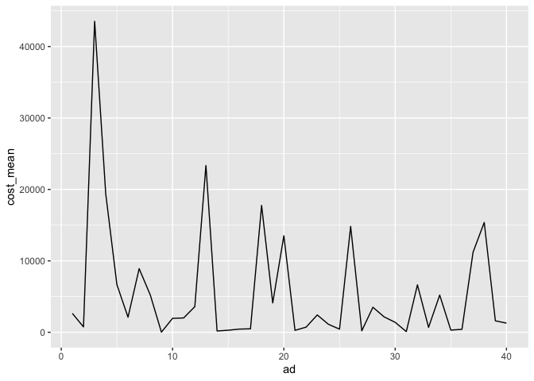

### Company XYZ is a food delivery company. Like pretty much any other site, in order to get customers, they have been relying significantly on online ads, such as those you see on Google or Facebook.

### At the moment, they are running 40 different ad campaigns and want you to help them understand their performance. Specifically, you are asked to:

#### (1) If you had to identify the 5 best ad groups, which ones would they be? Which metric did you choose to identify the best ad groups? Why? Explain the pros of your metric as well as the possible cons.

#### (2) For each group, predict how many ads will be shown on Dec, 15 (assume each ad group keeps following its trend).

#### (3) Cluster ads into 3 groups: the ones whose avg\_cost\_per\_click is going up, the ones whose avg\_cost\_per\_click is flat and the ones whose avg\_cost\_per\_click is going down.

Require needed packages and source codes
----------------------------------------

Read in dataset
---------------

Look into dataset
-----------------

    ## [1] 2115    7

    ## 'data.frame':    2115 obs. of  7 variables:
    ##  $ date              : Factor w/ 53 levels "2015-10-01","2015-10-02",..: 1 2 3 4 5 6 7 8 9 10 ...
    ##  $ shown             : int  65877 65100 70658 69809 68186 66864 68227 68520 67250 67873 ...
    ##  $ clicked           : int  2339 2498 2313 2833 2696 2617 2390 2909 2385 2614 ...
    ##  $ converted         : int  43 38 49 51 41 46 42 46 49 42 ...
    ##  $ avg_cost_per_click: num  0.9 0.94 0.86 1.01 1 0.98 0.94 1.07 0.88 0.93 ...
    ##  $ total_revenue     : num  642 756 971 907 879 ...
    ##  $ ad                : Factor w/ 40 levels "ad_group_1","ad_group_10",..: 1 1 1 1 1 1 1 1 1 1 ...

    ##       date                shown           clicked        converted     
    ##  Min.   :2015-10-01   Min.   :     0   Min.   :    0   Min.   :   0.0  
    ##  1st Qu.:2015-10-14   1st Qu.: 28030   1st Qu.:  744   1st Qu.:  18.0  
    ##  Median :2015-10-27   Median : 54029   Median : 1392   Median :  41.0  
    ##  Mean   :2015-10-27   Mean   : 68300   Mean   : 3056   Mean   : 126.5  
    ##  3rd Qu.:2015-11-09   3rd Qu.: 97314   3rd Qu.: 3366   3rd Qu.: 103.0  
    ##  Max.   :2015-11-22   Max.   :192507   Max.   :20848   Max.   :1578.0  
    ##                                                                        
    ##  avg_cost_per_click total_revenue               ad      
    ##  Min.   :0.000      Min.   : -200.2   ad_group_1 :  53  
    ##  1st Qu.:0.760      1st Qu.:  235.5   ad_group_11:  53  
    ##  Median :1.400      Median :  553.3   ad_group_12:  53  
    ##  Mean   :1.374      Mean   : 1966.5   ad_group_13:  53  
    ##  3rd Qu.:1.920      3rd Qu.: 1611.5   ad_group_15:  53  
    ##  Max.   :4.190      Max.   :39623.7   ad_group_16:  53  
    ##                                       (Other)    :1797

Based on the summary statistics, the data set recorded 53 days with 40
ad groups.

Multiple metrics could be used to evaluate the ads groups, such as CTR,
conversion rate, cost, revenue, and return. Let's create those variables
to explore the most appropriate ones further.

We noticed from the descriptive statistics that, the minimum value of
"shown" is 0, we need to see how many zeros exist since this variable
would be the denominator when creating new metrics.

    ## [1] 13

    ##  [1] ad_group_4  ad_group_5  ad_group_11 ad_group_11 ad_group_12
    ##  [6] ad_group_13 ad_group_13 ad_group_16 ad_group_16 ad_group_19
    ## [11] ad_group_20 ad_group_23 ad_group_25
    ## 40 Levels: ad_group_1 ad_group_10 ad_group_11 ad_group_12 ... ad_group_9

    ## [1] 0

    ## [1] 0

    ## [1] 0

Only 13 zeros of "shown" variable and these *z**e**r**o**s* were
distributed across multiple ads, which is fine since we will use the
average daily metrics to evaluate the ads.

Create new metrics
------------------

    ##    Min. 1st Qu.  Median    Mean 3rd Qu.    Max. 
    ##     0.0   480.9  1993.4  5668.4  6580.0 66922.1

    ##    Min. 1st Qu.  Median    Mean 3rd Qu.    Max.    NA's 
    ## 0.00000 0.01388 0.04116 0.04653 0.07508 0.12399      13

    ##     Min.  1st Qu.   Median     Mean  3rd Qu.     Max.     NA's 
    ## 0.000000 0.000350 0.000987 0.001966 0.002780 0.009533       13

    ##    Min. 1st Qu.  Median    Mean 3rd Qu.    Max.    NA's 
    ## -0.1193  0.1290  0.3550  0.7585  0.7506 19.3033      20

Visualize metrics by ad groups
------------------------------

Answer questions
----------------

### (1) If you had to identify the 5 best ad groups, which ones would they be? Which metric did you choose to identify the best ad groups? Why? Explain the pros of your metric as well as the possible cons.

    ## # A tibble: 5 x 6
    ##      ad cost_mean CTR_mean convertion_mean revenue_mean return_mean
    ##   <dbl>     <dbl>    <dbl>           <dbl>        <dbl>       <dbl>
    ## 1    31      101.  0.00521        0.000452         861.        8.85
    ## 2     2      756.  0.0228         0.00231         1784.        2.51
    ## 3    16      450.  0.0266         0.00236         1057.        2.45
    ## 4    14      181.  0.0299         0.00248          321.        1.85
    ## 5    27      205.  0.00822        0.000254         253.        1.26

### (2) For each group, predict how many ads will be shown on Dec, 15 (assume each ad group keeps following its trend).

#### Step 1: identify the trend of shown of each group

#### Step 2: Convert the ads data set from long format to wide format (and input missings), each row represent a ad group and each column records the number of shown by date.

    ##             Point Forecast      Lo 80      Hi 80      Lo 95     Hi 95
    ## ad groups1       72806.233  66856.810  78755.657  63707.375  81905.09
    ## ad groups2       51059.860  48515.600  53604.120  47168.751  54950.97
    ## ad groups3      162434.000 126073.828 198794.172 106825.915 218042.08
    ## ad groups4       93671.561  83100.721 104242.401  77504.856 109838.27
    ## ad groups5       54662.358  48171.355  61153.362  44735.226  64589.49
    ## ad groups6       40488.369  36364.247  44612.490  34181.069  46795.67
    ## ad groups7       56533.872  46049.792  67017.952  40499.855  72567.89
    ## ad groups8       45413.842  39425.558  51402.126  36255.552  54572.13
    ## ad groups9      123461.313 112150.714 134771.911 106163.245 140759.38
    ## ad groups10     131721.256 120701.301 142741.210 114867.690 148574.82
    ## ad groups11      21488.615  19095.735  23881.494  17829.022  25148.21
    ## ad groups12      29169.628  26926.894  31412.361  25739.663  32599.59
    ## ad groups13     161541.526 153793.409 169289.643 149691.803 173391.25
    ## ad groups14       8782.161   7902.841   9661.481   7437.357  10126.96
    ## ad groups15      15547.828  14741.498  16354.158  14314.653  16781.00
    ## ad groups16      30754.901  29441.326  32068.476  28745.961  32763.84
    ## ad groups17     140106.764 123314.917 156898.611 114425.850 165787.68
    ## ad groups18      89119.198  81862.130  96376.266  78020.471 100217.93
    ## ad groups19      21313.386  16754.990  25871.782  14341.920  28284.85
    ## ad groups20     123044.366 118301.399 127787.334 115790.624 130298.11
    ## ad groups21      27403.928  25765.924  29041.932  24898.818  29909.04
    ## ad groups22      27931.930  25752.644  30111.215  24599.000  31264.86
    ## ad groups23      48119.900  43227.937  53011.862  40638.289  55601.51
    ## ad groups24      39542.331  36990.800  42093.861  35640.102  43444.56
    ## ad groups25     179639.015 154186.192 205091.837 140712.282 218565.75
    ## ad groups26      81556.701  73841.527  89271.875  69757.360  93356.04
    ## ad groups27      65824.261  62689.028  68959.493  61029.337  70619.18
    ## ad groups28      22217.147  20315.842  24118.453  19309.352  25124.94
    ## ad groups29      20679.434  19714.201  21644.667  19203.237  22155.63
    ## ad groups30     116400.944 109125.632 123676.256 105274.314 127527.57
    ## ad groups31     130046.449 122367.636 137725.261 118302.719 141790.18
    ## ad groups32      39237.468  34242.992  44231.945  31599.076  46875.86
    ## ad groups33      15944.000  15080.340  16807.660  14623.146  17264.85
    ## ad groups34      37334.609  30884.584  43784.633  27470.147  47199.07
    ## ad groups35      60288.801  57253.402  63324.200  55646.559  64931.04
    ## ad groups36      76631.629  70383.672  82879.586  67076.203  86187.05
    ## ad groups37      75381.967  67378.810  83385.124  63142.195  87621.74
    ## ad groups38     174954.553 166892.813 183016.292 162625.186 187283.92
    ## ad groups39      24947.257  21751.054  28143.460  20059.086  29835.43
    ## ad groups40      76842.894  69465.999  84219.790  65560.906  88124.88

### (3) Cluster ads into 3 groups: the ones whose avg\_cost\_per\_click is going up, the ones whose avg\_cost\_per\_click is flat and the ones whose avg\_cost\_per\_click is going down.

#### Step 1: Create wide format avg\_cost\_per\_click data set

#### Step 2: Convert to long format and regress avg\_cost\_per\_click on date

    ## # A tibble: 40 x 4
    ##    ad                 slp p_val cluster
    ##    <fct>            <dbl> <dbl> <chr>  
    ##  1 ad_group_1   0.000926  0.145 flat   
    ##  2 ad_group_10 -0.000158  0.862 flat   
    ##  3 ad_group_11 -0.00662   0.126 flat   
    ##  4 ad_group_12 -0.00305   0.427 flat   
    ##  5 ad_group_13 -0.000368  0.911 flat   
    ##  6 ad_group_14 -0.000772  0.165 flat   
    ##  7 ad_group_15  0.000406  0.533 flat   
    ##  8 ad_group_16 -0.000318  0.777 flat   
    ##  9 ad_group_17 -0.0000274 0.894 flat   
    ## 10 ad_group_18  0.000602  0.696 flat   
    ## # … with 30 more rows

#### Step 3: Cluster slopes

    ##            [,1]
    ## 1  0.0022354817
    ## 2 -0.0006538969
    ## 3 -0.0068476859

    ##            [,1]
    ## 1 -0.0016498805
    ## 2  0.0002537091
    ## 3  0.0031077246
    ## 4 -0.0068476859

    ##            [,1]
    ## 1  0.0042807612
    ## 2 -0.0002025989
    ## 3  0.0015352363
    ## 4 -0.0020757021
    ## 5 -0.0068476859

We may cluster the groups using 4 clusters or 5 clusters. Here we
summarize the clusters using 4 clusters.

-   Going up cluster: cluster 3.

<!-- -->

    ## # A tibble: 5 x 4
    ##   ad              slp   p_val cluster
    ##   <fct>         <dbl>   <dbl> <chr>  
    ## 1 ad_group_20 0.00430 0.0747  flat   
    ## 2 ad_group_3  0.00244 0.256   flat   
    ## 3 ad_group_32 0.00426 0.0338  up     
    ## 4 ad_group_37 0.00261 0.0762  flat   
    ## 5 ad_group_40 0.00192 0.00589 up

-   Going down cluster: either cluster 1 or cluster 4.

<!-- -->

    ## # A tibble: 15 x 4
    ##    ad                slp  p_val cluster
    ##    <fct>           <dbl>  <dbl> <chr>  
    ##  1 ad_group_11 -0.00662  0.126  flat   
    ##  2 ad_group_12 -0.00305  0.427  flat   
    ##  3 ad_group_14 -0.000772 0.165  flat   
    ##  4 ad_group_19 -0.00704  0.0371 down   
    ##  5 ad_group_23 -0.00137  0.542  flat   
    ##  6 ad_group_24 -0.00600  0.0354 down   
    ##  7 ad_group_28 -0.00183  0.188  flat   
    ##  8 ad_group_29 -0.00128  0.337  flat   
    ##  9 ad_group_33 -0.000967 0.319  flat   
    ## 10 ad_group_36 -0.00107  0.0568 flat   
    ## 11 ad_group_38 -0.000809 0.432  flat   
    ## 12 ad_group_4  -0.00773  0.117  flat   
    ## 13 ad_group_6  -0.00173  0.0771 flat   
    ## 14 ad_group_7  -0.00257  0.120  flat   
    ## 15 ad_group_8  -0.00269  0.0262 down

-   Flat cluster: cluster 2.

<!-- -->

    ## # A tibble: 20 x 4
    ##    ad                  slp p_val cluster
    ##    <fct>             <dbl> <dbl> <chr>  
    ##  1 ad_group_1   0.000926   0.145 flat   
    ##  2 ad_group_10 -0.000158   0.862 flat   
    ##  3 ad_group_13 -0.000368   0.911 flat   
    ##  4 ad_group_15  0.000406   0.533 flat   
    ##  5 ad_group_16 -0.000318   0.777 flat   
    ##  6 ad_group_17 -0.0000274  0.894 flat   
    ##  7 ad_group_18  0.000602   0.696 flat   
    ##  8 ad_group_2  -0.00000645 0.991 flat   
    ##  9 ad_group_21  0.000460   0.827 flat   
    ## 10 ad_group_22 -0.000244   0.696 flat   
    ## 11 ad_group_25  0.00106    0.323 flat   
    ## 12 ad_group_26  0.000724   0.700 flat   
    ## 13 ad_group_27 -0.000302   0.144 flat   
    ## 14 ad_group_30 -0.000114   0.878 flat   
    ## 15 ad_group_31  0.0000798  0.450 flat   
    ## 16 ad_group_34  0.000128   0.933 flat   
    ## 17 ad_group_35 -0.000412   0.163 flat   
    ## 18 ad_group_39  0.00114    0.328 flat   
    ## 19 ad_group_5   0.00145    0.610 flat   
    ## 20 ad_group_9   0.0000443  0.435 flat
