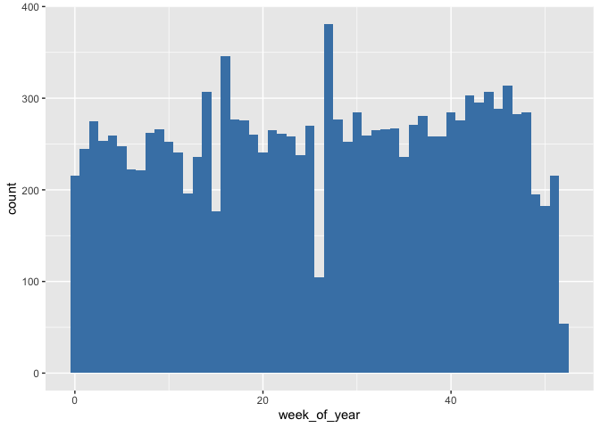

Employee Retention
================

### We got employee data from a few companies. We have data about all employees who joined from 2011/01/24 to 2015/12/13. For each employee, we also know if they are still at the company as of 2015/12/13 or they have quit. Besides that, we have general info about the employee, such as avg salary during her tenure, dept, and yrs of experience.

### As said above, and the goal is to predict employee retention and understand its main drivers. Specifically, you should:

#### (1) Assume, for each company, that the headcount starts from zero on 2011/01/23. Estimate employee headcount, for each company, on each day, from 2011/01/24 to 2015/12/13. That is, if by 2012/03/02 2000 people have joined company 1 and 1000 of them have already quit, then company headcount on 2012/03/02 for company 1 would be 1000. You should create a table with 3 columns: day, employee\_headcount, company\_id.

#### (2) What are the main factors that drive employee churn? Do they make sense? Explain your findings.

#### (3) If you could add to this data set just one variable that could help explain employee churn, what would that be?

### Require needed packages and source codes

### Read in dataset

### Look into dataset

    ## 'data.frame':    24702 obs. of  7 variables:
    ##  $ employee_id: num  13021 825355 927315 662910 256971 ...
    ##  $ company_id : int  7 7 4 7 2 4 4 2 9 1 ...
    ##  $ dept       : Factor w/ 6 levels "customer_service",..: 1 5 5 1 2 2 1 1 4 6 ...
    ##  $ seniority  : int  28 20 14 20 23 14 21 4 7 7 ...
    ##  $ salary     : num  89000 183000 101000 115000 276000 165000 107000 30000 160000 104000 ...
    ##  $ join_date  : Factor w/ 995 levels "2011-01-24","2011-01-25",..: 643 459 758 264 148 205 558 633 380 280 ...
    ##  $ quit_date  : Factor w/ 664 levels "2011-10-13","2011-10-14",..: 643 364 NA 229 428 267 NA NA 640 NA ...

    ## 'data.frame':    24702 obs. of  7 variables:
    ##  $ employee_id: num  13021 825355 927315 662910 256971 ...
    ##  $ company_id : Factor w/ 12 levels "1","2","3","4",..: 7 7 4 7 2 4 4 2 9 1 ...
    ##  $ dept       : Factor w/ 6 levels "customer_service",..: 1 5 5 1 2 2 1 1 4 6 ...
    ##  $ seniority  : int  28 20 14 20 23 14 21 4 7 7 ...
    ##  $ salary     : num  89000 183000 101000 115000 276000 165000 107000 30000 160000 104000 ...
    ##  $ join_date  : Date, format: "2014-03-24" "2013-04-29" ...
    ##  $ quit_date  : Date, format: "2015-10-30" "2014-04-04" ...

    ## [1] TRUE

    ##   employee_id       company_id                 dept        seniority    
    ##  Min.   :    36   1      :8486   customer_service:9180   Min.   : 1.00  
    ##  1st Qu.:250134   2      :4222   data_science    :3190   1st Qu.: 7.00  
    ##  Median :500793   3      :2749   design          :1380   Median :14.00  
    ##  Mean   :501604   4      :2062   engineer        :4613   Mean   :14.13  
    ##  3rd Qu.:753137   5      :1755   marketing       :3167   3rd Qu.:21.00  
    ##  Max.   :999969   6      :1291   sales           :3172   Max.   :99.00  
    ##                   (Other):4137                                          
    ##      salary         join_date            quit_date         
    ##  Min.   : 17000   Min.   :2011-01-24   Min.   :2011-10-13  
    ##  1st Qu.: 79000   1st Qu.:2012-04-09   1st Qu.:2013-06-28  
    ##  Median :123000   Median :2013-06-24   Median :2014-06-20  
    ##  Mean   :138183   Mean   :2013-06-29   Mean   :2014-05-02  
    ##  3rd Qu.:187000   3rd Qu.:2014-09-17   3rd Qu.:2015-03-27  
    ##  Max.   :408000   Max.   :2015-12-10   Max.   :2015-12-09  
    ##                                        NA's   :11192

### (1) Assume, for each company, that the headcount starts from zero on 2011/01/23. Estimate employee headcount, for each company, on each day, from 2011/01/24 to 2015/12/13. That is, if by 2012/03/02 2000 people have joined company 1 and 1000 of them have already quit, then company headcount on 2012/03/02 for company 1 would be 1000. You should create a table with 3 columns: day, employee\_headcount, company\_id.

The general idea for this question: (1) Create a blank dataframe with any date between 2011/01/24 to 2015/12/13 and any company id (i.e., two columns) (2) Count how many employees joined/quitted for every company and every single date. At this step, if no one joined/quitted, it would return NA; we then need to replace the NA's with 0's. (3) Calculate the cumulative sum of joined employees and quitted employees, by taking a difference, we then get the number of headcounts.

    ##          day company_id employee_headcount
    ## 1 2011-01-24          1                 25
    ## 2 2011-01-24          2                 17
    ## 3 2011-01-24          3                  9
    ## 4 2011-01-24          4                 12
    ## 5 2011-01-24          5                  5
    ## 6 2011-01-24          6                  3

### (2) What are the main factors that drive employee churn? Do they make sense? Explain your findings.

There are peaks around each employee year anniversary, especially the first two. And such patterns do not change by companies and departments.

It also peaks around the new year or a new fiscal year, which makes sense, since people prefer to wait until that time to get their bonus.

Based on the distribution (histogram), we would like to classify employees as short-term and long-term ones. From the histogram, we want to set up the cut-off at 15 months.

    ## 
    ##         0         1 
    ## 0.6489243 0.3510757

    ## n= 18825 
    ## 
    ## node), split, n, loss, yval, (yprob)
    ##       * denotes terminal node
    ## 
    ## 1) root 18825 9412.5000 0 (0.5000000 0.5000000)  
    ##   2) salary>=223500 2733  875.8795 0 (0.6507394 0.3492606) *
    ##   3) salary< 223500 16092 7780.5690 1 (0.4768327 0.5231673)  
    ##     6) salary< 65500 3189 1404.2560 0 (0.5472597 0.4527403) *
    ##     7) salary>=65500 12903 6083.1440 1 (0.4603034 0.5396966) *

    ## Warning: Factor `salary_percentile` contains implicit NA, consider using
    ## `forcats::fct_explicit_na`

Salary is what matters the most. After all, it is likely to associate with other factors such as seniority, department, and company impact. So salary carries pretty much all information available.

It is interesting though that, looking at the root nodes, the way the tree split is: the employee has a higher probability of being an early quitter if salary is between 66, 000 and 224, 000. It suggests that people who make a lot of money and very little are not likely to quit.

### (3) If you could add to this data set just one variable that could help explain employee churn, what would that be?

Given how important is salary, I would definitely love to have as a variable the salary the employee who quit was offered in the next job. Otherwise, things like: promotions or raise received during the employee tenure would be interesting.

### Main conclusion

The major findings are that employees quit at year anniversaries or the beginning of years. Both cases make sense. Even if you don't like your current job, you often stay for 1 yr before quitting, and you often get stocks after 1 yr so it makes sense to wait. Also, the beginning of the year is well known to be the best time to change job: companies are hiring more and you often want to stay until the end of December to get the calendar year bonus. In addition, employees with low and high salaries are less likely to quit. Probably because employees with high salary are happy there and employees with low salary are not that marketable, so they have a hard time finding a new job.

