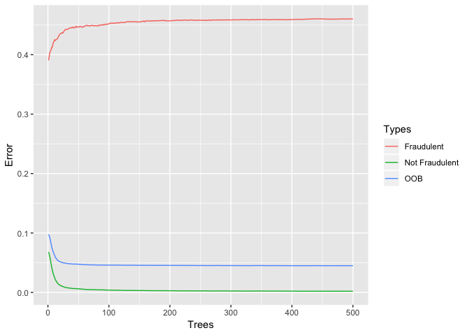
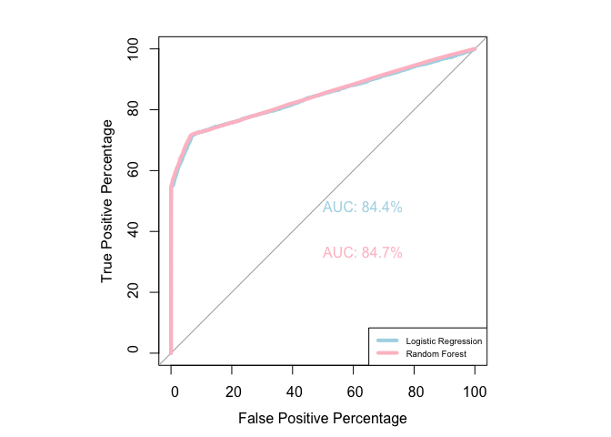
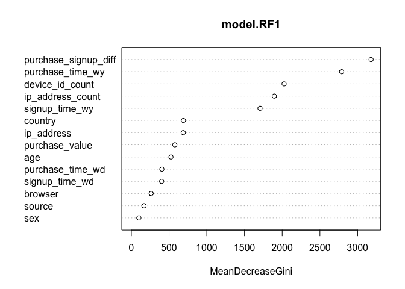
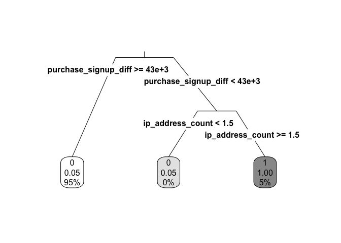

Identifying Fraudulent Activities
================

### Company XYZ is an e-commerce site that sells hand-made clothes. You have to build a model that predicts whether a user has a high probability of using the site to perform some illegal activity or not. This is a super common task for data scientists. You only have information about the user first transaction on the site and based on that you have to make your classification ("fraud/no fraud").

### These are the tasks you are asked to do:

#### (1) For each user, determine her country based on the numeric IP address.

#### (2) Build a model to predict whether an activity is fraudulent or not. Explain how different assumptions about the cost of false positives vs false negatives would impact the model.

#### (3) Your boss is a bit worried about using a model she doesn't understand for something as important as fraud detection. How would you explain to her how the model is making the predictions? Not from a mathematical perspective (she couldn't care less about that), but from a user perspective. What kinds of users are more likely to be classified as at risk? What are their characteristics?

#### (4) Let's say you now have this model which can be used live to predict in real time if an activity is fraudulent or not. From a product perspective, how would you use it? That is, what kind of different user experiences would you build based on the model output?

### Library needed packages and source codes

### Read in dataset

### Look into dataset

    ## [1] TRUE

    ## 'data.frame':    151112 obs. of  11 variables:
    ##  $ user_id       : int  22058 333320 1359 150084 221365 159135 50116 360585 159045 182338 ...
    ##  $ signup_time   : Date, format: "2015-02-24" "2015-06-07" ...
    ##  $ purchase_time : Date, format: "2015-04-18" "2015-06-08" ...
    ##  $ purchase_value: int  34 16 15 44 39 42 11 27 30 62 ...
    ##  $ device_id     : Factor w/ 137956 levels "AAALBGNHHVMKG",..: 89216 24079 131217 3978 68758 2323 46738 40067 44614 72058 ...
    ##  $ source        : Factor w/ 3 levels "Ads","Direct",..: 3 1 3 3 1 1 1 1 3 1 ...
    ##  $ browser       : Factor w/ 5 levels "Chrome","FireFox",..: 1 1 4 5 5 1 1 4 3 3 ...
    ##  $ sex           : Factor w/ 2 levels "F","M": 2 1 2 2 2 2 1 2 1 2 ...
    ##  $ age           : int  39 53 53 41 45 18 19 34 43 31 ...
    ##  $ ip_address    : num  7.33e+08 3.50e+08 2.62e+09 3.84e+09 4.16e+08 ...
    ##  $ class         : Factor w/ 2 levels "0","1": 1 1 2 1 1 1 1 1 1 1 ...

    ##     user_id        signup_time         purchase_time       
    ##  Min.   :     2   Min.   :2015-01-01   Min.   :2015-01-01  
    ##  1st Qu.:100642   1st Qu.:2015-02-18   1st Qu.:2015-04-18  
    ##  Median :199958   Median :2015-04-19   Median :2015-06-18  
    ##  Mean   :200171   Mean   :2015-04-19   Mean   :2015-06-15  
    ##  3rd Qu.:300054   3rd Qu.:2015-06-18   3rd Qu.:2015-08-17  
    ##  Max.   :400000   Max.   :2015-08-18   Max.   :2015-12-16  
    ##                                                            
    ##  purchase_value           device_id         source         browser     
    ##  Min.   :  9.00   CQTUVBYIWWWBC:    20   Ads   :59881   Chrome :61432  
    ##  1st Qu.: 22.00   EQYVNEGOFLAWK:    20   Direct:30616   FireFox:24610  
    ##  Median : 35.00   ITUMJCKWEYNDD:    20   SEO   :60615   IE     :36727  
    ##  Mean   : 36.94   KIPFSCNUGOLDP:    20                  Opera  : 3676  
    ##  3rd Qu.: 49.00   NGQCKIADMZORL:    20                  Safari :24667  
    ##  Max.   :154.00   ZUSVMDEZRBDTX:    20                                 
    ##                   (Other)      :150992                                 
    ##  sex            age          ip_address        class     
    ##  F:62819   Min.   :18.00   Min.   :5.209e+04   0:136961  
    ##  M:88293   1st Qu.:27.00   1st Qu.:1.086e+09   1: 14151  
    ##            Median :33.00   Median :2.155e+09             
    ##            Mean   :33.14   Mean   :2.152e+09             
    ##            3rd Qu.:39.00   3rd Qu.:3.243e+09             
    ##            Max.   :76.00   Max.   :4.295e+09             
    ## 

### (1) For each user, determine her country based on the numeric IP address.

    ## 'data.frame':    138846 obs. of  3 variables:
    ##  $ lower_bound_ip_address: num  16777216 16777472 16777728 16778240 16779264 ...
    ##  $ upper_bound_ip_address: num  16777471 16777727 16778239 16779263 16781311 ...
    ##  $ country               : Factor w/ 235 levels "Afghanistan",..: 12 43 43 12 43 105 43 105 209 43 ...

    ##                   United States                           Japan 
    ##                           58049                           29272 
    ##                           China                  United Kingdom 
    ##                           12038                            4490 
    ##               Korea Republic of                         Germany 
    ##                            4162                            3646 
    ##                          France                          Canada 
    ##                            3161                            2975 
    ##                          Brazil                           Italy 
    ##                            2961                            1944 
    ##                       Australia                     Netherlands 
    ##                            1844                            1680 
    ##              Russian Federation                           India 
    ##                            1616                            1310 
    ## Taiwan; Republic of China (ROC)                          Mexico 
    ##                            1237                            1121 
    ##                          Sweden                           Spain 
    ##                            1090                            1027 
    ##                    South Africa                     Switzerland 
    ##                             838                             785 
    ##                          Poland                       Argentina 
    ##                             729                             661 
    ##                       Indonesia                          Norway 
    ##                             649                             609 
    ##                        Colombia                          Turkey 
    ##                             602                             568 
    ##                        Viet Nam                         Romania 
    ##                             550                             525 
    ##                         Denmark                       Hong Kong 
    ##                             490                             471 
    ##                         Finland                         Austria 
    ##                             460                             435 
    ##                         Ukraine                           Chile 
    ##                             429                             417 
    ##                         Belgium      Iran (ISLAMIC Republic Of) 
    ##                             409                             389 
    ##                           Egypt                  Czech Republic 
    ##                             359                             349 
    ##                        Thailand                     New Zealand 
    ##                             291                             278 
    ##                          Israel                    Saudi Arabia 
    ##                             272                             264 
    ##                       Venezuela                         Ireland 
    ##                             251                             240 
    ##                  European Union                          Greece 
    ##                             238                             231 
    ##                        Portugal                         Hungary 
    ##                             229                             211 
    ##                        Malaysia                       Singapore 
    ##                             210                             208 
    ##                        Pakistan                     Philippines 
    ##                             186                             177 
    ##                        Bulgaria                         Morocco 
    ##                             166                             158 
    ##                         Algeria                            Peru 
    ##                             122                             119 
    ##                         Tunisia            United Arab Emirates 
    ##                             118                             114 
    ##                         Ecuador                       Lithuania 
    ##                             106                              95 
    ##                      Seychelles                           Kenya 
    ##                              95                              93 
    ##                      Kazakhstan                      Costa Rica 
    ##                              92                              90 
    ##                          Kuwait                        Slovenia 
    ##                              90                              87 
    ##      Slovakia (SLOVAK Republic)                         Uruguay 
    ##                              86                              80 
    ##  Croatia (LOCAL Name: Hrvatska)                         Belarus 
    ##                              79                              72 
    ##                      Luxembourg                          Serbia 
    ##                              72                              69 
    ##                         Nigeria                          Latvia 
    ##                              67                              64 
    ##                          Panama                         Bolivia 
    ##                              62                              53 
    ##              Dominican Republic                          Cyprus 
    ##                              51                              43 
    ##                         Estonia                            Oman 
    ##                              42                              41 
    ##                      Bangladesh             Moldova Republic of 
    ##                              37                              37 
    ##                        Paraguay                         Georgia 
    ##                              35                              32 
    ##                       Sri Lanka          Bosnia and Herzegowina 
    ##                              31                              30 
    ##                     Puerto Rico                          Jordan 
    ##                              30                              28 
    ##                         Lebanon                     El Salvador 
    ##                              28                              25 
    ##                           Qatar                           Sudan 
    ##                              25                              25 
    ##                          Angola                       Macedonia 
    ##                              24                              24 
    ##            Syrian Arab Republic                      Azerbaijan 
    ##                              24                              23 
    ##                         Namibia                           Malta 
    ##                              23                              22 
    ##             Trinidad and Tobago                         (Other) 
    ##                              22                             528

### (2) Build a model to predict whether an activity is fraudulent or not. Explain how different assumptions about the cost of false positives vs. false negatives would impact the model.

#### Before constructing classification models, we need to specify features to this model which could be

1.  Time difference between sign-up time and purchase time;
2.  Whether the device ID is unique or certain users are sharing the same device (though it is possible that family members/close friends may share the same device, it is still an indicator of fake account)
3.  Same for IP address. Many different users having the same IP address could be an indicator of faked accounts
4.  Time variables such as the week of the year and the day of the week

#### Construct a predictive model, optimize the number of the trees as well as that of the features split at each node.

#### Logistic regression: Logistic regression: for the logistic regression, we need several things from the output: (1) estimate, standard error, and p-value; (2) pseudo R square.

    ## Warning: glm.fit: algorithm did not converge

    ## [1] 0.45

A pseudo R square of 0.45 suggests that 45% of the variance is explained. The model is not so powerful to predict the fraudulent. But it's okay, since the real aim of this project to have insights on the fraudulent pattern.

#### Random forests

    ##  [1] 0.044 0.044 0.045 0.046 0.046 0.046 0.046 0.046 0.046 0.046

It seems that 150 or 200 is the optimized number of trees since the error rates are convergent at those points. For this dataset, the number of features of each split does not matter.

#### Model comparison and cut-off optimization

    ## Setting levels: control = 0, case = 1

    ## Setting direction: controls < cases

    ## 
    ## Call:
    ## roc.default(response = test_data$class, predictor = logit0_pred,     percent = T, plot = T, legacy.axes = T, xlab = "False Positive Percentage",     ylab = "True Positive Percentage", col = "light blue", lwd = 4,     print.auc = T)
    ## 
    ## Data: logit0_pred in 46585 controls (test_data$class 0) < 4794 cases (test_data$class 1).
    ## Area under the curve: 84.38%

    ## Setting levels: control = 0, case = 1
    ## Setting direction: controls < cases

Based on the AUC, there is no big difference between the logistic regression and the random forest. So, we still use the random forest model for further analysis.

#### Given the aim of the project, we want to minimize the false negative rate (or maximize the true positive rate), and we then print threshold between TPP 95% and 100%.

    ## Setting levels: control = 0, case = 1

    ## Setting direction: controls < cases

    ##          tpp       fpp  thresholds
    ## 1  100.00000 100.00000        -Inf
    ## 2   98.12974  93.39094 0.005154639
    ## 3   98.12974  93.38873 0.010362973
    ## 4   98.12974  93.38652 0.010471491
    ## 5   98.12974  93.38209 0.010582307
    ## 6   98.12974  93.37435 0.010695493
    ## 7   98.12974  93.36107 0.010811127
    ## 8   98.12974  93.34447 0.010929288
    ## 9   98.12974  93.31017 0.011050061
    ## 10  98.11906  93.28362 0.011173533
    ## 11  98.10837  93.22386 0.011299796
    ## 12  98.08699  93.16079 0.011428945
    ## 13  98.05493  93.06785 0.011561080
    ## 14  97.96943  92.95278 0.011696306
    ## 15  97.90531  92.80672 0.011834734
    ## 16  97.86256  92.61198 0.011976477
    ## 17  97.80913  92.33978 0.012121657
    ## 18  97.75569  92.00341 0.012270400
    ## 19  97.63813  91.61835 0.012422840
    ## 20  97.54195  91.18239 0.012579114
    ## 21  97.42439  90.68226 0.012739370
    ## 22  97.28545  90.11463 0.012903763
    ## 23  97.07171  89.45627 0.013072454
    ## 24  96.76178  88.73595 0.013245614
    ## 25  96.52666  87.90055 0.013423423
    ## 26  96.30223  87.11715 0.013606072
    ## 27  96.12055  86.23750 0.013793760
    ## 28  95.91749  85.37776 0.013986698
    ## 29  95.70375  84.57887 0.014185111
    ## 30  95.42588  83.82203 0.014389234
    ## 31  95.23352  83.07515 0.014599318
    ## 32  95.05183  82.38028 0.014815628

From the output, to have a high true positive rate, the thresholds are pretty low (i.e., we will classify most entries as fraudulent). Again, the aim of this project is still to obtain insights on the fraudulent pattern instead of to predict whether an entry is deceptive.

On the contrary, if we want to minimize the false positive rate for the above ROC, we need to consider a threshold which makes the true positive rate between 50% and 60%.

### (3) How would you explain your boss how the model is making the predictions.

#### Extract insights out from the model

The most important feature is the difference between purchase time and signup time, then the number of users who shared the same IP address, then the week-of-a-year of purchase time, then the number of users who share the same device, and then the week-of-a-year of sign up time. We then constructed a decision tree to see if its results align with the findings from the random forest.

#### Build a simple decision tree and check the 2 or 3 most important segaments

    ## n= 151112 
    ## 
    ## node), split, n, loss, yval, (yprob)
    ##       * denotes terminal node
    ## 
    ## 1) root 151112 14151 0 (0.9063542273 0.0936457727)  
    ##   2) purchase_signup_diff>=43200 142908  6521 0 (0.9543692445 0.0456307555) *
    ##   3) purchase_signup_diff< 43200 8204   574 1 (0.0699658703 0.9300341297)  
    ##     6) ip_address_count< 1.5 600    30 0 (0.9500000000 0.0500000000) *
    ##     7) ip_address_count>=1.5 7604     4 1 (0.0005260389 0.9994739611) *

Based on the result of the decision tree, the most important segment is the number of users who shared a device, which also an important feature from a random forest. Then I would explain to my boss like that: suppose we have a classifier to distinguish an entry as fraudulent or not based on some characteristics of this entry. For example, if the difference between the sign-up time and the purchase time greater than 12 hours, it would be less likely a fraudulent action. On the other hand, among user IDs whose time difference are less than 12 hours, if a user shares IP address with others, it is likely fraudulent.

### (4) Let's say you now have this model which can be used live to predict in real time if an activity is fraudulent or not. From a product perspective, how would you use it? That is, what kind of different user experiences would you build based on the model output?

1.  If predicted fraud probability &lt; x, the user has the normal experience (the high majority should fall here)
2.  If x &lt;= predicted fraud probability &lt; z (so the user is at risk, but not too much), we can create an additional verification step, like verify his/her phone number/email address via a code sent by SMS/email
3.  If predicted fraud probability &gt;= z (so here is really likely the user is trying to commit a fraud), we can tell the user his session has been put on hold, send this user info to someone who reviews it manually and either blocks the user or decides it is not a fraud so the session is resumed.

