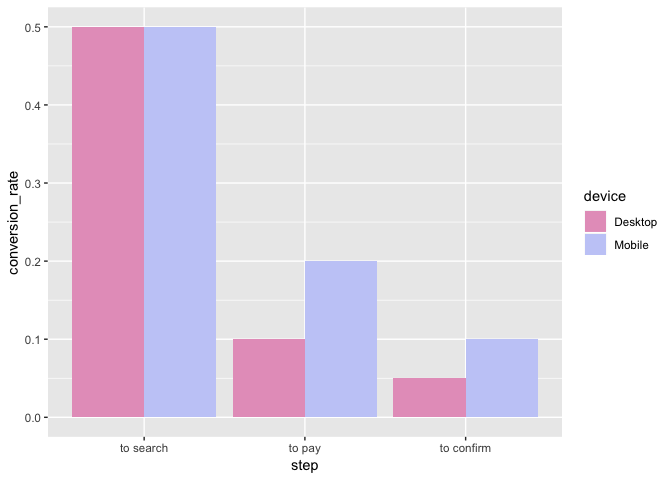
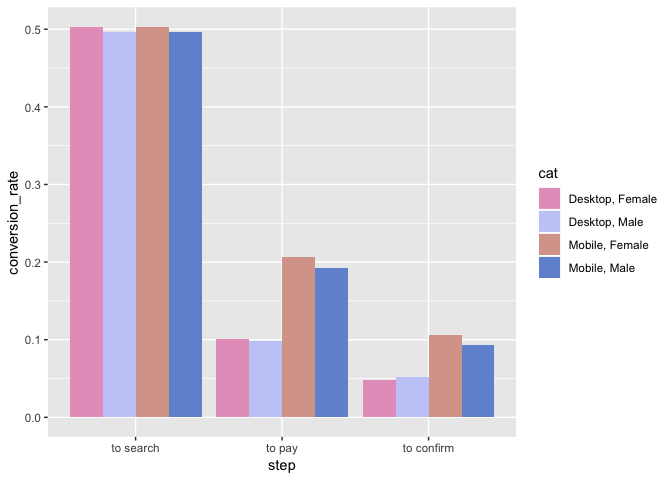
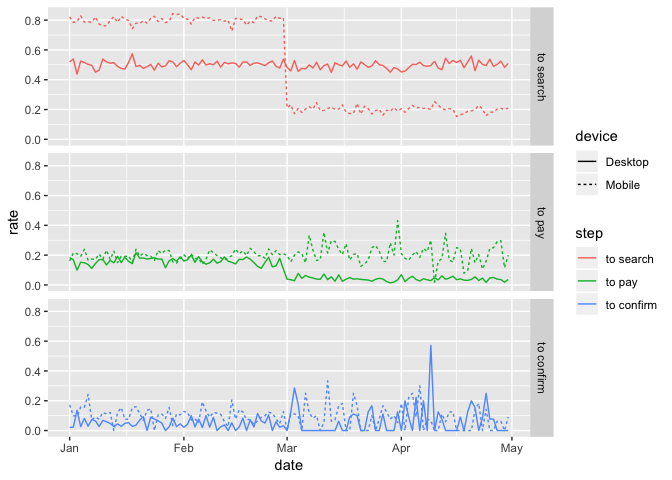

Funnel Analysis
================

### You are looking at data from an e-commerce website. The site is very simple and has just 4 pages:

#### The first page is the home page. When you come to the site for the first time, you can only land on the home page as a first page.

#### From the home page, the user can perform a search and land on the search page. From the search page, if the user clicks on a product, she will get to the payment page, where she is asked to provide payment information in order to buy that product.

#### If she does decide to buy, she ends up on the confirmation page

### The company CEO isn't very happy with the volume of sales and, especially, of sales coming from new users. Therefore, she asked you to investigate whether there is something wrong in the conversion funnel or, in general, if you could suggest how conversion rate can be improved.

### Specifically, she is interested in:

#### (1) A full picture of the funnel conversion rate for both desktop and mobile.

#### (2) Some insights on what the product team should focus on in order to improve conversion rate as well as anything you might discover that could help improve conversion rate.

### Library needed packages and source codes

### Read in dataset

### Look into data

    ## 'data.frame':    90400 obs. of  4 variables:
    ##  $ user_id: int  450007 756838 568983 190794 537909 993454 377150 137258 608249 615615 ...
    ##  $ date   : Factor w/ 120 levels "2015-01-01","2015-01-02",..: 59 13 99 49 15 62 105 27 102 55 ...
    ##  $ device : Factor w/ 2 levels "Desktop","Mobile": 1 1 1 1 1 1 1 2 1 2 ...
    ##  $ sex    : Factor w/ 2 levels "Female","Male": 1 2 2 1 2 2 1 2 1 1 ...

    ## [1] TRUE

    ##     user_id            date                device          sex       
    ##  Min.   :    17   Min.   :2015-01-01   Desktop:60200   Female:45075  
    ##  1st Qu.:247979   1st Qu.:2015-01-31   Mobile :30200   Male  :45325  
    ##  Median :498267   Median :2015-02-28                                 
    ##  Mean   :498710   Mean   :2015-03-01                                 
    ##  3rd Qu.:749789   3rd Qu.:2015-03-31                                 
    ##  Max.   :999979   Max.   :2015-04-30

    ## 'data.frame':    90400 obs. of  2 variables:
    ##  $ user_id: int  313593 468315 264005 290784 639104 262889 708793 943143 417894 729374 ...
    ##  $ page   : Factor w/ 1 level "home_page": 1 1 1 1 1 1 1 1 1 1 ...

    ## [1] TRUE

    ## [1] TRUE

    ## 'data.frame':    45200 obs. of  2 variables:
    ##  $ user_id: int  15866 347058 577020 780347 383739 383371 681241 76676 823713 245022 ...
    ##  $ page   : Factor w/ 1 level "search_page": 1 1 1 1 1 1 1 1 1 1 ...

    ## [1] TRUE

    ## [1] TRUE

    ## 'data.frame':    6030 obs. of  2 variables:
    ##  $ user_id: int  253019 310478 304081 901286 195052 721699 266323 726983 920853 331768 ...
    ##  $ page   : Factor w/ 1 level "payment_page": 1 1 1 1 1 1 1 1 1 1 ...

    ## [1] TRUE

    ## [1] TRUE

    ## 'data.frame':    452 obs. of  2 variables:
    ##  $ user_id: int  123100 704999 407188 538348 841681 820062 365738 994662 898109 615140 ...
    ##  $ page   : Factor w/ 1 level "payment_confirmation_page": 1 1 1 1 1 1 1 1 1 1 ...

    ## [1] TRUE

    ## [1] TRUE

### Left join dataset

### (1) A full picture of funnel conversion rate for both desktop and mobile.

#### General description

    ##     user_id            date                device          sex       
    ##  Min.   :    17   Min.   :2015-01-01   Desktop:60200   Female:45075  
    ##  1st Qu.:247979   1st Qu.:2015-01-31   Mobile :30200   Male  :45325  
    ##  Median :498267   Median :2015-02-28                                 
    ##  Mean   :498710   Mean   :2015-03-01                                 
    ##  3rd Qu.:749789   3rd Qu.:2015-03-31                                 
    ##  Max.   :999979   Max.   :2015-04-30                                 
    ##    Home_Page  Search_Page   Payment_Page     Confirm_Page  
    ##  Min.   :1   Min.   :0.0   Min.   :0.0000   Min.   :0.000  
    ##  1st Qu.:1   1st Qu.:0.0   1st Qu.:0.0000   1st Qu.:0.000  
    ##  Median :1   Median :0.5   Median :0.0000   Median :0.000  
    ##  Mean   :1   Mean   :0.5   Mean   :0.0667   Mean   :0.005  
    ##  3rd Qu.:1   3rd Qu.:1.0   3rd Qu.:0.0000   3rd Qu.:0.000  
    ##  Max.   :1   Max.   :1.0   Max.   :1.0000   Max.   :1.000

    ##    device count
    ## 1 Desktop     0
    ## 2  Mobile     0

We first investigate the general patterns of the conversion rates at each step by devices among new users. Results show that more users dropped off and left the website at further actions and the "dropped" rate seems much higher among desktop users. Specifically, from the home page to the search page, users in both device groups converted well (50%); at two following steps, conversion rates of both groups decreased, and that of users who are using desktop declines more evident. From this step, we also found that though the conversion rate of mobile users is relatively higher, the number of such users is much smaller than that of desktop users.

#### Conversion rate by gender

We then examine if such patterns of conversion rates by devices differ among males and females. Above plot shows that, in general, female users converted slightly better.

#### Ratio of conversion rates by date

We then investigate the conversion rate by day. Above dashed-trajectories suggest that something happened among mobile users in early March. In January and February, the majority of mobile users (80%) performed search and landed on the search page; among them, around 20% clicked products and got the payment page; and finally, among users who arrived at the payment page, less than 20% finalized the payment. However, in March and April, the conversion rate from the home page to the search page dramatically dropped to 20%, and the trends of the last two steps seem to fluctuate more severely. On the contrary, though the rate of searching a product among desktop users did not change meaningfully over the four months (~50%), clients who intended to buy a product dropped from ~15% to ~5% in the last two months. Also, the curve of the confirmation rate vibrated harshly in March and April.

#### Construct a simple decision tree to identify important factors at each step

    ## n= 90400 
    ## 
    ## node), split, n, deviance, yval
    ##       * denotes terminal node
    ## 
    ## 1) root 90400 22600.000 0.5000000  
    ##   2) date>=16494.5 45200 10823.480 0.3973230  
    ##     4) device=Mobile 15100  2416.000 0.2000000 *
    ##     5) device=Desktop 30100  7524.591 0.4963123 *
    ##   3) date< 16494.5 45200 10823.480 0.6026770  
    ##     6) device=Desktop 30100  7524.591 0.5036877 *
    ##     7) device=Mobile 15100  2416.000 0.8000000 *

    ## n= 45200 
    ## 
    ## node), split, n, deviance, yval
    ##       * denotes terminal node
    ## 
    ## 1) root 45200 5225.5550 0.13340710  
    ##   2) date>=16494.5 17959 1144.0320 0.06837797  
    ##     4) device=Desktop 14939  574.0624 0.04002945 *
    ##     5) device=Mobile 3020  498.5762 0.20860930 *
    ##   3) date< 16494.5 27241 3955.5110 0.17627840 *

    ## n= 6030 
    ## 
    ## node), split, n, deviance, yval
    ##       * denotes terminal node
    ## 
    ## 1) root 6030 418.1187 0.07495854 *

Simple decision trees also confirmed the findings of conversion rate by day at the step from the home page to the search page and that from the search page to the payment page: after some time, the drop-off rate increased evidently. Also, the conversion rates at these steps differ between mobiles and desktops. We did not find any important features for the tree-based model from the payment to the confirmation, which also makes sense since, from the visualization part, we just saw the fluctuation of the conversion rate instead of any evident pattern.

### (2) Some insights on what the product team should focus on in order to improve conversion rate as well as anything you might discover that could help improve conversion rate.

Here are some insights for the product team:

(1) Though the conversion rate of mobile users is relatively higher, the number of such users is much smaller than that of desktop users. UI/experience is worse and needs to be fixed (product issue), or the app didn’t somehow become popular, so you just have very engaged users using mobile. You almost have no casual mobile visitors, and engaged users obviously convert at a higher rate. Another way to explain the larger number of desktop users, but much lower page conversion, is that the site is spending a lot of money on ads on desktop. And these ads are attracting the wrong kind of people (these are all marketing issues). All these hypotheses could be tested in a real-world scenario by looking at mobile vs. desktop user characteristics. If you find that mobile users and desktop users share the same characteristics, then desktop UI/UX sucks. Otherwise, you might find different user distributions (i.e.more ads users in desktop or repeat users in mobile). You don’t have the data here to do that, but you should say you would do it if you had access to the full database. Regardless of the reason, given that mobile is the future/present, <50\% of mobile users is considered really bad and should have been the Top 1 finding.

(2) Definitely, in March and April, the website users, especially the mobile users had an uncomfortable experience, which could be bugs in the mobile app (we may further examine this issue among iOS users and Android users) resulted from launching an updated version. It's urgent for the product team to fix such bugs to improve the user experience. 

(3) In January and February, the rate of searching for a product using mobiles was much higher than that using desktops. It's a good strategy to make the home page of desktop more appealing for users, for example, enhance the diversity of products. Through this way, clients tend to search a product since they usually assume that the more things presented on the home page, the higher probability to find products which they are looking for. 

(4) It's clear that the rate of landing the payment page was pretty low, suggesting that users, generally, failed to find products they would like to buy. Accordingly, it's a good idea to allow detailed searching options, for example, users could specify the price range, the color, the textile, etc. Or consider launching image search, which allows users to search styles they are looking for directly. Also, this rate was much lower among desktop users in March and April. It is worth to investigate the reasons (such as from March, to check if the pictures can be demonstrated correctly on a desktop) for it.

(5) Across the four months, the rate of confirming payments was unreasonably low, among both group users, indicating that the majority of users changed their mind at this step. Several things the product team could try: for example, allowing more payment options, like Paypal, since all of the users are new and they may have extra concerns other than the product itself, such as the security of their money. 

