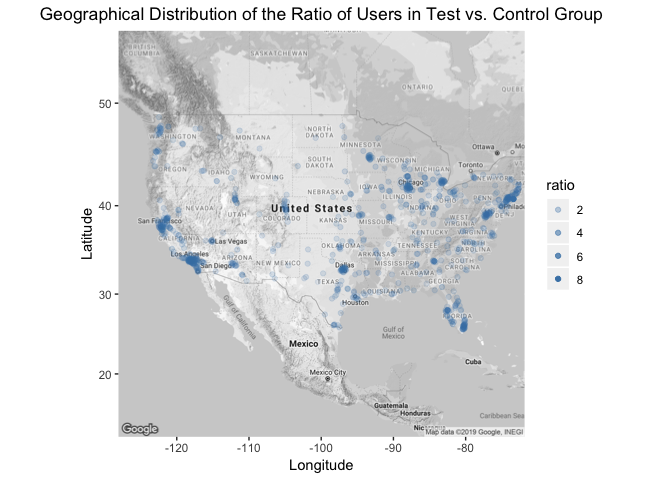
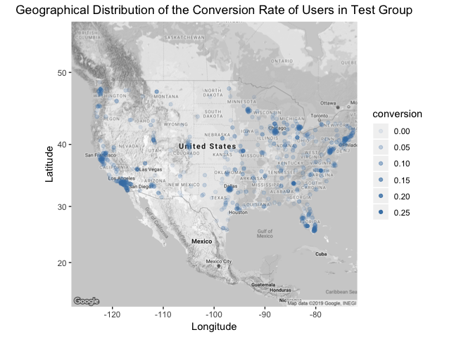

<div align = "justify">
    
Pricing Analysis
================

### Company XYZ sells software for $39. Since revenue has been flat for some time, the VP of Product has decided to run a test increasing the price. She hopes that this would increase revenue. In the experiment, 66% of the users have seen the old price ($39), while a random sample of 33% users a higher price ($59).

### The test has been running for some time, and the VP of Product is interested in understanding how it went and whether it would make sense to increase the price for all the users. Especially he asked you the following questions:

#### (1) Should the company sell its software for $39 or $59?

#### (2) The VP of Product is interested in having a holistic view into user behavior, especially focusing on actionable insights that might increase conversion rate. What are your main findings looking at the data?

#### (3) \[Bonus\] The VP of Product feels that the test has been running for too long and he should have been able to get statistically significant results in a shorter time. Do you agree with her intuition? After how many days you would have stopped the test? Please, explain why.

### Library needed packages and source codes

### Read in dataset

### Look into data

    ## 'data.frame':    316800 obs. of  8 variables:
    ##  $ user_id         : int  604839 624057 317970 685636 820854 169971 600150 798371 447194 431639 ...
    ##  $ timestamp       : Factor w/ 140931 levels "2015-03-02 00:04:12",..: 101200 108575 51554 99931 128964 65580 1803 20197 40301 81051 ...
    ##  $ source          : Factor w/ 12 levels "ads_facebook",..: 1 10 3 6 1 4 8 3 1 1 ...
    ##  $ device          : Factor w/ 2 levels "mobile","web": 1 1 1 1 2 1 2 1 2 2 ...
    ##  $ operative_system: Factor w/ 6 levels "android","iOS",..: 2 1 1 2 4 2 6 1 6 6 ...
    ##  $ test            : int  0 0 0 1 0 0 0 1 1 1 ...
    ##  $ price           : int  39 39 39 59 39 39 39 59 59 59 ...
    ##  $ converted       : int  0 0 0 0 0 0 0 1 0 0 ...

    ## 'data.frame':    275616 obs. of  5 variables:
    ##  $ user_id: int  510335 89568 434134 289769 939586 229234 339138 270353 166748 167700 ...
    ##  $ city   : Factor w/ 923 levels "Abilene","Akron",..: 620 679 683 128 156 553 233 553 113 553 ...
    ##  $ country: Factor w/ 1 level "USA": 1 1 1 1 1 1 1 1 1 1 ...
    ##  $ lat    : num  42.5 39.5 34.1 39.1 41.8 ...
    ##  $ long   : num  -71 -119.8 -117.4 -119.7 -87.7 ...

    ## [1] TRUE

    ## [1] TRUE

    ## [1] TRUE

### Data cleaning and data processing

    ##     
    ##           0      1
    ##   39 202517    155
    ##   59    210 113918

### Data Visualization

Before conducting A/B test, we prefer first examine if the randomization is valid.

#### Source

##### Visualized check if the randomization valid across all marketing channel


The rates of test samples seem similar across all marketing channels, suggesting that the randomization is valid across the source.

##### Visualize the difference of the conversion rate in the test/control group of each marketing source


##### Visualize the difference of the revenue in the test/control group of each marketing source


#### OS:

##### Visualized check if the randomization valid across all operating system


Though individuals using Linux OS seems to have a slightly high rate to be tested, it's still okay; since the number of Linux users is relatively small (4130/316435), such slightly "unbalance" won't affect much.

##### Visualize the difference of the conversion rate in the test/control group of each operating system


From the above plot, the conversion rate of the test group among Linux users is 0, which is impossible (may due to some bugs). Accordingly, in further analysis, we would remove this section, for users in both the test group and the control group.

##### Visualize the difference of the revenue in the test/control group of each operating system


#### Device:

##### Visualized check if the randomization valid of both devices


The rates of test samples seem similar of both devices, suggesting that the randomization is valid across the source.

##### Visualize the difference of the conversion rate in the test/control group of each both devices


##### Visualize the difference of the revenue in the test/control group of each operating system


#### Location

##### Visualize the location of users

Since we have the users information about their cities and even latitude and longitude. We firstly want to examine their geo-distribution of the test/control group as well as convert/non-convert group.

##### Since all users are from US, we load in the map of US first

``` r
USAMap <- get_googlemap(center = c(lon = -100, lat = 37), scale = 2, 
                        zoom = 4, color = "bw", key = api_key)
```

##### Visualize the ratio of users in the test/control from each city to see if the randomization is valid across cities

    ## Warning: Factor `city` contains implicit NA, consider using
    ## `forcats::fct_explicit_na`

    ## Warning: Factor `city` contains implicit NA, consider using
    ## `forcats::fct_explicit_na`

    ## [1] 0.0625 8.0000

    ## Warning: Removed 50 rows containing missing values (geom_point).



From the above geographical distributions of the ratio of users in test/control groups, the randomization of the tested sample selection seems not valid, which confirms our findings from the decision tree. From such plots, we also noticed that relatively fewer user coming from the middle of the country.

##### Visualize the conversion rate of users from each city

    ## Warning: Factor `city` contains implicit NA, consider using
    ## `forcats::fct_explicit_na`

    ## Warning: Removed 51 rows containing missing values (geom_point).


Obviously, the conversion rate is not even nationwide. Then we examine the conversion rate in the test/control group, respectively.

##### Visualize the conversion rate of users in both groups from each city

    ## Warning: Factor `city` contains implicit NA, consider using
    ## `forcats::fct_explicit_na`

    ## Warning: Factor `city` contains implicit NA, consider using
    ## `forcats::fct_explicit_na`

    ## Warning: Factor `city` contains implicit NA, consider using
    ## `forcats::fct_explicit_na`

    ## Warning: Factor `city` contains implicit NA, consider using
    ## `forcats::fct_explicit_na`

    ## Warning: Removed 51 rows containing missing values (geom_point).


    ## Warning: Removed 51 rows containing missing values (geom_point).



In general, of the same city, the conversion rate in the test group is a little bit lower than that in the control group, which makes sense. Since we can expect the number of buyers drops when increasing the price. Then we investigate the pattern of revenue across cities.

##### Visualize the revenue each city

    ## Warning: Factor `city` contains implicit NA, consider using
    ## `forcats::fct_explicit_na`

    ## Warning: Factor `city` contains implicit NA, consider using
    ## `forcats::fct_explicit_na`

    ## Warning: Factor `city` contains implicit NA, consider using
    ## `forcats::fct_explicit_na`

    ## Warning: Factor `city` contains implicit NA, consider using
    ## `forcats::fct_explicit_na`

    ## Warning: Removed 51 rows containing missing values (geom_point).


    ## Warning: Removed 54 rows containing missing values (geom_point).


Of the same city, generally, with the same scale, the size of the points in the test group is greater than that in the control group, suggesting that the mean revenue of the test group is relatively higher.

#### Temporal trend:

##### Visualize the temporal trend of conversion rate


##### Visualize the temporal trend of revenue


### Answer questions

#### (1) Should the company sell its software for $39 or $59?

For this part, we need to conduct an A/B test. However, from the results of the visualization section, the randomization may not be valid for the city. We first build a decision tree to see whether we need to do the test stratified by the city.

##### Build a simple decision tree to see if the randomization is valid

    ## Call:
    ## rpart(formula = test ~ ., data = test[, -c(1:2, 7:9, 11:13, 17)], 
    ##     control = rpart.control(minbucket = nrow(test)/10, maxdepth = 2, 
    ##         cp = 0.001))
    ##   n= 316435 
    ## 
    ##   CP nsplit rel error xerror xstd
    ## 1  0      0         1      0    0
    ## 
    ## Node number 1: 316435 observations
    ##   predicted class=0  expected loss=0.3600044  P(node) =1
    ##     class counts: 202517 113918
    ##    probabilities: 0.640 0.360

    ## NULL

The tree does not split on any variable, suggesting that we may assume the randomization is valid in this case generally. Also, when deciding the price in this case, we actually have two considerations: on the one hand, we do hope to investigate the price group with the higher revenue; on the other hand, it is also of interest to see the change of the conversion rate due to the increasing price, since it is sorts of indicator of the number of customers, which definitely affects the long-term revenue.

    ##           control   test p.value
    ## Converted  0.0199 0.0156 <0.0001
    ## Revenue    0.7761 0.9177 <0.0001

From the above summary, the conversion rate favors $39 while the revenue favors $59, which makes sense, since when you increase the price, you may earn more money, and at the same time, you definitely lose more customers.

In our visualization part, we noticed that the zero users who are using the Linux operative system bought the product with the new price, suggesting that there might be a bug (like input error) exists, we then consider removing the uses with Linux OS to avoid potential bias. Additionally, from the geographical distribution of the ratio of test/control, some cities may have much more test users then it was supposed to, indicating that they may be sorts of outliers, which we'll also remove.

    ##           control   test p.value
    ## Converted  0.0198 0.0157 <0.0001
    ## Revenue    0.7727 0.9287 <0.0001

After removing potential outliers, the results and corresponding insights did not change.

#### (2) The VP of Product is interested in having a holistic view into user behavior, especially focusing on actionable insights that might increase conversion rate. What are your main findings looking at the data?

1.  In terms of marketing channels, the conversion rate of users referred by friends is much higher than other sources. On the one hand, we may have the market team to make the advertisement more appealing and to improve the rank among search results by optimizing the website content, such as titles, words, etc. On the other hand, we may provide a discount to users who succeed in referring friends to buy that product.

2.  For the operating system, it seems that iOS/Mac users converted much better than others. It suggests that the product itself may not be user-friendly on other OSs, such as Android or windows. It's better to let the product team investigate this issue further.

3.  No big difference between phone-users and website-users.

4.  Last but maybe the most actionable part should be the geographic factor. From the map, users on the east/west coast and in big cities such as Chicago and Dallas seemed to convert better than those in other regions. It is a good idea to let marketing to advertise and use marketing channel which is more likely to reach people who are living in big cities. At the same time, given the poor conversion rates in other regions, it is at least worth to try to know the reasons.

#### (3) \[Bonus\] The VP of Product feels that the test has been running for too long and he should have been able to get statistically significant results in a shorter time. Do you agree with her intuition? After how many days you would have stopped the test? Please, explain why.

From the temporal plot, this experiment to test if helpful to improve the product price lasted three months, from March to June, to collect information from 316, 435 users. If we have evidence to say that we do not need so many users in the experiment, we definitely feel comfortable to shorten the experiment period.

Basically, we need to calculate the sample size for this experiment. By default, we set the significance level and the power as 0.05 and 0.8, respectively. We then plot the required sample size by the effect size.

    ##  [1] 0.05 0.06 0.07 0.08 0.09 0.10 0.11 0.12 0.13 0.14 0.15 0.16 0.17 0.18
    ## [15] 0.19 0.20 0.21 0.22 0.23 0.24 0.25


From the plot, if we want to examine the significant difference at 0.05 significance level, 0.8 level and 0.05 effect size, we only need aroung 6, 000 users, we can shorten the time taken of the experiment.

</div>


