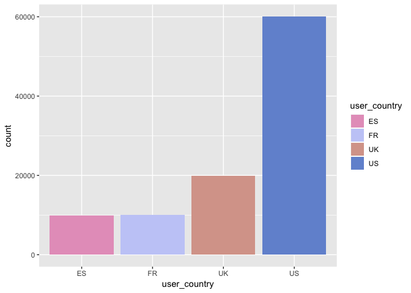

Marketing Email Campaign
================

### The marketing team of an e-commerce site has launched an email campaign. This site has email addresses from all the users who created an account in the past. They have chosen a random sample of users and emailed them. The email let the user know about a new feature implemented on the site. From the marketing team perspective, success is if the user clicks on the link inside of the email. This link takes the user to the company site.

### You are in charge of figuring out how the email campaign performed and were asked the following questions:

#### (1) What percentage of users opened the email and what percentage clicked on the link within the email?

#### (2) The VP of marketing thinks that it is stupid to send emails to a random subset and in a random way. Based on all the information you have about the emails that were sent, can you build a model to optimize in future email campaigns to maximize the probability of users clicking on the link inside the email?

#### (3) By how much do you think your model would improve click-through-rate (defined as \# of users who click on the link/total users who received the email). How would you test that?

#### (4) Did you find any interesting pattern on how the email campaign performed for different segments of users? Explain.

### Library needed packages and source codes

### Read in dataset

### Look into dataset

    ## [1] TRUE

    ## [1] TRUE

    ## [1] TRUE

    ## [1] 0

    ## [1] 0

    ##     email_id            email_text         email_version  
    ##  Min.   :     8   long_email :50276   generic     :50209  
    ##  1st Qu.:246708   short_email:49724   personalized:49791  
    ##  Median :498447                                           
    ##  Mean   :498690                                           
    ##  3rd Qu.:749943                                           
    ##  Max.   :999998                                           
    ##                                                           
    ##       hour             weekday      user_country user_past_purchases
    ##  Min.   : 1.000   Friday   :14177   ES: 9967     Min.   : 0.000     
    ##  1st Qu.: 6.000   Monday   :14363   FR: 9995     1st Qu.: 1.000     
    ##  Median : 9.000   Saturday :14569   UK:19939     Median : 3.000     
    ##  Mean   : 9.059   Sunday   :14387   US:60099     Mean   : 3.878     
    ##  3rd Qu.:12.000   Thursday :14277                3rd Qu.: 6.000     
    ##  Max.   :24.000   Tuesday  :14143                Max.   :22.000     
    ##                   Wednesday:14084                                   
    ##       open            click        
    ##  Min.   :0.0000   Min.   :0.00000  
    ##  1st Qu.:0.0000   1st Qu.:0.00000  
    ##  Median :0.0000   Median :0.00000  
    ##  Mean   :0.1035   Mean   :0.02119  
    ##  3rd Qu.:0.0000   3rd Qu.:0.00000  
    ##  Max.   :1.0000   Max.   :1.00000  
    ## 

    ## [1] 0.2048333

### Data Visualization

Before building a model to predict the clicking rate, we first visualize the click-through-rate and sorts of conversion rate at each step.

#### email text

#### email version

#### user country

#### user past purchases

#### user local hour

### user local hour

### Answer questions

#### (1) What percentage of users opened the email and what percentage clicked on the link within the email?

Among all users who received the email, around 10% users open the email and 2% click the link. And among all users who open the email, 20% click the link.

#### (2) The VP of marketing thinks that it is stupid to send emails to a random subset and in a random way. Based on all the information you have about the emails that were sent, can you build a model to optimize in future email campaigns to maximize the probability of users clicking on the link inside the email?

##### Build models for predicting clicking rate

##### Personalized dataset with unique combinations of 6 features and predict the click-through-rate for each unique combination

    ## [1] 22226

    ## # A tibble: 1 x 7
    ## # Groups:   user_country [1]
    ##   user_country user_past_purch… max_prob email_text email_version  hour
    ##   <fct>                   <int>    <dbl> <fct>      <fct>         <int>
    ## 1 ES                          1     0.32 long_email personalized     18
    ## # … with 1 more variable: weekday <fct>

    ## # A tibble: 4 x 7
    ## # Groups:   user_country [4]
    ##   user_country user_past_purch… max_prob email_text email_version  hour
    ##   <fct>                   <int>    <dbl> <fct>      <fct>         <int>
    ## 1 ES                          0     0.04 short_ema… personalized     18
    ## 2 FR                          0     0.09 short_ema… personalized     22
    ## 3 UK                          0     0.01 short_ema… personalized     22
    ## 4 US                          0     0.01 short_ema… personalized     19
    ## # … with 1 more variable: weekday <fct>

The generated matric, personalized\_features, provides sorts of strategies to optimize future emails. For example, for a user located in ES with one past purchase, to enhance the CRT, it's better to send a personalized long email at 6:00 PM on Monday. However, for clients without purchase history, there may exist multiple combinations of features. Based on the summary, one possible strategy is sending a personalized (no matter long or short) after 4:00 PM on workdays.

#### (3) By how much do you think your model would improve click through rate (defined as \# of users who click on the link/total users who received the email). How would you test that?

    ## [1] 0.3356605

To see how much the predictive model would improve the click-through rate, we add the maximum probability for each combo of country and purchase history in the original dataset and summarize it. Based on the result, the CRT would be expected to increase to over 30%. We also want to conduct an A/B test to see if there exists statistical significance to support personalizing emails.

1.  First of all, we need to calculate the sample size to conduct such a test, as shown below.

<!-- -->

    ##  [1] 0.025 0.030 0.035 0.040 0.045 0.050 0.055 0.060 0.065 0.070 0.075
    ## [12] 0.080 0.085 0.090 0.095 0.100

1.  Since we can do nothing for the country of users and their purchase history, we want to conduct a design of block randomization. Specifically, we block users according to their country and purchase history and in each block, we randomly assign each user either to the test group or to the control group. For example, suppose users are coming from the US and UK, and they may have 0 − 4 purchase records, then we split users into 2 \* 5 = 10 blocks. In each block, we let each user in the test or control group randomly.

2.  Doing this test for 2-3 weeks so that we may collect enough entries as we calculated in the first step.

#### (4) Did you find any interesting pattern on how the email campaign performed for different segments of users? Explain.

1.  For those users from non-spoken English countries, there must be something led to the low "opening" rate, either the cultural difference or poor translation or something else. It's important to examine the reason since as shown in the plot, they have comparable clicking rates if they open the emails.

2.  In addition, personalized but short email would be helpful to increase both "opening rate" as well as "clicking rate", which finally contribute to the "clicking-through-rate".

3.  It seems that the time point of sending an email is also important. And the best time interval should be afternoon (tree splits), or more specifically, after 8:00 PM (from the plot). Additionally, around 10:00 PM may also work well. It also shows that the "clicking-through-rate" is relatively higher from Monday to Thursday.

