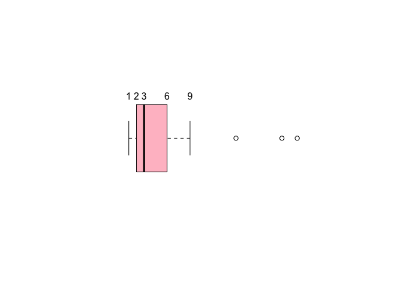
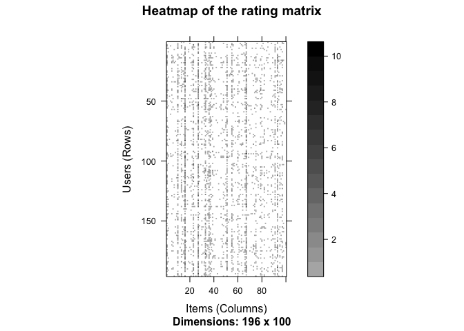
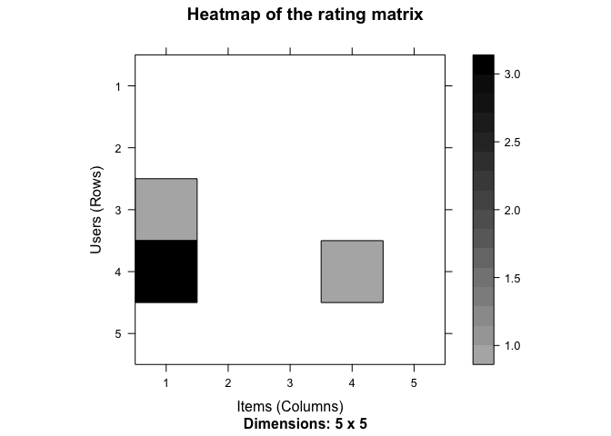
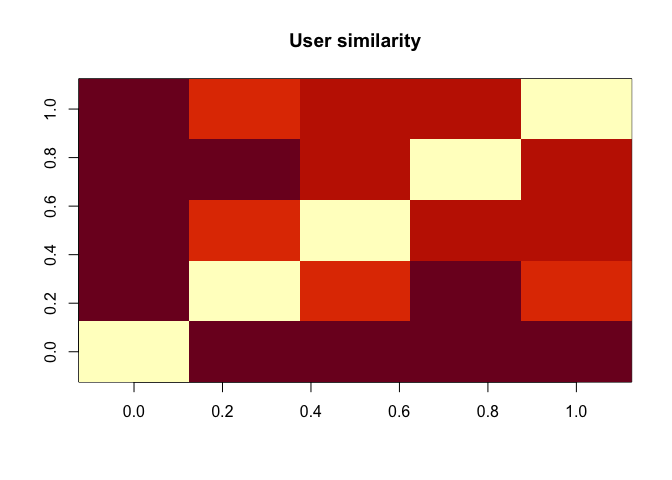
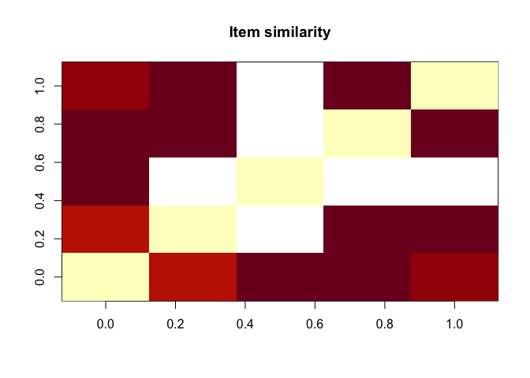
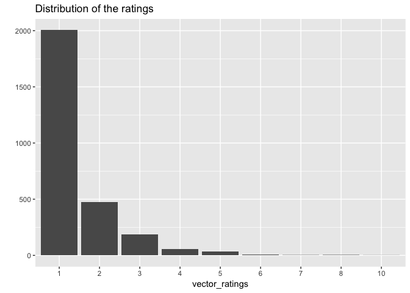
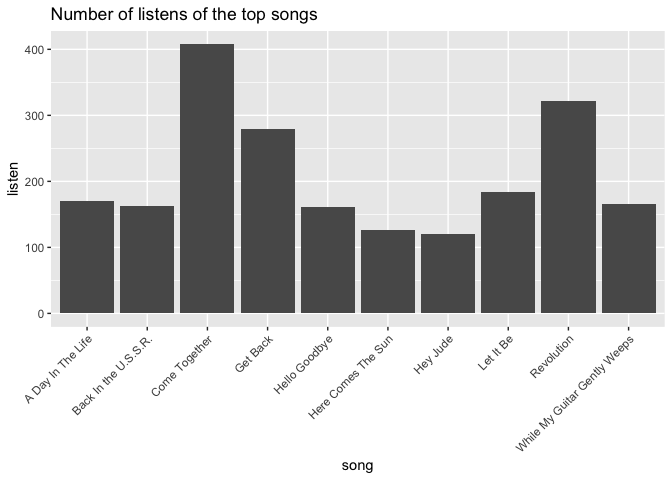
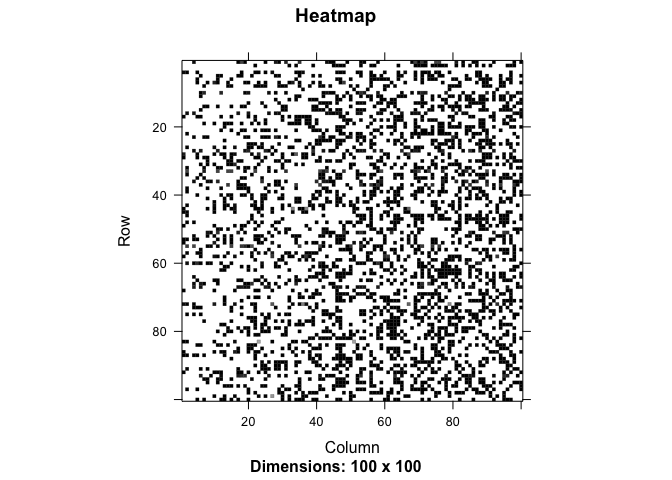
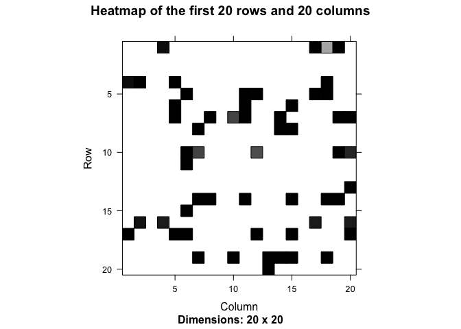
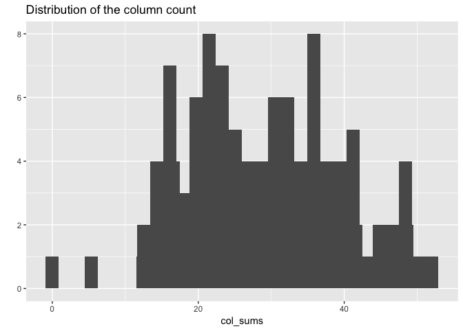

Song Challenge
================

### You are the fifth employee at company XYZ. The good news is that if the company becomes big, you will become very rich with the stocks. The bad news is that, at such an early stage, the data is usually very messy. All their data is stored in json files.

### The company CEO asked you very specific questions:

#### (1) What are the top 3 and the bottom 3 states in terms of number of users?

#### (2) What are the top 3 and the bottom 3 states in terms of user engagement? You can choose how to mathematically define user engagement. What the CEO cares about here is in which states users are using the product a lot/very little.

#### (3) The CEO wants to send a gift to the first user who signed-up for each state. That is, the first user who signed-up from California, from Oregon, etc. Can you give him a list of those users?

#### (4) Build a function that takes as an input any of the songs in the data and returns the most likely song to be listened next. That is, if, for instance, a user is currently listening to "Eight Days A Week", which song has the highest probability of being played right after it by the same user? This is going to be v1 of a song recommendation model.

#### (5) How would you set up a test to check whether your model works well and is improving engagement?

### Library needed packages and source codes

### Read in dataset

    ## [1] TRUE

    ## 'data.frame':    4000 obs. of  6 variables:
    ##  $ id               : chr  "GOQMMKSQQH" "HWKKBQKNWI" "DKQSXVNJDH" "HLHRIDQTUW" ...
    ##  $ user_id          : int  122 3 35 126 6 147 155 171 174 170 ...
    ##  $ user_state       : chr  "Louisiana" "Ohio" "New Jersey" "Illinois" ...
    ##  $ user_sign_up_date: chr  "2015-05-16" "2015-05-01" "2015-05-04" "2015-05-16" ...
    ##  $ song_played      : chr  "Hey Jude" "We Can Work It Out" "Back In the U.S.S.R." "P.s. I Love You" ...
    ##  $ time_played      : chr  "2015-06-11 21:51:35" "2015-06-06 16:49:19" "2015-06-14 02:11:29" "2015-06-08 12:26:10" ...

    ##       id               user_id       user_state        user_sign_up_date 
    ##  Length:4000        Min.   :  1.0   Length:4000        Length:4000       
    ##  Class :character   1st Qu.: 48.0   Class :character   Class :character  
    ##  Mode  :character   Median :102.0   Mode  :character   Mode  :character  
    ##                     Mean   :101.6                                        
    ##                     3rd Qu.:155.0                                        
    ##                     Max.   :200.0                                        
    ##  song_played        time_played       
    ##  Length:4000        Length:4000       
    ##  Class :character   Class :character  
    ##  Mode  :character   Mode  :character  
    ##                                       
    ##                                       
    ## 

    ## [1] 196

    ## [1] 100

#### (1) What are the top 3 and the bottom 3 states in terms of number of users?

    ## # A tibble: 3 x 2
    ##   user_state user_no
    ##   <chr>        <int>
    ## 1 New York        23
    ## 2 California      21
    ## 3 Texas           15

    ## # A tibble: 3 x 2
    ##   user_state  user_no
    ##   <chr>         <int>
    ## 1 Arizona           1
    ## 2 Connecticut       1
    ## 3 Idaho             1

In terms of the number of users, the top 3 states are New York, California, and Texas while the bottom 3 states are Arizona, Connecticut, and Idaho (and tied with several other states).

#### (2) What are the top 3 and the bottom 3 states in terms of user engagement? You can choose how to mathematically define user engagement. What the CEO cares about here is in which states users are using the product a lot/very little.

``` r
text(x = boxplot.stats(data_user$user_no)$stats, 
     labels = boxplot.stats(data_user$user_no)$stats, y = 1.25)
```



In this part, we would like to define the engagement as the average number of events per user only considering states with at least 3 users (we do not want to include the states with too few users in our analysis, and 3 is the median of the distribution of the number of users per state.)

    ## [1] 26

    ## # A tibble: 3 x 2
    ##   user_state     avg_engage
    ##   <chr>               <dbl>
    ## 1 Mississippi          28.3
    ## 2 South Carolina       28.3
    ## 3 Alabama              26

    ## # A tibble: 3 x 2
    ##   user_state    avg_engage
    ##   <chr>              <dbl>
    ## 1 Minnesota           10.5
    ## 2 West Virginia       12.7
    ## 3 Indiana             13.8

Among the states with at least 3 users, in terms of the number of users, the top 3 states are Mississippi, South Carolina, and Alabama while the bottom 3 states are Minnesota, West Virginia, and Indiana.

### (3) The CEO wants to send a gift to the first user who signed-up for each state. That is, the first user who signed-up from California, from Oregon, etc. Can you give him a list of those users?

    ##         user_state first_date user_id
    ## 1          Alabama 2015-05-01       5
    ## 22          Alaska 2015-05-12     106
    ## 48         Arizona 2015-05-12     105
    ## 70        Arkansas 2015-05-08      78
    ## 79      California 2015-05-04      39
    ## 80      California 2015-05-04      44
    ## 120       Colorado 2015-05-19     166
    ## 121       Colorado 2015-05-19     173
    ## 155    Connecticut 2015-05-16     127
    ## 171        Florida 2015-05-04      43
    ## 172        Florida 2015-05-04      41
    ## 239        Georgia 2015-05-02      20
    ## 240        Georgia 2015-05-02      16
    ## 320          Idaho 2015-05-19     165
    ## 346       Illinois 2015-05-05      45
    ## 359        Indiana 2015-05-12     102
    ## 367           Iowa 2015-05-19     178
    ## 390         Kansas 2015-05-19     177
    ## 398       Kentucky 2015-05-04      34
    ## 426      Louisiana 2015-05-06      50
    ## 428       Maryland 2015-05-02      18
    ## 467  Massachusetts 2015-05-02      15
    ## 478       Michigan 2015-05-02      13
    ## 497      Minnesota 2015-05-02       8
    ## 498      Minnesota 2015-05-02      21
    ## 500    Mississippi 2015-05-02      23
    ## 501    Mississippi 2015-05-02      26
    ## 540       Missouri 2015-05-09      85
    ## 572       Nebraska 2015-05-16     134
    ## 608     New Jersey 2015-05-01       6
    ## 634     New Mexico 2015-05-01       4
    ## 651       New York 2015-05-02      27
    ## 652       New York 2015-05-02      22
    ## 654       New York 2015-05-02      12
    ## 655       New York 2015-05-02      19
    ## 659       New York 2015-05-02      10
    ## 730 North Carolina 2015-05-01       2
    ## 748   North Dakota 2015-05-17     135
    ## 774           Ohio 2015-05-01       3
    ## 792       Oklahoma 2015-05-16     119
    ## 815         Oregon 2015-05-01       1
    ## 825   Pennsylvania 2015-05-02      11
    ## 838   Rhode Island 2015-05-19     174
    ## 865 South Carolina 2015-05-08      64
    ## 885      Tennessee 2015-05-08      70
    ## 903          Texas 2015-05-01       7
    ## 915           Utah 2015-05-03      29
    ## 948       Virginia 2015-05-17     142
    ## 950     Washington 2015-05-16     125
    ## 968  West Virginia 2015-05-07      60
    ## 984      Wisconsin 2015-05-04      32

Though we only have 41 unique states, I have a list of 51 user ID. Since for some states, such as California, a couple of customers may sign up on the same day, without further time information, it is hard to say who came first.

### (4) Build a function that takes as an input any of the songs in the data and returns the most likely song to be listened next. That is, if, for instance, a user is currently listening to "Eight Days A Week", which song has the highest probability of being played right after it by the same user? This is going to be v1 of a song recommendation model.

There are several ways to construct recommendation models.

#### Method 1: Select several most popular songs and recommend one of them to users randomly every user, which can be obtained in Method 2.

#### Method 2: Employ item-based collaborative filtering (IBCF), which can be carried out as follows.

##### Step 1: Count each song played by each user. Each row corresponds to a user, and each column corresponds to a song. There are more than 196 \* 100 = 19, 600 combinations between a user and a song. Therefore, storing the complete matrix would require 39, 200 cells. However, not every user has listened to every song. Therefore, there are 4, 000 records (i.e., 4, 000 events), and the matrix is sparse.

##### Build the heatmap for the song\_by\_user matrix and its subset



From such heatmap, we may see the 4<sup>*t**h*</sup> user has listened the 1<sup>*s**t*</sup> song three times and the 4<sup>*t**h*</sup> once.

##### Step 2: Compute the similarity matrix

###### Determine how similar the first five users are with each other by cosine distance.

    ## [1] "dist"

 The more red the cell is, the more similar two users are.

###### Determine how similar the first five songs are with each other by cosine distance.



##### Step 3: Look into song\_by\_user\_matrix

In this part, we view the listening frequency of one song as sorts of rating, since the more times a user listened to one song, the more likely he/she likes the song.

    ## [1] "data"      "normalize"

    ## [1] "dgCMatrix"
    ## attr(,"package")
    ## [1] "Matrix"

    ## [1] 196 100

    ##  [1]  0  1  3  2  5  4  7  8  6 10

The ratings are integers in the range of 0 − 10. We'll count the occurrences of each of them.

    ## vector_ratings
    ##     0     1     2     3     4     5     6     7     8    10 
    ## 16828  2007   475   186    59    33     6     2     3     1

Build a frequency plot of the ratings after removing 0. 

##### Step 4: Exploring which songs have been listened to

    ##                                                                                                            song
    ## Come Together                                                                                     Come Together
    ## Revolution                                                                                           Revolution
    ## Get Back                                                                                               Get Back
    ## Let It Be                                                                                             Let It Be
    ## A Day In The Life                                                                             A Day In The Life
    ## While My Guitar Gently Weeps                                                       While My Guitar Gently Weeps
    ## Back In the U.S.S.R.                                                                       Back In the U.S.S.R.
    ## Hello Goodbye                                                                                     Hello Goodbye
    ## Here Comes The Sun                                                                           Here Comes The Sun
    ## Hey Jude                                                                                               Hey Jude
    ## Eleanor Rigby                                                                                     Eleanor Rigby
    ## Lucy In The Sky With Diamonds                                                     Lucy In The Sky With Diamonds
    ## We Can Work It Out                                                                           We Can Work It Out
    ## Birthday                                                                                               Birthday
    ## Reprise / Day in the Life                                                             Reprise / Day in the Life
    ## Yesterday                                                                                             Yesterday
    ## Ob-la-di, Ob-la-da                                                                           Ob-la-di, Ob-la-da
    ## Something                                                                                             Something
    ## Sgt. Pepper/with A Little Help From My Friends                   Sgt. Pepper/with A Little Help From My Friends
    ## The Ballad Of John And Yoko                                                         The Ballad Of John And Yoko
    ## OH DARLING                                                                                           OH DARLING
    ## Strawberry Fields Forever                                                             Strawberry Fields Forever
    ## Got To Get You Into My Life                                                         Got To Get You Into My Life
    ## With a Little Help From My Friends                                           With a Little Help From My Friends
    ## I Feel Fine                                                                                         I Feel Fine
    ## Magical Mystery Tour                                                                       Magical Mystery Tour
    ## I Am the Walrus                                                                                 I Am the Walrus
    ## Help!                                                                                                     Help!
    ## Can't Buy Me Love                                                                             Can't Buy Me Love
    ## Eight Days A Week                                                                             Eight Days A Week
    ## Golden Slumbers                                                                                 Golden Slumbers
    ## Lady Madonna                                                                                       Lady Madonna
    ## Helter Skelter                                                                                   Helter Skelter
    ## IN MY LIFE                                                                                           IN MY LIFE
    ## Ticket to Ride                                                                                   Ticket to Ride
    ## Penny Lane                                                                                           Penny Lane
    ## Twist and Shout                                                                                 Twist and Shout
    ## All My Loving                                                                                     All My Loving
    ## Paperback Writer                                                                               Paperback Writer
    ## Drive My Car                                                                                       Drive My Car
    ## A Hard Day's Night                                                                           A Hard Day's Night
    ## I've Got A Feeling                                                                           I've Got A Feeling
    ## Sgt. Pepper's Lonely Hearts Club Band (Reprise)                 Sgt. Pepper's Lonely Hearts Club Band (Reprise)
    ## Yellow Submarine                                                                               Yellow Submarine
    ## Sgt. Pepper/a Day In The Life                                                     Sgt. Pepper/a Day In The Life
    ## She Loves You                                                                                     She Loves You
    ## The Long And Winding Road                                                             The Long And Winding Road
    ## All You Need Is Love                                                                       All You Need Is Love
    ## I Saw Her Standing There                                                               I Saw Her Standing There
    ## I've Just Seen A Face                                                                     I've Just Seen A Face
    ## Wild Honey Pie                                                                                   Wild Honey Pie
    ## Blackbird                                                                                             Blackbird
    ## Day Tripper                                                                                         Day Tripper
    ## Sgt. Pepper Inner Groove                                                               Sgt. Pepper Inner Groove
    ## Things We Said Today                                                                       Things We Said Today
    ## Two Of Us                                                                                             Two Of Us
    ## And Your Bird Can Sing                                                                   And Your Bird Can Sing
    ## Fixing A Hole                                                                                     Fixing A Hole
    ## I Want To Hold Your Hand                                                               I Want To Hold Your Hand
    ## I Want You (She's So Heavy)                                                         I Want You (She's So Heavy)
    ## Rocky Raccoon                                                                                     Rocky Raccoon
    ## The Fool On The Hill                                                                       The Fool On The Hill
    ## BAD BOY                                                                                                 BAD BOY
    ## Maxwell's Silver Hammer                                                                 Maxwell's Silver Hammer
    ## You Never Give Me Your Money                                                       You Never Give Me Your Money
    ## Don't Let Me Down                                                                             Don't Let Me Down
    ## Please Please Me                                                                               Please Please Me
    ## Sgt. Pepper's Lonely Hearts Club Band                                     Sgt. Pepper's Lonely Hearts Club Band
    ## SHE'S A WOMAN                                                                                     SHE'S A WOMAN
    ## Sun King                                                                                               Sun King
    ## ANYTIME AT ALL                                                                                   ANYTIME AT ALL
    ## Dear Prudence                                                                                     Dear Prudence
    ## Everybody's Got Something To Hide Except Me And My Monk Everybody's Got Something To Hide Except Me And My Monk
    ## Norwegian Wood                                                                                   Norwegian Wood
    ## Baby You're A Rich Man                                                                   Baby You're A Rich Man
    ## BALLAD OF JOHN AND YOKO                                                                 BALLAD OF JOHN AND YOKO
    ## Getting Better                                                                                   Getting Better
    ## I'm A Loser                                                                                         I'm A Loser
    ## IT WON'T BE LONG                                                                               IT WON'T BE LONG
    ## P.s. I Love You                                                                                 P.s. I Love You
    ## She's Leaving Home                                                                           She's Leaving Home
    ## YOUR MOTHER SHOULD KNOW                                                                 YOUR MOTHER SHOULD KNOW
    ## Across The Universe                                                                         Across The Universe
    ## Good Day Sunshine                                                                             Good Day Sunshine
    ## Lovely Rita                                                                                         Lovely Rita
    ## NOWHERE MAN                                                                                         NOWHERE MAN
    ## Roll Over Beethoven                                                                         Roll Over Beethoven
    ## The Word                                                                                               The Word
    ## Cry For A Shadow                                                                               Cry For A Shadow
    ## From Me To You                                                                                   From Me To You
    ## GIRL                                                                                                       GIRL
    ## I'll Follow The Sun                                                                         I'll Follow The Sun
    ## LITTLE CHILD                                                                                       LITTLE CHILD
    ## Love Me Do                                                                                           Love Me Do
    ## ROCK AND ROLL MUSIC                                                                         ROCK AND ROLL MUSIC
    ## When I'm 64                                                                                         When I'm 64
    ## A Saturday Club Xmas/Crimble Medley                                         A Saturday Club Xmas/Crimble Medley
    ## I'm Down                                                                                               I'm Down
    ## THE CONTINUING STORY OF BUNG                                                       THE CONTINUING STORY OF BUNG
    ## You're Going To Lose That Girl                                                   You're Going To Lose That Girl
    ##                                                         listen
    ## Come Together                                              408
    ## Revolution                                                 321
    ## Get Back                                                   279
    ## Let It Be                                                  184
    ## A Day In The Life                                          170
    ## While My Guitar Gently Weeps                               165
    ## Back In the U.S.S.R.                                       163
    ## Hello Goodbye                                              161
    ## Here Comes The Sun                                         127
    ## Hey Jude                                                   120
    ## Eleanor Rigby                                              116
    ## Lucy In The Sky With Diamonds                              113
    ## We Can Work It Out                                          99
    ## Birthday                                                    79
    ## Reprise / Day in the Life                                   69
    ## Yesterday                                                   68
    ## Ob-la-di, Ob-la-da                                          66
    ## Something                                                   61
    ## Sgt. Pepper/with A Little Help From My Friends              57
    ## The Ballad Of John And Yoko                                 41
    ## OH DARLING                                                  40
    ## Strawberry Fields Forever                                   39
    ## Got To Get You Into My Life                                 36
    ## With a Little Help From My Friends                          36
    ## I Feel Fine                                                 35
    ## Magical Mystery Tour                                        35
    ## I Am the Walrus                                             33
    ## Help!                                                       32
    ## Can't Buy Me Love                                           31
    ## Eight Days A Week                                           31
    ## Golden Slumbers                                             30
    ## Lady Madonna                                                30
    ## Helter Skelter                                              29
    ## IN MY LIFE                                                  28
    ## Ticket to Ride                                              27
    ## Penny Lane                                                  24
    ## Twist and Shout                                             24
    ## All My Loving                                               22
    ## Paperback Writer                                            22
    ## Drive My Car                                                21
    ## A Hard Day's Night                                          20
    ## I've Got A Feeling                                          20
    ## Sgt. Pepper's Lonely Hearts Club Band (Reprise)             20
    ## Yellow Submarine                                            20
    ## Sgt. Pepper/a Day In The Life                               19
    ## She Loves You                                               18
    ## The Long And Winding Road                                   17
    ## All You Need Is Love                                        16
    ## I Saw Her Standing There                                    16
    ## I've Just Seen A Face                                       16
    ## Wild Honey Pie                                              16
    ## Blackbird                                                   14
    ## Day Tripper                                                 11
    ## Sgt. Pepper Inner Groove                                    11
    ## Things We Said Today                                        11
    ## Two Of Us                                                   11
    ## And Your Bird Can Sing                                      10
    ## Fixing A Hole                                               10
    ## I Want To Hold Your Hand                                    10
    ## I Want You (She's So Heavy)                                 10
    ## Rocky Raccoon                                               10
    ## The Fool On The Hill                                        10
    ## BAD BOY                                                      9
    ## Maxwell's Silver Hammer                                      9
    ## You Never Give Me Your Money                                 9
    ## Don't Let Me Down                                            8
    ## Please Please Me                                             8
    ## Sgt. Pepper's Lonely Hearts Club Band                        8
    ## SHE'S A WOMAN                                                8
    ## Sun King                                                     8
    ## ANYTIME AT ALL                                               7
    ## Dear Prudence                                                7
    ## Everybody's Got Something To Hide Except Me And My Monk      7
    ## Norwegian Wood                                               7
    ## Baby You're A Rich Man                                       6
    ## BALLAD OF JOHN AND YOKO                                      6
    ## Getting Better                                               6
    ## I'm A Loser                                                  6
    ## IT WON'T BE LONG                                             6
    ## P.s. I Love You                                              6
    ## She's Leaving Home                                           6
    ## YOUR MOTHER SHOULD KNOW                                      6
    ## Across The Universe                                          5
    ## Good Day Sunshine                                            5
    ## Lovely Rita                                                  5
    ## NOWHERE MAN                                                  5
    ## Roll Over Beethoven                                          5
    ## The Word                                                     5
    ## Cry For A Shadow                                             4
    ## From Me To You                                               4
    ## GIRL                                                         4
    ## I'll Follow The Sun                                          4
    ## LITTLE CHILD                                                 4
    ## Love Me Do                                                   4
    ## ROCK AND ROLL MUSIC                                          4
    ## When I'm 64                                                  3
    ## A Saturday Club Xmas/Crimble Medley                          2
    ## I'm Down                                                     2
    ## THE CONTINUING STORY OF BUNG                                 2
    ## You're Going To Lose That Girl                               2

Visualize top listened songs  From this step, we actually can have an easy way to recommend a list of songs to a user: just recommend the favorite ones, such as Come Together, Revolution, Get Back, etc.

##### Step 5: Build a recommendation model

    ## $k
    ## [1] 30
    ## 
    ## $method
    ## [1] "Cosine"
    ## 
    ## $normalize
    ## [1] "center"
    ## 
    ## $normalize_sim_matrix
    ## [1] FALSE
    ## 
    ## $alpha
    ## [1] 0.5
    ## 
    ## $na_as_zero
    ## [1] FALSE

    ## [1] "IBCF: Reduced similarity matrix"

    ## [1] 100 100

    ## [1] 30

Build a heatmap for the square matrix with size of the number of the song.  Most of the values are equal to 0. The reason is that each row contains only *k*(30) elements. Additionally, the matrix is not supposed to be symmetric. The number of non-null cells for each column depends on how many times the corresponding song was included in the top k of another song. Let's check the distribution of the number of elements by column:

    ## `stat_bin()` using `bins = 30`. Pick better value with `binwidth`.



As expected, there are a few songs that are similar to many others. Let's see which are the songs with the most elements:

    ## [1] "Magical Mystery Tour"     "Sgt. Pepper Inner Groove"
    ## [3] "I've Just Seen A Face"    "Rocky Raccoon"           
    ## [5] "I've Got A Feeling"       "Ticket to Ride"

    ## Recommendations as 'topNList' with n = 6 for 67 users.

    ## [1] "Baby You're A Rich Man"       "You Never Give Me Your Money"
    ## [3] "Across The Universe"          "Norwegian Wood"              
    ## [5] "Cry For A Shadow"             "She's Leaving Home"

    ## $`1`
    ## [1] "Baby You're A Rich Man"       "You Never Give Me Your Money"
    ## [3] "Across The Universe"          "Norwegian Wood"              
    ## [5] "Cry For A Shadow"             "She's Leaving Home"          
    ## 
    ## $`8`
    ## character(0)
    ## 
    ## $`9`
    ## character(0)
    ## 
    ## $`16`
    ## [1] "IT WON'T BE LONG"                     
    ## [2] "Sgt. Pepper's Lonely Hearts Club Band"
    ## [3] "From Me To You"                       
    ## [4] "Lovely Rita"                          
    ## [5] "I'm A Loser"                          
    ## [6] "I'm Down"                             
    ## 
    ## $`21`
    ## character(0)
    ## 
    ## $`24`
    ## [1] "And Your Bird Can Sing"               
    ## [2] "Maxwell's Silver Hammer"              
    ## [3] "ROCK AND ROLL MUSIC"                  
    ## [4] "IT WON'T BE LONG"                     
    ## [5] "Sgt. Pepper's Lonely Hearts Club Band"
    ## [6] "I'm Down"                             
    ## 
    ## $`25`
    ## [1] "Birthday"                     "Day Tripper"                 
    ## [3] "From Me To You"               "Lovely Rita"                 
    ## [5] "THE CONTINUING STORY OF BUNG" "I'm Down"                    
    ## 
    ## $`27`
    ## [1] "Maxwell's Silver Hammer" "IT WON'T BE LONG"       
    ## [3] "From Me To You"          "LITTLE CHILD"           
    ## [5] "ROCK AND ROLL MUSIC"     "Across The Universe"    
    ## 
    ## $`31`
    ## [1] "And Your Bird Can Sing"       "ROCK AND ROLL MUSIC"         
    ## [3] "LITTLE CHILD"                 "Dear Prudence"               
    ## [5] "I'm Down"                     "THE CONTINUING STORY OF BUNG"
    ## 
    ## $`34`
    ## [1] "You're Going To Lose That Girl" "Getting Better"                
    ## [3] "THE CONTINUING STORY OF BUNG"   "IT WON'T BE LONG"              
    ## [5] "Norwegian Wood"                 "I'm Down"                      
    ## 
    ## $`39`
    ## [1] "I'll Follow The Sun"            "Sun King"                      
    ## [3] "Good Day Sunshine"              "You're Going To Lose That Girl"
    ## [5] "I'm A Loser"                    "ROCK AND ROLL MUSIC"           
    ## 
    ## $`42`
    ## [1] "When I'm 64"                    "I'm Down"                      
    ## [3] "The Word"                       "THE CONTINUING STORY OF BUNG"  
    ## [5] "IT WON'T BE LONG"               "You're Going To Lose That Girl"
    ## 
    ## $`44`
    ## [1] "Baby You're A Rich Man"         "You're Going To Lose That Girl"
    ## [3] "IT WON'T BE LONG"               "Norwegian Wood"                
    ## [5] "THE CONTINUING STORY OF BUNG"   "GIRL"                          
    ## 
    ## $`46`
    ## [1] "Sgt. Pepper's Lonely Hearts Club Band"
    ## [2] "THE CONTINUING STORY OF BUNG"         
    ## [3] "I'm A Loser"                          
    ## [4] "I'm Down"                             
    ## [5] "IT WON'T BE LONG"                     
    ## [6] "Lovely Rita"                          
    ## 
    ## $`47`
    ## [1] "Maxwell's Silver Hammer"        "Day Tripper"                   
    ## [3] "When I'm 64"                    "Please Please Me"              
    ## [5] "Cry For A Shadow"               "You're Going To Lose That Girl"
    ## 
    ## $`48`
    ## character(0)
    ## 
    ## $`53`
    ## [1] "You're Going To Lose That Girl" "Baby You're A Rich Man"        
    ## [3] "I'm Down"                       "You Never Give Me Your Money"  
    ## [5] "From Me To You"                 "THE CONTINUING STORY OF BUNG"  
    ## 
    ## $`56`
    ## [1] "Sgt. Pepper's Lonely Hearts Club Band"
    ## [2] "Things We Said Today"                 
    ## [3] "ROCK AND ROLL MUSIC"                  
    ## [4] "The Word"                             
    ## [5] "Birthday"                             
    ## [6] "Rocky Raccoon"                        
    ## 
    ## $`57`
    ## [1] "All My Loving"        "IT WON'T BE LONG"     "Fixing A Hole"       
    ## [4] "Magical Mystery Tour" "Twist and Shout"      "Yesterday"           
    ## 
    ## $`60`
    ## [1] "IT WON'T BE LONG"               "You're Going To Lose That Girl"
    ## [3] "I'll Follow The Sun"            "Norwegian Wood"                
    ## [5] "THE CONTINUING STORY OF BUNG"   "I'm A Loser"                   
    ## 
    ## $`63`
    ## character(0)
    ## 
    ## $`64`
    ## [1] "Love Me Do"          "Across The Universe" "Good Day Sunshine"  
    ## [4] "ANYTIME AT ALL"      "LITTLE CHILD"        "IT WON'T BE LONG"   
    ## 
    ## $`67`
    ## [1] "IT WON'T BE LONG"             "From Me To You"              
    ## [3] "I'm Down"                     "ROCK AND ROLL MUSIC"         
    ## [5] "THE CONTINUING STORY OF BUNG" "I'm A Loser"                 
    ## 
    ## $`73`
    ## character(0)
    ## 
    ## $`76`
    ## [1] "Things We Said Today" "When I'm 64"          "Love Me Do"          
    ## [4] "Lovely Rita"          "The Word"             "Getting Better"      
    ## 
    ## $`80`
    ## [1] "You're Going To Lose That Girl"       
    ## [2] "From Me To You"                       
    ## [3] "THE CONTINUING STORY OF BUNG"         
    ## [4] "I'll Follow The Sun"                  
    ## [5] "Sgt. Pepper's Lonely Hearts Club Band"
    ## [6] "IT WON'T BE LONG"                     
    ## 
    ## $`82`
    ## [1] "Across The Universe" "Good Day Sunshine"   "I'm Down"           
    ## [4] "IT WON'T BE LONG"    "LITTLE CHILD"        "Norwegian Wood"     
    ## 
    ## $`84`
    ## [1] "ROCK AND ROLL MUSIC"                  
    ## [2] "LITTLE CHILD"                         
    ## [3] "Sgt. Pepper's Lonely Hearts Club Band"
    ## [4] "THE CONTINUING STORY OF BUNG"         
    ## [5] "The Word"                             
    ## [6] "I'm Down"                             
    ## 
    ## $`85`
    ## [1] "You're Going To Lose That Girl"       
    ## [2] "THE CONTINUING STORY OF BUNG"         
    ## [3] "Getting Better"                       
    ## [4] "I'll Follow The Sun"                  
    ## [5] "From Me To You"                       
    ## [6] "Sgt. Pepper's Lonely Hearts Club Band"
    ## 
    ## $`89`
    ## [1] "Baby You're A Rich Man" "OH DARLING"            
    ## [3] "NOWHERE MAN"            "Roll Over Beethoven"   
    ## [5] "Sun King"               "GIRL"                  
    ## 
    ## $`90`
    ## [1] "Getting Better"                 "LITTLE CHILD"                  
    ## [3] "Love Me Do"                     "THE CONTINUING STORY OF BUNG"  
    ## [5] "I'm Down"                       "You're Going To Lose That Girl"
    ## 
    ## $`93`
    ## character(0)
    ## 
    ## $`94`
    ## [1] "Penny Lane"                     "The Ballad Of John And Yoko"   
    ## [3] "OH DARLING"                     "I Saw Her Standing There"      
    ## [5] "You're Going To Lose That Girl" "I'll Follow The Sun"           
    ## 
    ## $`100`
    ## [1] "IT WON'T BE LONG"                     
    ## [2] "ROCK AND ROLL MUSIC"                  
    ## [3] "I'll Follow The Sun"                  
    ## [4] "Sgt. Pepper's Lonely Hearts Club Band"
    ## [5] "I'm A Loser"                          
    ## [6] "I'm Down"                             
    ## 
    ## $`111`
    ## [1] "Baby You're A Rich Man"       "You Never Give Me Your Money"
    ## [3] "Love Me Do"                   "GIRL"                        
    ## [5] "THE CONTINUING STORY OF BUNG" "Across The Universe"         
    ## 
    ## $`112`
    ## [1] "IT WON'T BE LONG"             "I'm A Loser"                 
    ## [3] "Baby You're A Rich Man"       "I'm Down"                    
    ## [5] "THE CONTINUING STORY OF BUNG" "Norwegian Wood"              
    ## 
    ## $`115`
    ## [1] "THE CONTINUING STORY OF BUNG" "Baby You're A Rich Man"      
    ## [3] "Norwegian Wood"               "I'm Down"                    
    ## [5] "Cry For A Shadow"             "ROCK AND ROLL MUSIC"         
    ## 
    ## $`116`
    ## [1] "Good Day Sunshine"              "You're Going To Lose That Girl"
    ## [3] "GIRL"                           "ANYTIME AT ALL"                
    ## [5] "Sun King"                       "I'm Down"                      
    ## 
    ## $`117`
    ## [1] "LITTLE CHILD"                 "Love Me Do"                  
    ## [3] "IT WON'T BE LONG"             "THE CONTINUING STORY OF BUNG"
    ## [5] "Norwegian Wood"               "From Me To You"              
    ## 
    ## $`118`
    ## [1] "I'm Down"                       "Baby You're A Rich Man"        
    ## [3] "IT WON'T BE LONG"               "You're Going To Lose That Girl"
    ## [5] "LITTLE CHILD"                   "GIRL"                          
    ## 
    ## $`120`
    ## [1] "Don't Let Me Down"                                      
    ## [2] "Everybody's Got Something To Hide Except Me And My Monk"
    ## [3] "I Want To Hold Your Hand"                               
    ## [4] "Yellow Submarine"                                       
    ## [5] "Things We Said Today"                                   
    ## [6] "From Me To You"                                         
    ## 
    ## $`121`
    ## [1] "IT WON'T BE LONG" "I'm Down"         "The Word"        
    ## [4] "From Me To You"   "LITTLE CHILD"     "Lovely Rita"     
    ## 
    ## $`122`
    ## [1] "The Word"                             
    ## [2] "Norwegian Wood"                       
    ## [3] "I Want You (She's So Heavy)"          
    ## [4] "Sgt. Pepper's Lonely Hearts Club Band"
    ## [5] "I'm Down"                             
    ## [6] "Love Me Do"                           
    ## 
    ## $`129`
    ## character(0)
    ## 
    ## $`131`
    ## [1] "THE CONTINUING STORY OF BUNG" "LITTLE CHILD"                
    ## [3] "From Me To You"               "I'm Down"                    
    ## [5] "ROCK AND ROLL MUSIC"          "Across The Universe"         
    ## 
    ## $`137`
    ## [1] "Across The Universe"     "Maxwell's Silver Hammer"
    ## [3] "ROCK AND ROLL MUSIC"     "Lovely Rita"            
    ## [5] "I'm A Loser"             "LITTLE CHILD"           
    ## 
    ## $`144`
    ## [1] "ANYTIME AT ALL"              "Yellow Submarine"           
    ## [3] "Fixing A Hole"               "Please Please Me"           
    ## [5] "Cry For A Shadow"            "I Want You (She's So Heavy)"
    ## 
    ## $`147`
    ## [1] "You're Going To Lose That Girl" "Dear Prudence"                 
    ## [3] "IT WON'T BE LONG"               "THE CONTINUING STORY OF BUNG"  
    ## [5] "Good Day Sunshine"              "Norwegian Wood"                
    ## 
    ## $`148`
    ## [1] "Baby You're A Rich Man"       "THE CONTINUING STORY OF BUNG"
    ## [3] "I'm Down"                     "You Never Give Me Your Money"
    ## [5] "Getting Better"               "The Word"                    
    ## 
    ## $`150`
    ## [1] "Across The Universe"          "Things We Said Today"        
    ## [3] "I'm A Loser"                  "ROCK AND ROLL MUSIC"         
    ## [5] "IT WON'T BE LONG"             "THE CONTINUING STORY OF BUNG"
    ## 
    ## $`152`
    ## [1] "Drive My Car"                                   
    ## [2] "Sgt. Pepper's Lonely Hearts Club Band (Reprise)"
    ## [3] "SHE'S A WOMAN"                                  
    ## [4] "I'll Follow The Sun"                            
    ## [5] "Sgt. Pepper's Lonely Hearts Club Band"          
    ## [6] "ROCK AND ROLL MUSIC"                            
    ## 
    ## $`153`
    ## [1] "IT WON'T BE LONG"                     
    ## [2] "Sgt. Pepper's Lonely Hearts Club Band"
    ## [3] "ROCK AND ROLL MUSIC"                  
    ## [4] "From Me To You"                       
    ## [5] "Norwegian Wood"                       
    ## [6] "The Word"                             
    ## 
    ## $`164`
    ## [1] "Things We Said Today"      "Golden Slumbers"          
    ## [3] "Strawberry Fields Forever" "ROCK AND ROLL MUSIC"      
    ## [5] "I'm A Loser"               "IT WON'T BE LONG"         
    ## 
    ## $`165`
    ## [1] "THE CONTINUING STORY OF BUNG"         
    ## [2] "Norwegian Wood"                       
    ## [3] "I'm A Loser"                          
    ## [4] "Sgt. Pepper's Lonely Hearts Club Band"
    ## [5] "Getting Better"                       
    ## [6] "I'm Down"                             
    ## 
    ## $`166`
    ## [1] "Across The Universe"          "The Word"                    
    ## [3] "From Me To You"               "THE CONTINUING STORY OF BUNG"
    ## [5] "LITTLE CHILD"                 "Maxwell's Silver Hammer"     
    ## 
    ## $`172`
    ## [1] "I'm A Loser"                    "I'll Follow The Sun"           
    ## [3] "THE CONTINUING STORY OF BUNG"   "LITTLE CHILD"                  
    ## [5] "You're Going To Lose That Girl" "I'm Down"                      
    ## 
    ## $`177`
    ## [1] "Baby You're A Rich Man" "Roll Over Beethoven"   
    ## [3] "The Fool On The Hill"   "Good Day Sunshine"     
    ## [5] "I'll Follow The Sun"    "GIRL"                  
    ## 
    ## $`179`
    ## [1] "I'm Down"                       "IT WON'T BE LONG"              
    ## [3] "ROCK AND ROLL MUSIC"            "You're Going To Lose That Girl"
    ## [5] "Baby You're A Rich Man"         "THE CONTINUING STORY OF BUNG"  
    ## 
    ## $`180`
    ## [1] "THE CONTINUING STORY OF BUNG" "From Me To You"              
    ## [3] "LITTLE CHILD"                 "IT WON'T BE LONG"            
    ## [5] "I Am the Walrus"              "I've Just Seen A Face"       
    ## 
    ## $`185`
    ## [1] "You're Going To Lose That Girl"       
    ## [2] "I'm Down"                             
    ## [3] "THE CONTINUING STORY OF BUNG"         
    ## [4] "Sgt. Pepper's Lonely Hearts Club Band"
    ## [5] "Norwegian Wood"                       
    ## [6] "ROCK AND ROLL MUSIC"                  
    ## 
    ## $`186`
    ## character(0)
    ## 
    ## $`187`
    ## character(0)
    ## 
    ## $`188`
    ## [1] "Baby You're A Rich Man" "Lovely Rita"           
    ## [3] "IT WON'T BE LONG"       "From Me To You"        
    ## [5] "Sun King"               "Norwegian Wood"        
    ## 
    ## $`189`
    ## [1] "Ob-la-di, Ob-la-da"                   
    ## [2] "Sgt. Pepper's Lonely Hearts Club Band"
    ## [3] "LITTLE CHILD"                         
    ## [4] "Getting Better"                       
    ## [5] "THE CONTINUING STORY OF BUNG"         
    ## [6] "I'm Down"                             
    ## 
    ## $`191`
    ## [1] "Love Me Do"                     "GIRL"                          
    ## [3] "ANYTIME AT ALL"                 "IT WON'T BE LONG"              
    ## [5] "You're Going To Lose That Girl" "THE CONTINUING STORY OF BUNG"  
    ## 
    ## $`195`
    ## [1] "You're Going To Lose That Girl" "GIRL"                          
    ## [3] "Baby You're A Rich Man"         "SHE'S A WOMAN"                 
    ## [5] "IT WON'T BE LONG"               "Lovely Rita"                   
    ## 
    ## $`199`
    ## [1] "Golden Slumbers"                               
    ## [2] "Sgt. Pepper Inner Groove"                      
    ## [3] "Sgt. Pepper/with A Little Help From My Friends"
    ## [4] "Yesterday"                                     
    ## [5] "And Your Bird Can Sing"                        
    ## [6] "When I'm 64"

#### Method 3: Build a first-order Markov chain, which can be carried out as follows.

##### Step 1: Build a data set where for each user and song, it gives the next song listened to; order the data set by user\_id and the time\_played

##### Step 2: Construct the recommendation system whose input is any of the songs in the data and the output is the most likely song to be listened next.

##### Step 3: Test the algorithm

``` r
song_recommend(song_df = user_song, song_listened_now = "Eight Days a Week")
```

    ## [1] "Error: The song is not in the system"
    ## [1] "Input another song @_@"

``` r
song_recommend(song_df = user_song, song_listened_now = "Eight Days A Week")
```

    ## [1] "Come Together"

#### (5) How would you set up a test to check whether your model works well and is improving engagement?

Should be an A/B test. We need to calcualte the sample size for using t-test. We may also want to use the defined engagement as we defined previously.
