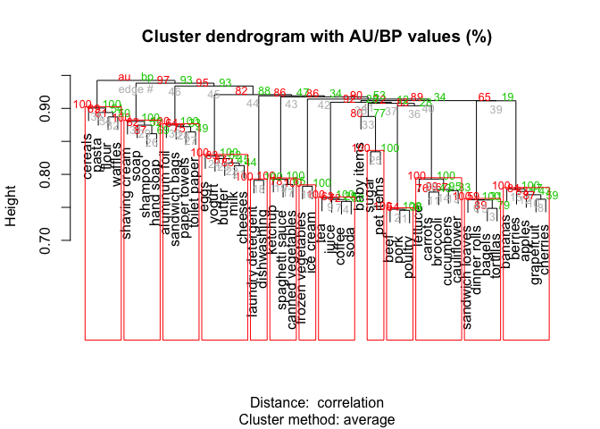

Clustering Grocery Items
================

### Company XYZ is an online grocery store. In the current version of the website, they have manually grouped the items into a few categories based on their experience. However, they now have a lot of data about user purchase history. Therefore, they would like to put the data into use! This is what they asked you to do:

#### (1) The company founder wants to meet with some of the best customers to go through a focus group with them. You are asked to send the ID of the following customers to the founder:

##### the customer who bought the most items overall in her lifetime

##### for each item, the customer who bought that product the most

#### (2) Cluster items based on user co-purchase history. That is, create clusters of products that have the highest probability of being bought together. The goal of this is to replace the old/manually created categories with these new ones. Each item can belong to just one cluster.

### Library needed packages and source codes

### Read in dataset

### Look into dataset

    ## [1] FALSE

    ## [1] TRUE

From this step, we noticed that the variable user id is not unique, suggesting that some customers had multiple purchase history. The item id is unique as what it is supposed to be. \#\#\#\# (1) The company founder wants to meet with some of the best customers to go through a focus group with them. You are asked to send the ID of the following customers to the founder: the customer who bought the most items overall in her lifetime & for each item, the customer who bought that product the most

To realize this aim, we need to create a table of user-by-item to count the purchase frequency of each user and each item. Let's do it.
\#\#\#\# Step 1: Separate the item of purchase history to multiple columns (up to total number of items)

    ## Warning: Expected 48 pieces. Missing pieces filled with `NA` in 39474
    ## rows [1, 2, 3, 4, 5, 6, 7, 8, 9, 10, 11, 12, 13, 14, 15, 16, 17, 18, 19,
    ## 20, ...].

#### Step 2: Convert the wide-format purchase history to long-format purchase history, and then remove missing values

    ## 'data.frame':    39474 obs. of  49 variables:
    ##  $ user_id: int  222087 1343649 404134 1110200 224107 409803 1296632 748280 31625 987613 ...
    ##  $ item1  : chr  "27" "6" "18" "9" ...
    ##  $ item2  : chr  "26" "47" "12" "23" ...
    ##  $ item3  : chr  NA "17" "23" "2" ...
    ##  $ item4  : chr  NA NA "22" "20" ...
    ##  $ item5  : chr  NA NA "27" "26" ...
    ##  $ item6  : chr  NA NA "43" "47" ...
    ##  $ item7  : chr  NA NA "38" "37" ...
    ##  $ item8  : chr  NA NA "20" NA ...
    ##  $ item9  : chr  NA NA "35" NA ...
    ##  $ item10 : chr  NA NA "1" NA ...
    ##  $ item11 : chr  NA NA NA NA ...
    ##  $ item12 : chr  NA NA NA NA ...
    ##  $ item13 : chr  NA NA NA NA ...
    ##  $ item14 : chr  NA NA NA NA ...
    ##  $ item15 : chr  NA NA NA NA ...
    ##  $ item16 : chr  NA NA NA NA ...
    ##  $ item17 : chr  NA NA NA NA ...
    ##  $ item18 : chr  NA NA NA NA ...
    ##  $ item19 : chr  NA NA NA NA ...
    ##  $ item20 : chr  NA NA NA NA ...
    ##  $ item21 : chr  NA NA NA NA ...
    ##  $ item22 : chr  NA NA NA NA ...
    ##  $ item23 : chr  NA NA NA NA ...
    ##  $ item24 : chr  NA NA NA NA ...
    ##  $ item25 : chr  NA NA NA NA ...
    ##  $ item26 : chr  NA NA NA NA ...
    ##  $ item27 : chr  NA NA NA NA ...
    ##  $ item28 : chr  NA NA NA NA ...
    ##  $ item29 : chr  NA NA NA NA ...
    ##  $ item30 : chr  NA NA NA NA ...
    ##  $ item31 : chr  NA NA NA NA ...
    ##  $ item32 : chr  NA NA NA NA ...
    ##  $ item33 : chr  NA NA NA NA ...
    ##  $ item34 : chr  NA NA NA NA ...
    ##  $ item35 : chr  NA NA NA NA ...
    ##  $ item36 : chr  NA NA NA NA ...
    ##  $ item37 : chr  NA NA NA NA ...
    ##  $ item38 : chr  NA NA NA NA ...
    ##  $ item39 : chr  NA NA NA NA ...
    ##  $ item40 : chr  NA NA NA NA ...
    ##  $ item41 : chr  NA NA NA NA ...
    ##  $ item42 : chr  NA NA NA NA ...
    ##  $ item43 : chr  NA NA NA NA ...
    ##  $ item44 : chr  NA NA NA NA ...
    ##  $ item45 : chr  NA NA NA NA ...
    ##  $ item46 : chr  NA NA NA NA ...
    ##  $ item47 : chr  NA NA NA NA ...
    ##  $ item48 : chr  NA NA NA NA ...

#### Step 3: Answer the questions

##### The customer who bought the most items overall in her lifetime

    ## # A tibble: 6 x 2
    ##   user_id count
    ##   <fct>   <int>
    ## 1 269335     72
    ## 2 367872     70
    ## 3 397623     64
    ## 4 599172     64
    ## 5 377284     63
    ## 6 917199     62

From this step, the id of the customer who bought the most items overall in her lifetime is 269335 with 72 items overall.

##### For each item, the customer who bought that product the most

    ## # A tibble: 6 x 4
    ##   item_id Item_name user_id count
    ##     <dbl> <fct>     <fct>   <int>
    ## 1       1 sugar     31625       4
    ## 2       1 sugar     68836       4
    ## 3       1 sugar     540483      4
    ## 4       1 sugar     1091637     4
    ## 5       1 sugar     1301034     4
    ## 6       2 lettuce   31625       5

### (2) Cluster items based on user co-purchase history. That is, create clusters of products that have the highest probability of being bought together. The goal of this is to replace the old/manually created categories with these new ones. Each item can belong to just one cluster.

As the requirements of this part, we need to hard clustering for all items (i.e., each item can belong to just one cluster without considering uncertainty). We decide to use a connectivity-based clustering--hierarchical cluster analysis, as the requirement of creating "clusters of products that have the highest probability of being brought together".

    ## Creating a temporary cluster...done:
    ## socket cluster with 3 nodes on host 'localhost'
    ## Multiscale bootstrap... Done.

    ## [[1]]
    ## [1] "beef"    "pork"    "poultry"
    ## 
    ## [[2]]
    ## [1] "bagels"          "tortillas"       "dinner rolls"    "sandwich loaves"
    ## 
    ## [[3]]
    ## [1] "tea"    "juice"  "coffee" "soda"  
    ## 
    ## [[4]]
    ## [1] "grapefruit" "cherries"   "apples"     "berries"    "bananas"   
    ## 
    ## [[5]]
    ## [1] "frozen vegetables" "ice cream"        
    ## 
    ## [[6]]
    ## [1] "laundry detergent" "dishwashing "     
    ## 
    ## [[7]]
    ## [1] "spaghetti sauce"   "canned vegetables" "ketchup"          
    ## 
    ## [[8]]
    ## [1] "carrots"     "lettuce"     "cucumbers"   "broccoli"    "cauliflower"
    ## 
    ## [[9]]
    ## [1] "eggs"    "milk"    "cheeses" "yogurt"  "butter" 
    ## 
    ## [[10]]
    ## [1] "sugar"     "pet items"
    ## 
    ## [[11]]
    ## [1] "aluminum foil" "paper towels"  "toilet paper"  "sandwich bags"
    ## 
    ## [[12]]
    ## [1] "shampoo"       "shaving cream" "hand soap"     "soap"         
    ## 
    ## [[13]]
    ## [1] "cereals" "flour"   "pasta"   "waffles"
